# SkillChain System Architecture Document (SAD)

**Version:** 1.0
**Status:** Draft
**Project:** SkillChain – Decentralized Certificate Issuance & Verification Platform
**Blockchain:** Electroneum Smart Chain (EVM Compatible)

---

# Section 1: High-Level Architecture

## 1.1 Overview

SkillChain is a cloud-native, blockchain-enabled Web3 platform designed to issue, manage, and verify digital certificates securely and efficiently. The platform combines a modern web application with decentralized technologies to ensure certificate authenticity, permanent ownership, and rapid verification.

Unlike traditional certificate systems that depend on centralized databases, SkillChain records immutable cryptographic proofs on the Electroneum Smart Chain while storing mutable application data off-chain. This hybrid architecture balances blockchain security with application performance, regulatory compliance, and scalability.

The architecture follows a layered, service-oriented design where each layer has a clearly defined responsibility. This improves maintainability, security, and future extensibility.

The primary architectural layers are:

* **Presentation Layer** – Web frontend for students, institutions, employers, and administrators.
* **Application Layer** – Backend services handling business logic, authentication, notifications, APIs, and blockchain orchestration.
* **Blockchain Layer** – Smart contracts deployed on the Electroneum Smart Chain for certificate anchoring, ownership, revocation, and verification.
* **Data Layer** – PostgreSQL, Redis, and IPFS for metadata, caching, queues, and decentralized storage.
* **Infrastructure Layer** – Docker, Kubernetes, Nginx, CI/CD pipelines, monitoring, and cloud infrastructure.

---

## 1.2 Architectural Principles

SkillChain is designed according to the following principles:

### Security by Design

Security is incorporated into every layer of the platform through encryption, role-based access control, multisignature governance, secure wallet authentication, smart contract auditing, and continuous monitoring.

### Decentralized Trust

Only cryptographic proofs and certificate state are stored on-chain, ensuring immutability while allowing personal data to remain off-chain for privacy and regulatory compliance.

### Scalability

Batch certificate issuance using Merkle Root Anchoring minimizes blockchain costs and enables millions of certificates to be managed efficiently.

### High Availability

Critical services are deployed redundantly to achieve a target availability of **99.9% uptime**.

### Modularity

Each subsystem can evolve independently without affecting other platform components.

### API-First Design

All frontend applications communicate exclusively through versioned REST APIs, allowing future support for mobile applications and third-party integrations.

### Cloud Native

Every component is containerized and orchestrated for automated deployment, scaling, and recovery.

---

## 1.3 High-Level Component Diagram

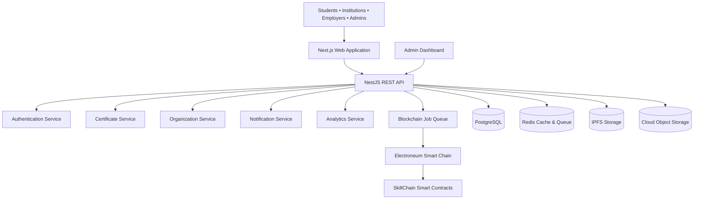

---

## 1.4 Layered Architecture

```text
┌───────────────────────────────────────────┐
│              Users                        │
└───────────────────────────────────────────┘
                    │
                    ▼
┌───────────────────────────────────────────┐
│         Frontend (Next.js)                │
└───────────────────────────────────────────┘
                    │
                    ▼
┌───────────────────────────────────────────┐
│      NestJS Backend Services              │
│                                           │
│ Authentication                            │
│ Certificates                              │
│ Organizations                             │
│ Notifications                             │
│ Analytics                                 │
│ Admin                                     │
└───────────────────────────────────────────┘
                    │
        ┌───────────┼────────────┐
        ▼           ▼            ▼
 PostgreSQL      Redis        IPFS
        │
        ▼
 Smart Contracts
        │
        ▼
 Electroneum Smart Chain
```

---

## 1.5 External Integrations

The platform integrates with several external services:

| Service                  | Purpose                                       |
| ------------------------ | --------------------------------------------- |
| Electroneum Smart Chain  | Immutable certificate proofs                  |
| MetaMask / WalletConnect | Wallet authentication and transaction signing |
| Embedded Wallet Provider | Managed wallets and account abstraction       |
| IPFS                     | Decentralized certificate metadata storage    |
| Email Provider           | User notifications                            |
| SMS Provider (optional)  | Multi-factor authentication and alerts        |
| Cloud Object Storage     | Static assets and downloadable reports        |
| Monitoring Services      | Metrics, logging, and alerting                |

---

## 1.6 Technology Stack

| Layer            | Technology                               |
| ---------------- | ---------------------------------------- |
| Frontend         | Next.js, React, TypeScript, Tailwind CSS |
| Backend          | NestJS (Node.js)                         |
| Blockchain       | Electroneum Smart Chain                  |
| Smart Contracts  | Solidity, OpenZeppelin                   |
| Database         | PostgreSQL                               |
| Cache & Queue    | Redis, BullMQ                            |
| Storage          | IPFS, Cloud Object Storage               |
| Reverse Proxy    | Nginx                                    |
| Containerization | Docker                                   |
| Orchestration    | Kubernetes                               |
| Monitoring       | Prometheus, Grafana                      |
| Logging          | Centralized logging stack                |
| CI/CD            | GitHub Actions                           |

---

## 1.7 Architectural Benefits

The proposed architecture provides:

* **Security:** Immutable blockchain proofs, audited smart contracts, encrypted communications, and robust access controls.
* **Scalability:** Efficient batch issuance through Merkle Root Anchoring, asynchronous processing, and horizontally scalable services.
* **Reliability:** Redundant deployment and automated recovery mechanisms support high availability.
* **Performance:** Redis caching, asynchronous job queues, and optimized APIs minimize response times.
* **Maintainability:** A modular, service-oriented design enables independent updates and future enhancements.
* **Compliance:** Separation of on-chain proofs from off-chain personal data supports privacy regulations such as GDPR.

# Section 2: Overall System Components

## 2.1 Overview

The SkillChain platform consists of multiple independent but interconnected components that work together to provide secure, scalable, and reliable certificate issuance and verification.

Each component has a single responsibility and communicates through well-defined APIs and events. This modular architecture simplifies development, testing, deployment, and future expansion.

---

# 2.2 System Component Overview

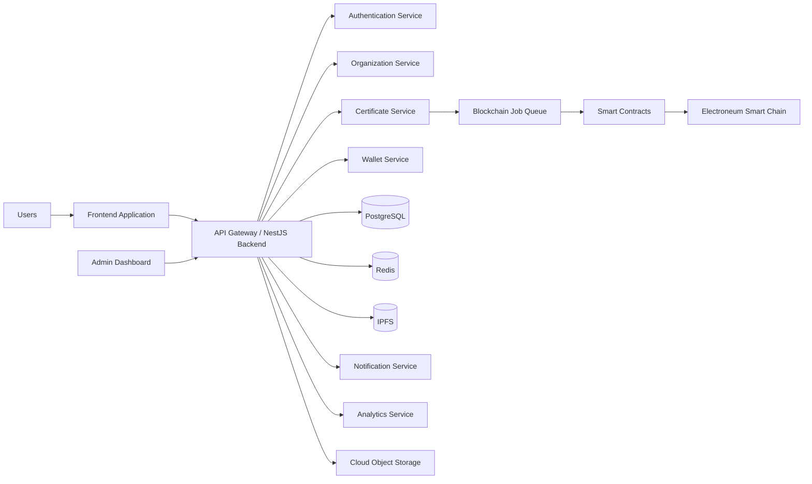

---

# 2.3 Presentation Layer

### Purpose

Provides the user interface for all platform users.

### Users

* Students
* Institutions
* Employers
* Platform Administrators

### Responsibilities

* User authentication
* Wallet connection
* Dashboard
* Certificate viewing
* Certificate issuance
* Certificate verification
* QR scanning
* Notifications
* Analytics visualization

### Technology

* Next.js
* React
* TypeScript
* Tailwind CSS

---

# 2.4 API Gateway

## Purpose

Acts as the single entry point into the backend.

All frontend requests pass through the API Gateway before reaching internal services.

### Responsibilities

* Authentication
* Request validation
* Rate limiting
* API versioning
* Routing
* Logging
* Error handling

---

# 2.5 Authentication Service

## Responsibilities

* User registration
* Login
* Wallet Sign-In (EIP-4361)
* JWT generation
* Refresh tokens
* MFA verification
* Session management
* Password reset
* Managed wallet onboarding

### Connected Components

* PostgreSQL
* Wallet Service
* Email Service
* Redis

---

# 2.6 Organization Service

Responsible for managing issuing organizations.

### Features

Institution Registration

KYB Verification

Approval Workflow

Suspension

Appeals

Issuer Directory

Subscription Management

Institution Analytics

---

# 2.7 Certificate Service

This is the core business service of SkillChain.

### Responsibilities

Generate certificate metadata

Generate certificate hash

Create Merkle Tree

Store metadata on IPFS

Submit blockchain jobs

Retrieve certificates

Revoke certificates

Manage expiry

Generate verification reports

Generate QR Codes

---

## Internal Workflow

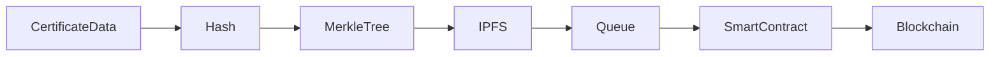

---

# 2.8 Wallet Service

Responsible for blockchain wallet operations.

### Supports

MetaMask

WalletConnect

Embedded Wallets

Hardware Wallets

### Responsibilities

Wallet Connection

Wallet Signature

SIWE Authentication

Wallet Recovery

Gasless Transactions

Transaction Monitoring

Account Abstraction

---

# 2.9 Smart Contract Layer

Contains all blockchain logic.

### Smart Contracts

Certificate Registry

Issuer Registry

Role Management

Soulbound Certificate Token

Merkle Verification

Revocation Registry

Upgradeable Proxy

---

### Responsibilities

Certificate issuance

Ownership

Verification

Revocation

Event logging

Permission management

Emergency pause

---

# 2.10 Blockchain Queue Service

Instead of writing directly to the blockchain,

all write requests are placed into a queue.

### Benefits

Fast API response

Retry mechanism

Transaction ordering

Failure recovery

Lower user waiting time

Reduced blockchain congestion

Technology

BullMQ

Redis

---

## Queue Workflow

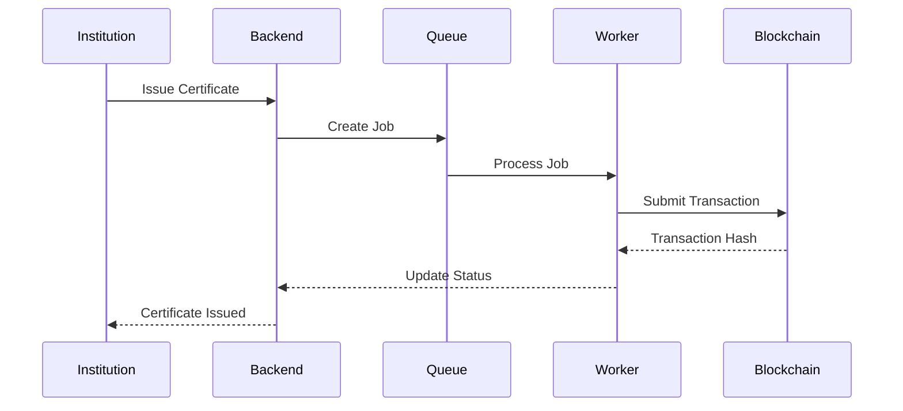

---

# 2.11 Notification Service

Handles all communication with users.

### Notifications

Certificate Issued

Certificate Revoked

Certificate Expiring

Institution Approved

Password Reset

Wallet Connected

Verification Completed

System Maintenance

### Channels

Email

SMS

In-App Notifications

Push Notifications (Future)

---

# 2.12 Analytics Service

Provides platform intelligence.

### Institution Analytics

Certificates issued

Verification count

Active students

Revoked certificates

Monthly activity

### Platform Analytics

Daily users

Revenue

Transactions

Gas usage

Blockchain health

API usage

---

# 2.13 Database Layer

Uses PostgreSQL.

Stores

Users

Organizations

Certificate Metadata

Roles

Permissions

Notifications

Audit Logs

Subscriptions

Analytics

API Keys

Session Tokens

Blockchain Transactions

---

# 2.14 Redis Layer

Redis is used for

Caching

Session storage

Queue processing

Rate limiting

Temporary verification tokens

OTP storage

---

# 2.15 IPFS Storage

Stores decentralized files.

### Stored Files

Certificate Metadata

Certificate Images

PDF Certificates

Verification Assets

QR Images

Only immutable assets are stored on IPFS.

Personal information remains in PostgreSQL.

---

# 2.16 Cloud Object Storage

Stores non-blockchain assets.

Examples

Company logos

Landing page images

User avatars

Help center assets

Email templates

Temporary exports

---

# 2.17 Monitoring Components

Prometheus

Grafana

Centralized Logging

Alert Manager

Health Checks

Performance Metrics

Blockchain Monitoring

API Monitoring

---

# 2.18 Security Components

Identity Management

RBAC

JWT

MFA

Wallet Signature Verification

Rate Limiting

Encryption

Secrets Management

Multisig Governance

Timelock Controller

Audit Logging

Intrusion Detection

---

# 2.19 Component Interaction Diagram

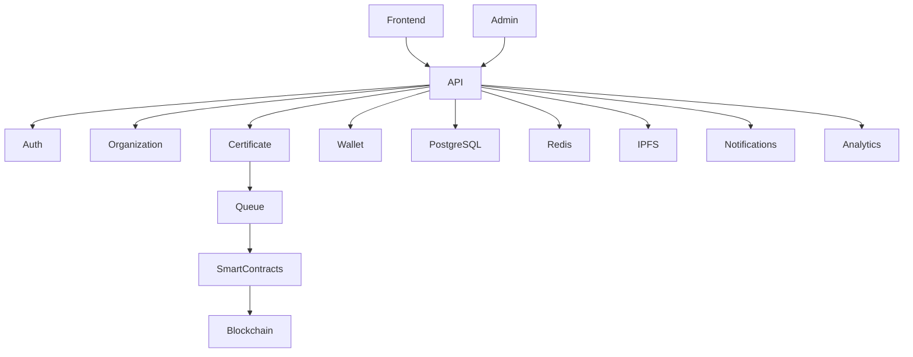

---

# 2.20 Design Principles

Each component follows these principles:

* **Single Responsibility:** Every component performs one primary function.
* **Loose Coupling:** Components communicate through well-defined interfaces, reducing dependencies.
* **High Cohesion:** Related functionality is grouped together for maintainability.
* **Scalability:** Services can be scaled independently based on demand.
* **Fault Isolation:** Failures in one component should not cascade across the platform.
* **Observability:** Logging, metrics, and tracing are built into each service for monitoring and troubleshooting.

# Section 3: Frontend Architecture

## 3.1 Overview

The SkillChain Frontend is the primary interface through which users interact with the platform. It is designed as a modern, responsive, and secure Single Page Application (SPA) built with **Next.js**, **React**, **TypeScript**, and **Tailwind CSS**.

The frontend communicates exclusively with the backend through versioned REST APIs and interacts with blockchain wallets for authentication and transaction signing. It does **not** communicate directly with smart contracts except through approved wallet interactions.

The frontend must deliver a seamless experience for both Web3-native users and users with no prior blockchain experience.

---

# 3.2 Frontend Goals

The frontend should provide:

* Simple and intuitive user experience.
* Responsive design for desktop, tablet, and mobile devices.
* Fast page loading and navigation.
* Secure authentication and session handling.
* Integrated blockchain wallet support.
* Accessible interfaces (WCAG 2.1 AA).
* Multi-language (i18n) support.
* Dark and light mode.
* Progressive enhancement for future mobile apps.

---

# 3.3 Frontend Architecture Diagram

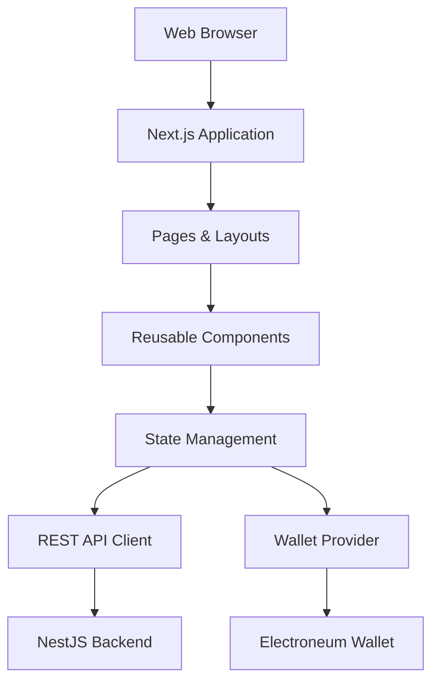

---

# 3.4 Application Structure

The frontend is organized into modular layers:

### Presentation Layer

Responsible for rendering pages, layouts, and reusable UI components.

### Business Logic Layer

Handles client-side validation, state management, and interaction logic.

### Data Access Layer

Communicates with backend APIs and wallet providers.

### Integration Layer

Connects with authentication services, blockchain wallets, and external APIs.

---

# 3.5 User Interfaces

## Public Pages

* Landing Page
* About
* Features
* Pricing
* Documentation
* Contact
* Public Issuer Directory
* Certificate Verification
* Privacy Policy
* Terms of Service

---

## Authentication Pages

* Login
* Register
* Forgot Password
* Reset Password
* Wallet Sign-In
* Multi-Factor Authentication
* Managed Wallet Onboarding

---

## Student Dashboard

Features include:

* Profile Management
* Wallet Information
* Certificate Gallery
* Certificate Details
* QR Code Viewer
* Download PDF
* Download Certificate Image
* Share Certificate
* Notifications
* Activity History

---

## Institution Dashboard

Features include:

* Organization Profile
* KYB Status
* Certificate Issuance
* Batch Certificate Upload
* Issuance History
* Revocation Management
* Analytics Dashboard
* User Management
* Subscription Management

---

## Employer Dashboard (Optional)

* Recent Verifications
* Saved Verification Reports
* API Access
* Verification History

---

## Super Admin Dashboard

* User Management
* Institution Approval
* KYB Review
* Analytics
* Fraud Monitoring
* Audit Logs
* System Health
* Feature Flags
* Support Tickets
* Compliance Reports

---

# 3.6 Routing Strategy

Routes are grouped by feature and user role.

### Public Routes

* `/`
* `/about`
* `/pricing`
* `/verify`
* `/issuer-directory`
* `/contact`

### Authentication Routes

* `/login`
* `/register`
* `/wallet-login`
* `/forgot-password`

### Student Routes

* `/dashboard`
* `/dashboard/certificates`
* `/dashboard/profile`
* `/dashboard/settings`

### Institution Routes

* `/institution/dashboard`
* `/institution/issue`
* `/institution/batch-issue`
* `/institution/history`
* `/institution/analytics`

### Admin Routes

* `/admin`
* `/admin/users`
* `/admin/institutions`
* `/admin/analytics`
* `/admin/security`

---

# 3.7 Component Hierarchy

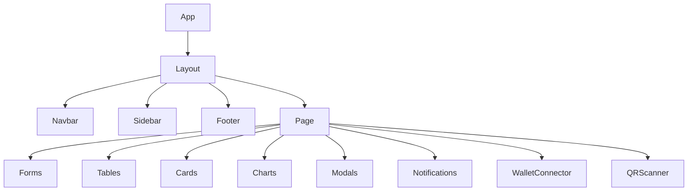

---

# 3.8 State Management

State is divided into:

### Global State

* Logged-in user
* Authentication status
* Wallet information
* Theme
* Language
* Notifications

### Feature State

* Certificate data
* Institution data
* Analytics
* Verification results
* QR scan results

### Local State

* Form inputs
* Modal visibility
* Loading indicators
* Search filters

---

# 3.9 Wallet Integration

The frontend integrates with:

* MetaMask
* WalletConnect
* Embedded Wallets
* Ledger Hardware Wallets

Functions include:

* Connect Wallet
* Disconnect Wallet
* Sign Authentication Message (SIWE)
* Sign Transactions
* Display Wallet Address
* Network Detection
* Transaction Status

---

# 3.10 API Communication

All backend communication uses HTTPS REST APIs.

Key features:

* JWT Authentication
* Automatic Token Refresh
* Retry on Temporary Failures
* Standard Error Handling
* Request Timeouts
* API Versioning (`/v1`)
* Rate Limit Awareness

---

# 3.11 Certificate Viewer

The certificate viewer allows users to:

* View certificate details
* View issuer information
* Display blockchain status
* Display verification status
* Download PDF
* Download image
* Share public verification link
* Display QR code

---

# 3.12 Certificate Issuance Interface

Institution administrators can:

* Create certificates manually
* Upload CSV/Excel files for batch issuance
* Preview certificates before submission
* Validate data before submission
* Monitor issuance progress
* View transaction status
* Retry failed submissions

---

# 3.13 Verification Interface

Employers and verifiers can:

* Search by Certificate ID
* Search by Student ID (where permitted)
* Scan QR code
* Upload verification file (future)
* View verification results
* Download signed verification report

No login or wallet is required for public verification.

---

# 3.14 Responsive Design

The frontend supports:

* Desktop
* Laptop
* Tablet
* Mobile

Responsive layouts ensure consistent usability across devices.

---

# 3.15 Accessibility

The interface complies with **WCAG 2.1 AA** by providing:

* Keyboard navigation
* Screen reader compatibility
* High-contrast support
* Sufficient color contrast
* Accessible forms
* Focus indicators
* Alternative text for images

---

# 3.16 Internationalization (i18n)

The application supports multiple languages.

Features include:

* Language switcher
* Localized date and time
* Currency formatting (where applicable)
* Right-to-left language support (future)

Initial languages:

* English
* French
* Spanish

---

# 3.17 Error Handling

The frontend provides:

* Friendly error messages
* Validation feedback
* Offline detection
* Retry mechanisms
* Loading indicators
* Skeleton screens
* Graceful degradation for unsupported features

---

# 3.18 Security Considerations

The frontend:

* Never stores private keys.
* Uses secure HTTP-only cookies or secure token storage where appropriate.
* Validates all user inputs.
* Protects against XSS and CSRF through backend and browser security policies.
* Enforces role-based route protection.
* Clears sensitive data on logout.
* Verifies connected blockchain network before allowing transactions.

---

# 3.19 Frontend Interaction Flow

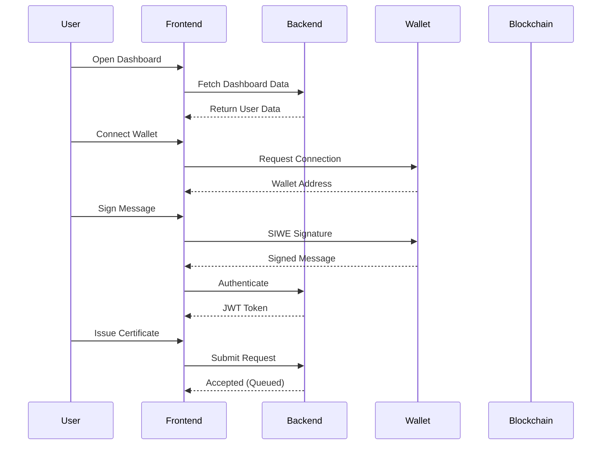

---

# 3.20 Frontend Design Principles

The SkillChain frontend adheres to the following principles:

* **User-Centric Design:** Simple workflows for both Web3 and non-Web3 users.
* **Consistency:** Uniform components, layouts, and interactions across the application.
* **Performance:** Optimized assets, lazy loading, and efficient rendering.
* **Scalability:** Modular architecture supporting future features without major refactoring.
* **Security:** Secure authentication, wallet integration, and protected routes.
* **Accessibility:** Inclusive design following WCAG 2.1 AA standards.

# Section 4: Backend Architecture

## 4.1 Overview

The SkillChain backend is the central processing layer of the platform. It is responsible for enforcing business rules, coordinating communication between the frontend, blockchain, database, and external services, and ensuring the system remains secure, scalable, and reliable.

The backend is implemented as a **modular monolith using NestJS** for the initial production release. This architecture provides the maintainability of modular services while avoiding the operational complexity of microservices during the early growth stage. As the platform scales, individual modules can be extracted into independent microservices with minimal disruption.

The backend exposes versioned REST APIs (`/v1/...`) and processes blockchain write operations asynchronously through a job queue to prevent long-running requests from affecting user experience.

---

# 4.2 Backend Goals

The backend is designed to achieve the following goals:

* Enforce all business rules consistently.
* Provide secure authentication and authorization.
* Coordinate blockchain transactions.
* Process certificate issuance asynchronously.
* Maintain auditability and traceability.
* Support horizontal scaling.
* Ensure high availability (99.9% uptime).
* Provide comprehensive logging and monitoring.
* Enable future migration to microservices.

---

# 4.3 Backend Architecture Diagram

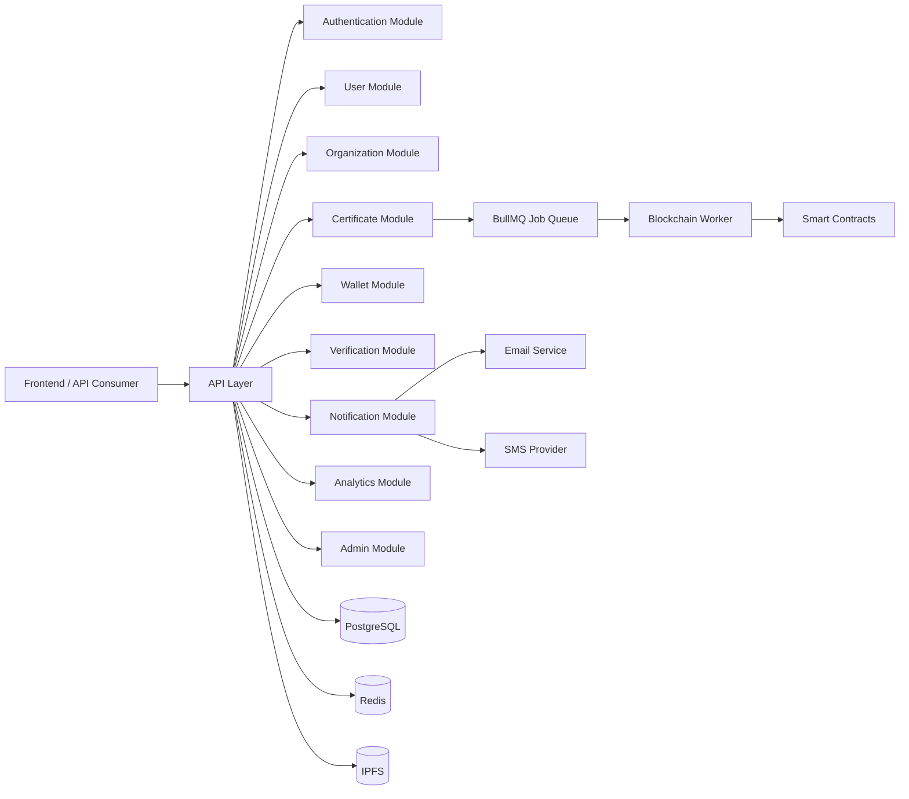

---

# 4.4 Backend Module Structure

The backend is divided into feature modules.

## Core Modules

### Authentication Module

Responsibilities:

* User registration
* Login
* JWT issuance
* Refresh tokens
* SIWE authentication
* MFA
* Password reset
* Session management

---

### User Module

Responsibilities:

* User profiles
* Preferences
* Role assignments
* Activity history
* Notification preferences

---

### Organization Module

Responsibilities:

* Institution registration
* KYB processing
* Approval workflow
* Suspension
* Appeals
* Issuer directory
* Subscription management

---

### Certificate Module

The heart of the platform.

Responsibilities:

* Certificate creation
* Certificate validation
* Metadata generation
* Merkle tree generation
* Batch issuance
* Revocation
* Expiry management
* Verification preparation
* QR generation

---

### Verification Module

Responsible for:

* Certificate lookup
* QR verification
* Blockchain proof validation
* Verification reports
* Public verification endpoint

---

### Wallet Module

Responsibilities:

* Wallet connection support
* SIWE challenge generation
* Signature validation
* Managed wallet integration
* Gasless transaction coordination
* Wallet recovery support

---

### Notification Module

Responsible for:

* Email
* SMS
* In-app notifications
* Push notifications (future)

---

### Analytics Module

Collects:

* Usage metrics
* Institution analytics
* Verification statistics
* Revenue metrics
* Blockchain metrics

---

### Admin Module

Provides:

* User administration
* Institution management
* Fraud detection
* Audit log access
* Feature flag management
* Platform configuration

---

# 4.5 Request Lifecycle

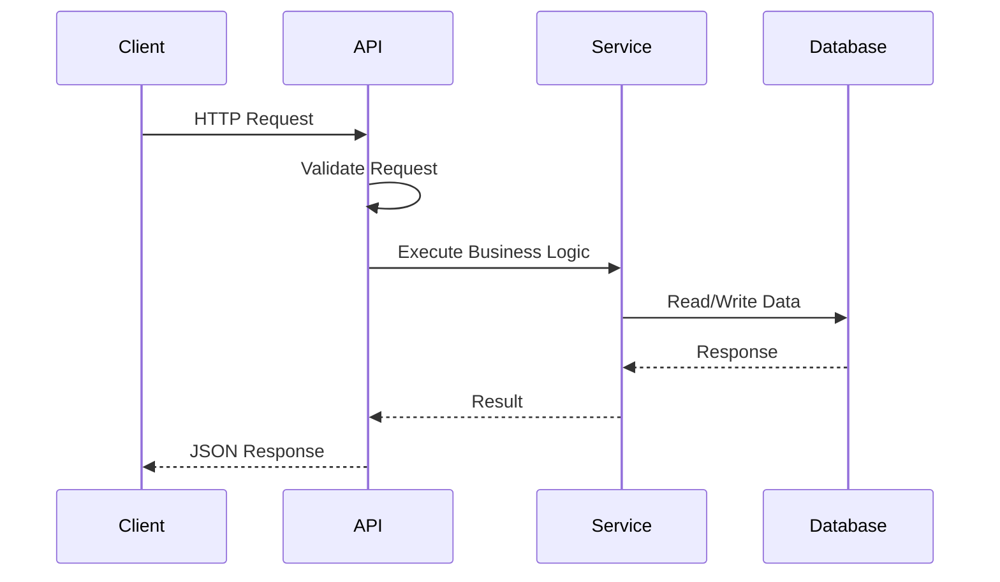

---

# 4.6 Blockchain Processing

Blockchain writes are never executed directly within the API request cycle.

Instead:

1. Request received
2. Validation completed
3. Data stored
4. Blockchain job created
5. Job added to Redis queue
6. API immediately returns **202 Accepted**
7. Background worker submits blockchain transaction
8. Transaction status updated
9. User notified

This approach improves responsiveness and resilience.

---

# 4.7 Job Queue Architecture

The backend uses **BullMQ** with **Redis**.

Queued operations include:

* Certificate issuance
* Batch issuance
* Revocation
* IPFS uploads
* Email delivery
* Verification report generation
* Analytics aggregation

Benefits:

* Retry on failure
* Dead-letter queue support
* Controlled concurrency
* Scheduled jobs
* Reduced API latency

---

# 4.8 API Layer

The API layer is responsible for:

* Request routing
* Authentication
* Authorization
* Validation
* Serialization
* Versioning
* Rate limiting
* Error handling

API standards:

* RESTful design
* `/v1` version prefix
* JSON responses
* OpenAPI/Swagger documentation
* Consistent error schema

---

# 4.9 Validation Layer

All incoming data is validated before processing.

Validation includes:

* Required fields
* Data types
* Length constraints
* File validation
* Wallet address validation
* Duplicate certificate checks
* Organization permissions

Invalid requests return standardized error responses.

---

# 4.10 Business Logic Layer

Business logic is isolated from controllers.

Responsibilities include:

* Permission checks
* Certificate rules
* Revocation policies
* Batch processing
* Subscription enforcement
* Notification triggers
* Analytics updates

This separation improves maintainability and testability.

---

# 4.11 Data Access Layer

Responsible for communication with:

* PostgreSQL
* Redis
* IPFS
* External APIs
* Blockchain workers

All database access passes through repository or service abstractions, preventing business logic from directly interacting with storage.

---

# 4.12 Caching Strategy

Redis is used for:

* Frequently accessed certificate lookups
* Session storage
* API rate limiting
* OTP storage
* Verification results
* Dashboard statistics

Caching reduces database load and improves response times.

---

# 4.13 Event-Driven Communication

The backend emits domain events for significant actions.

Examples:

* CertificateIssued
* CertificateRevoked
* InstitutionApproved
* WalletConnected
* VerificationCompleted
* UserRegistered

These events trigger notifications, analytics updates, audit logging, and integrations without tightly coupling modules.

---

# 4.14 Error Handling Strategy

Errors are categorized as:

* Validation Errors (400)
* Authentication Errors (401)
* Authorization Errors (403)
* Not Found (404)
* Conflict (409)
* Rate Limit (429)
* Internal Server Error (500)

Each response includes:

* Error code
* Message
* Timestamp
* Request ID
* Optional validation details

Sensitive implementation details are never exposed.

---

# 4.15 Security Controls

The backend enforces:

* JWT authentication
* SIWE wallet authentication
* Role-Based Access Control (RBAC)
* Multi-Factor Authentication (MFA)
* HTTPS/TLS
* Input sanitization
* Rate limiting
* Idempotency keys for write operations
* Audit logging
* Secrets management via a secure vault
* HSM-backed signing keys for relayer wallets

---

# 4.16 External Integrations

The backend integrates with:

| Service                 | Purpose                                |
| ----------------------- | -------------------------------------- |
| Electroneum Smart Chain | Certificate anchoring and verification |
| IPFS                    | Metadata storage                       |
| Email Provider          | Notifications                          |
| SMS Provider            | MFA and alerts                         |
| Managed Wallet Provider | Embedded wallets                       |
| Cloud Object Storage    | Static assets and reports              |

All integrations are abstracted behind service interfaces to allow future provider changes.

---

# 4.17 Performance Considerations

To meet the PRD targets (API p95 < 500 ms), the backend employs:

* Asynchronous blockchain processing
* Redis caching
* Database indexing
* Pagination for list endpoints
* Connection pooling
* Efficient query design
* Background processing for heavy tasks
* Compression for API responses

---

# 4.18 High Availability

The backend is designed for redundancy:

* Multiple application instances behind a load balancer
* Stateless API servers
* Shared Redis cluster
* Highly available PostgreSQL deployment
* Automatic health checks
* Kubernetes self-healing and auto-restart

This ensures continued operation during instance failures.

---

# 4.19 Backend Design Principles

The backend follows these principles:

* **Modularity:** Independent feature modules with clear responsibilities.
* **Scalability:** Services and workers can scale horizontally.
* **Reliability:** Asynchronous processing and retries improve resilience.
* **Security:** Defense-in-depth with layered controls.
* **Maintainability:** Clear separation of controllers, services, repositories, and integrations.
* **Observability:** Comprehensive logging, metrics, and tracing across all modules.

# Section 5: Smart Contract Architecture

## 5.1 Overview

The SkillChain Smart Contract Layer is the trust foundation of the platform. It is responsible for maintaining an immutable, transparent, and verifiable record of digital certificate proofs on the Electroneum Smart Chain.

Unlike traditional applications that store complete certificates on-chain, SkillChain adopts a **hybrid architecture**:

* **On-chain:** Cryptographic proofs, ownership, certificate state, issuer authorization, and audit events.
* **Off-chain:** Personal data, certificate metadata, PDF files, and images stored in IPFS and referenced by immutable hashes.

This design minimizes transaction costs, improves scalability, and supports privacy regulations while preserving the integrity of certificate verification.

---

# 5.2 Design Principles

The smart contracts are designed around the following principles:

* **Security First:** All privileged actions are protected through role-based access control, multisignature governance, and time-locked execution.
* **Immutability:** Certificate proofs cannot be altered once anchored on-chain.
* **Scalability:** Merkle Root Anchoring enables batch issuance of thousands of certificates in a single transaction.
* **Minimal On-Chain Data:** Personally identifiable information (PII) is never stored on-chain.
* **Upgradeability:** UUPS Proxy Pattern allows secure contract upgrades under governed processes.
* **Transparency:** Every state-changing action emits events for indexing and auditing.

---

# 5.3 Smart Contract Architecture Diagram

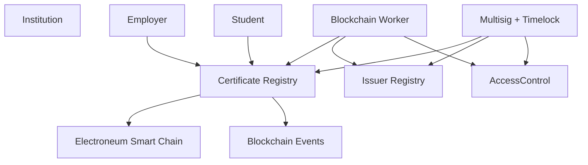

---

# 5.4 Smart Contract Components

The blockchain layer consists of the following contracts.

## 1. Certificate Registry

The Certificate Registry is the core contract responsible for anchoring certificate proofs.

### Responsibilities

* Register certificate batches
* Register individual certificates (where required)
* Store Merkle roots
* Track certificate status
* Record expiry
* Emit issuance events
* Emit revocation events
* Verify proofs

---

## 2. Issuer Registry

Maintains the list of approved issuing organizations.

Responsibilities include:

* Register issuer
* Suspend issuer
* Reactivate issuer
* Store issuer metadata reference
* Validate authorization before issuance

Only approved organizations may issue certificates.

---

## 3. Access Control

Role management is implemented using **OpenZeppelin AccessControl**.

### Roles

| Role                    | Responsibility                  |
| ----------------------- | ------------------------------- |
| DEFAULT_ADMIN_ROLE      | Governance only                 |
| ISSUER_ROLE             | Issue certificates              |
| REVOKER_ROLE            | Revoke certificates             |
| PAUSER_ROLE             | Pause contracts                 |
| UPGRADER_ROLE           | Upgrade implementation          |
| AUDITOR_ROLE (optional) | Read privileged audit functions |

No single externally owned account (EOA) should hold unrestricted administrative privileges.

---

## 4. Governance Contract

Administrative actions are protected by:

* Multisignature wallet
* Timelock controller

Governed actions include:

* Contract upgrades
* Role assignment
* Emergency pause
* Emergency unpause

This prevents unilateral control and reduces operational risk.

---

# 5.5 Certificate Lifecycle

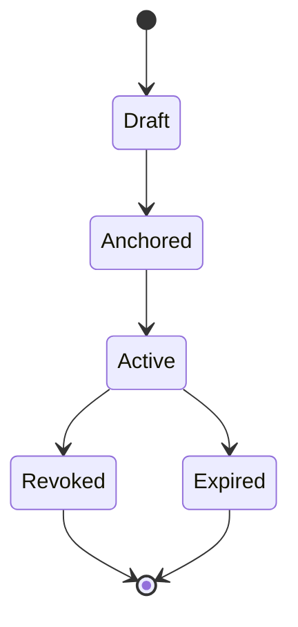

### State Definitions

* **Draft:** Certificate created but not yet anchored.
* **Anchored:** Merkle root successfully written on-chain.
* **Active:** Certificate is valid and verifiable.
* **Revoked:** Certificate has been invalidated by an authorized issuer.
* **Expired:** Certificate validity period has ended.

Once anchored, the certificate proof remains immutable; only its status may change.

---

# 5.6 Certificate Data Model

The blockchain stores only essential verification data:

* Certificate Identifier
* Merkle Root
* Merkle Leaf Hash
* Issuer Identifier
* Recipient Wallet Address
* Issue Timestamp
* Expiry Timestamp (optional)
* Status
* Batch Identifier

No names, grades, or other personal information are stored on-chain.

---

# 5.7 Merkle Root Anchoring

To reduce gas costs, certificates are grouped into batches.

Workflow:

1. Backend generates certificate hashes.
2. Hashes form a Merkle Tree.
3. The Merkle Root is submitted on-chain.
4. Individual certificates are verified using Merkle proofs.

### Benefits

* Thousands of certificates anchored in one transaction.
* Lower gas fees.
* Faster issuance.
* Better scalability.

---

# 5.8 Soulbound Certificate Model

Certificates are implemented as **non-transferable (Soulbound) credentials**.

Characteristics:

* Permanently linked to the recipient.
* Cannot be transferred, sold, or traded.
* Can be revoked by an authorized issuer.
* Can expire if configured.
* Remains historically verifiable even after revocation.

This preserves the authenticity and personal ownership of credentials.

---

# 5.9 Certificate Issuance Flow

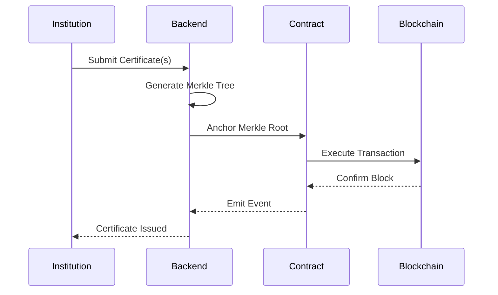

---

# 5.10 Verification Flow

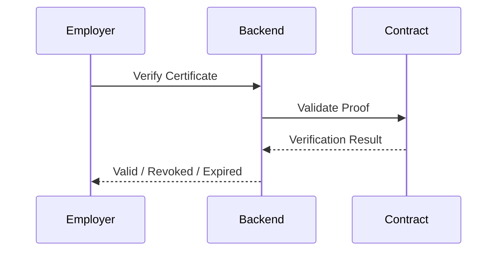

Verification does not require a wallet or blockchain transaction from the employer.

---

# 5.11 Revocation Mechanism

Revocation changes the certificate status but does not remove the proof.

Revocation rules:

* Only authorized issuers may revoke.
* Revocation reason recorded off-chain and referenced for audit.
* On-chain status updates are reflected immediately after confirmation.
* Verification always returns the latest certificate status.

This preserves immutability while allowing operational corrections.

---

# 5.12 Event Logging

The contracts emit events for all critical actions, including:

* IssuerRegistered
* IssuerSuspended
* CertificateAnchored
* CertificateRevoked
* CertificateExpired
* RoleGranted
* RoleRevoked
* ContractPaused
* ContractUnpaused
* ContractUpgraded

Events enable efficient indexing and real-time monitoring.

---

# 5.13 Upgrade Strategy

Contracts follow the **UUPS Proxy Pattern**.

Upgrade process:

1. New implementation developed and audited.
2. Governance multisig approves upgrade.
3. Timelock delay expires.
4. Upgrade transaction executed.
5. Monitoring confirms successful migration.

Every upgrade is documented and communicated to stakeholders.

---

# 5.14 Emergency Controls

The contracts include emergency mechanisms:

* Pause issuance
* Pause revocation (if required)
* Block privileged operations during incidents
* Preserve read-only verification

Verification remains available whenever possible, even during operational pauses.

---

# 5.15 Gas Optimization Strategy

The design minimizes transaction costs through:

* Merkle Root Anchoring
* Batch issuance
* Efficient storage layout
* Minimal on-chain data
* Compact events
* Optimized state updates
* Avoidance of unnecessary writes

Gas usage is reviewed before every production release.

---

# 5.16 Security Controls

Smart contract security includes:

* OpenZeppelin libraries
* AccessControl
* Multisig governance
* Timelock controller
* Pausable contracts
* UUPS upgrade safeguards
* Reentrancy protection where applicable
* Input validation
* Comprehensive automated testing
* Independent third-party security audit
* Public bug bounty program

---

# 5.17 Smart Contract Interaction Diagram

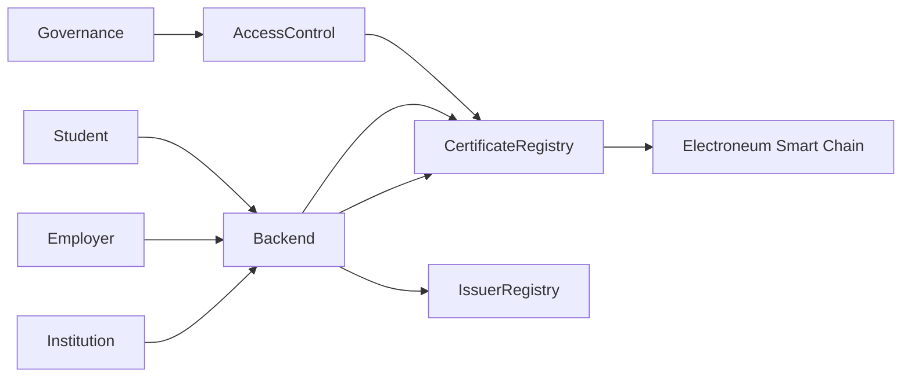

---

# 5.18 Design Principles

The smart contract layer follows these guiding principles:

* **Trust:** Blockchain serves as the immutable source of truth for certificate proofs.
* **Least Privilege:** AccessControl ensures only authorized roles perform sensitive actions.
* **Efficiency:** Batch anchoring minimizes gas costs while maintaining verifiability.
* **Governance:** Multisig and timelocks prevent unauthorized administrative actions.
* **Privacy:** Personal data remains off-chain to support regulatory compliance.
* **Future-Proofing:** Upgradeable architecture allows controlled evolution without compromising existing records.

# Section 6: Database Architecture

## 6.1 Overview

The SkillChain platform uses a **hybrid storage architecture** that combines a relational database, an in-memory cache, decentralized storage, and blockchain.

Each storage technology is selected based on the type of data it manages:

| Storage                     | Purpose                                   |
| --------------------------- | ----------------------------------------- |
| **PostgreSQL**              | Persistent application and business data  |
| **Redis**                   | Caching, queues, sessions, rate limiting  |
| **IPFS**                    | Immutable certificate metadata and assets |
| **Electroneum Smart Chain** | Immutable certificate proofs and state    |

This separation ensures high performance, scalability, privacy, and compliance with data protection regulations.

---

# 6.2 Database Design Principles

The database architecture follows these principles:

* **Normalization:** Reduce data duplication while maintaining consistency.
* **Security:** Encrypt sensitive data at rest and in transit.
* **Scalability:** Support millions of certificates and users.
* **Auditability:** Maintain immutable audit logs.
* **Privacy:** Separate personal data from blockchain proofs.
* **Performance:** Use indexing, caching, and optimized queries.

---

# 6.3 High-Level Data Architecture

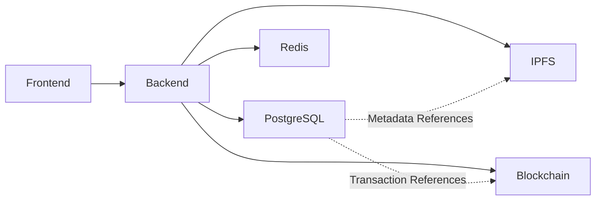

---

# 6.4 Core Database Entities

The primary entities include:

### Identity & Access

* Users
* Roles
* Permissions
* User Roles
* Sessions

---

### Organization Management

* Organizations
* KYB Applications
* Organization Members
* Subscription Plans
* Subscriptions

---

### Certificate Management

* Certificates
* Certificate Batches
* Certificate Metadata
* Revocations
* Verification Requests
* Verification Reports

---

### Blockchain

* Blockchain Transactions
* Wallets
* Merkle Roots
* Smart Contract Events

---

### Platform

* Notifications
* Audit Logs
* API Keys
* Feature Flags
* Support Tickets
* Activity Logs

---

### Analytics

* Daily Metrics
* Institution Metrics
* Verification Metrics
* Revenue Metrics

---

# 6.5 Entity Relationship Diagram (ERD)

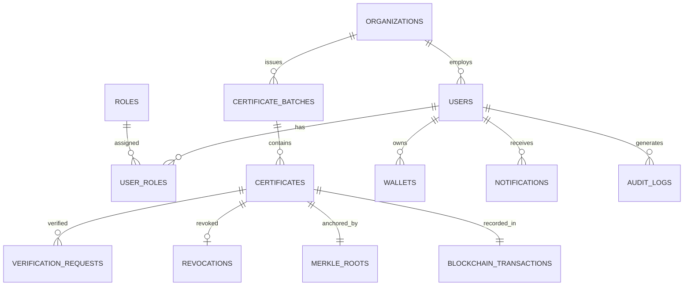

---

# 6.6 Users Table

Stores user identity information.

Example fields:

* User ID
* First Name
* Last Name
* Email
* Password Hash (if applicable)
* Account Status
* MFA Status
* Preferred Language
* Created At
* Updated At

No wallet private keys are stored.

---

# 6.7 Wallet Table

Stores wallet metadata.

Fields include:

* Wallet ID
* User ID
* Wallet Address
* Wallet Type (Self-custody / Managed)
* Network
* Status
* Linked Date

Only public wallet addresses are stored.

---

# 6.8 Organizations Table

Stores institution information.

Fields include:

* Organization ID
* Name
* Type
* Registration Number
* KYB Status
* Subscription Plan
* Contact Information
* Approval Date
* Status

---

# 6.9 Certificates Table

Stores off-chain certificate records.

Fields include:

* Certificate ID
* Batch ID
* Organization ID
* Student ID
* Certificate Title
* Issue Date
* Expiry Date
* Current Status
* IPFS CID
* Blockchain Transaction Hash
* Merkle Root ID

The certificate file itself is not stored in PostgreSQL.

---

# 6.10 Certificate Batch Table

Stores batch issuance information.

Fields include:

* Batch ID
* Organization ID
* Batch Name
* Total Certificates
* Merkle Root
* Blockchain Transaction Hash
* Processing Status

---

# 6.11 Blockchain Transaction Table

Stores blockchain transaction metadata.

Fields include:

* Transaction Hash
* Block Number
* Network
* Gas Used
* Status
* Timestamp
* Confirmation Count

This allows users to track blockchain activity without querying the chain directly.

---

# 6.12 Audit Log Table

Every important system action is recorded.

Examples:

* Login
* Logout
* Certificate Issued
* Certificate Revoked
* Organization Approved
* Role Changed
* Wallet Linked
* Smart Contract Upgrade

Audit records are immutable and retained according to the platform's retention policy.

---

# 6.13 Notification Table

Stores:

* Notification Type
* Recipient
* Message
* Delivery Channel
* Delivery Status
* Read Status
* Timestamp

Supports email, SMS, and in-app notifications.

---

# 6.14 Verification Request Table

Tracks verification activity.

Fields include:

* Verification ID
* Certificate ID
* Verification Method (ID / QR / API)
* Verifier (if authenticated)
* Result
* Timestamp

Used for analytics and fraud detection.

---

# 6.15 GDPR Data Separation

To comply with privacy regulations:

### Off-Chain (PostgreSQL)

* Names
* Email addresses
* Contact details
* Organization information
* Notification history

### On-Chain

* Certificate hash
* Merkle root
* Wallet address
* Issue timestamp
* Status

This allows deletion of personal data while preserving proof integrity.

---

# 6.16 IPFS References

PostgreSQL stores only references to IPFS.

Example:

* IPFS CID
* Metadata Version
* Pinning Status
* Upload Timestamp

Actual files remain in decentralized storage.

---

# 6.17 Redis Usage

Redis is not the system of record. It is used for:

* Session storage
* API caching
* Queue management
* Rate limiting
* OTP storage
* Temporary verification results

Data in Redis is ephemeral and automatically expires.

---

# 6.18 Indexing Strategy

To ensure fast queries, indexes are created on frequently searched fields, including:

* User Email
* Wallet Address
* Organization ID
* Certificate ID
* Blockchain Transaction Hash
* Merkle Root
* Certificate Status
* Verification Timestamp

Composite indexes are used where query patterns require them.

---

# 6.19 Data Retention & Lifecycle

Different data types have different retention policies:

| Data Type             | Retention                                                                           |
| --------------------- | ----------------------------------------------------------------------------------- |
| Audit Logs            | Long-term (per policy)                                                              |
| Notifications         | Configurable retention                                                              |
| Sessions              | Short-lived                                                                         |
| Verification Requests | Configurable for analytics                                                          |
| Certificate Metadata  | Retained while certificate is valid and according to contractual/legal requirements |
| Blockchain Proofs     | Permanent (on-chain)                                                                |

Expired or deleted personal data must not affect certificate verification.

---

# 6.20 Backup & Recovery

Database protection includes:

* Automated daily backups
* Incremental backups
* Point-in-Time Recovery (PITR)
* Encrypted backup storage
* Regular restoration testing
* Multi-region backup replication (where applicable)

These measures support the disaster recovery objectives defined in the PRD.

---

# 6.21 Database Security

Security controls include:

* Encryption at rest
* TLS for database connections
* Least-privilege database accounts
* Role-based access control
* Secrets managed through a secure vault
* SQL injection protection via ORM and parameterized queries
* Database activity monitoring
* Regular vulnerability assessments

---

# 6.22 Design Principles

The database architecture is guided by:

* **Data Integrity:** Ensure accuracy and consistency across all records.
* **Privacy by Design:** Separate personal data from immutable blockchain proofs.
* **Performance:** Optimize queries with indexing, caching, and efficient schema design.
* **Scalability:** Support growth to millions of certificates and users.
* **Resilience:** Implement reliable backup and recovery strategies.
* **Compliance:** Facilitate regulatory requirements such as GDPR through careful data modeling.

# Section 7: API Architecture

## 7.1 Overview

The SkillChain API serves as the communication layer between the frontend, backend services, blockchain infrastructure, and authorized third-party integrations.

It follows an **API-First** approach, ensuring that every platform capability is exposed through well-documented, secure, and versioned REST APIs. This enables future support for web applications, mobile applications, Learning Management Systems (LMS), Human Resource Information Systems (HRIS), and enterprise integrations.

The API is designed to be:

* RESTful
* Versioned
* Secure
* Consistent
* Scalable
* Well documented
* Easy to integrate
* Backward compatible where possible

---

# 7.2 API Architecture Overview

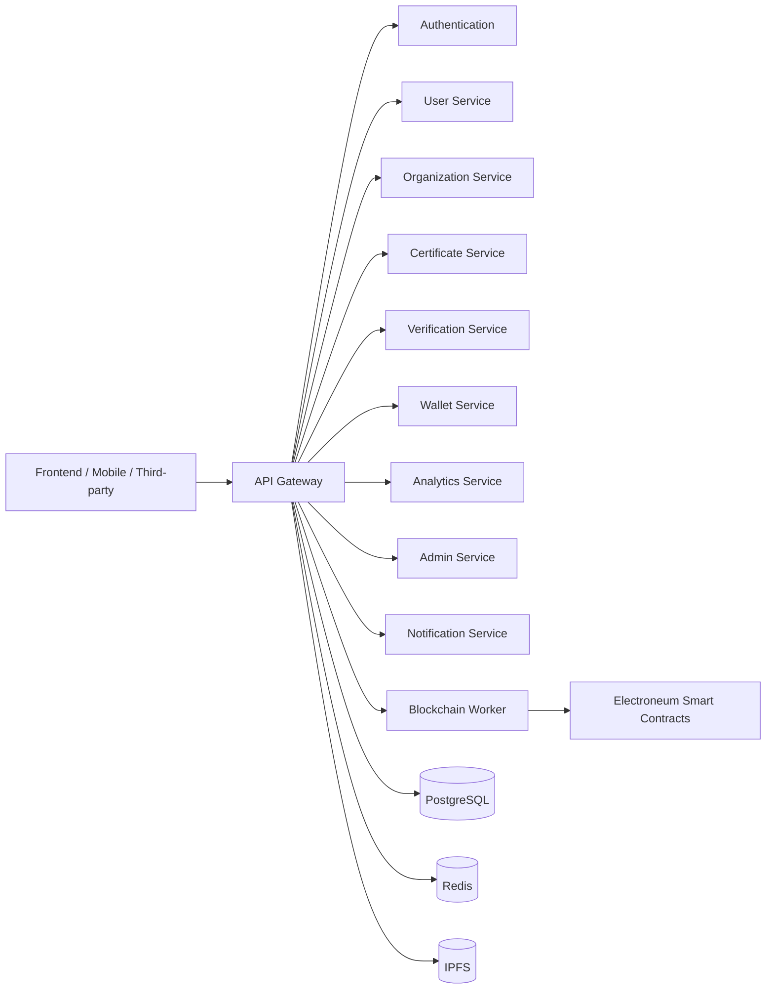

---

# 7.3 API Design Principles

The SkillChain API follows these principles:

### API-First

Every feature is designed as an API before frontend implementation.

### Stateless

Each request contains all required authentication and context. The server does not rely on client session state.

### Resource-Oriented

Endpoints represent business resources such as:

* Users
* Certificates
* Organizations
* Wallets
* Verifications

### Consistent

All endpoints use standardized request and response structures.

### Versioned

All endpoints are prefixed with:

```
/api/v1/
```

Future breaking changes will be released under `/api/v2/`.

---

# 7.4 API Categories

The API is organized into the following domains:

| Category       | Description                         |
| -------------- | ----------------------------------- |
| Authentication | User and wallet authentication      |
| Users          | User profile management             |
| Organizations  | Institution management              |
| Certificates   | Certificate issuance and management |
| Verification   | Certificate verification            |
| Wallets        | Wallet operations                   |
| Notifications  | User notifications                  |
| Analytics      | Reports and metrics                 |
| Administration | Platform administration             |
| Webhooks       | Third-party event delivery          |
| Health         | System status and monitoring        |

---

# 7.5 Authentication APIs

Responsibilities include:

* Register account
* Login
* Refresh token
* Logout
* Forgot password
* Reset password
* Verify email
* Wallet Sign-In (SIWE)
* MFA verification
* Session management

Authentication methods:

* JWT Access Token
* Refresh Token
* Wallet Signature (SIWE)
* API Key (for enterprise integrations)

---

# 7.6 User APIs

Functions include:

* Retrieve profile
* Update profile
* Change password
* Manage preferences
* Manage notification settings
* View activity history
* Link/unlink wallet
* Manage language settings

---

# 7.7 Organization APIs

Functions include:

* Register organization
* Submit KYB
* Update organization profile
* Upload KYB documents
* View approval status
* Appeal suspension
* Manage institution members
* Subscription management

---

# 7.8 Certificate APIs

This is the core API group.

Capabilities:

* Create certificate
* Batch issue certificates
* Retrieve certificate
* List certificates
* Revoke certificate
* Update expiry
* Generate QR code
* Download PDF
* Download certificate image
* Retrieve issuance history

All write operations support **Idempotency-Key** headers to prevent duplicate certificate issuance.

---

# 7.9 Verification APIs

Supports:

* Verify by Certificate ID
* Verify by QR Code
* Verify by blockchain proof
* Generate verification report
* Verification history
* Public verification endpoint

Verification is public and does not require authentication unless accessing protected organizational data.

---

# 7.10 Wallet APIs

Supports:

* Wallet connection initiation
* SIWE challenge generation
* Signature verification
* Wallet linking
* Wallet unlinking
* Managed wallet provisioning
* Wallet recovery initiation
* Network status

---

# 7.11 Notification APIs

Functions include:

* Retrieve notifications
* Mark notification as read
* Update notification preferences
* Resend notification (authorized users)
* Delivery status lookup

---

# 7.12 Analytics APIs

Provides metrics for:

Institution Dashboard

* Certificates issued
* Revocations
* Verification count
* Active students

Platform Dashboard

* Daily active users
* Revenue
* API usage
* Blockchain transactions
* Gas consumption
* System health

---

# 7.13 Admin APIs

Administrative endpoints support:

* User management
* Institution approval
* KYB review
* Fraud monitoring
* Audit logs
* Feature flags
* Support tickets
* Compliance reporting
* System configuration

All admin endpoints require elevated privileges and MFA.

---

# 7.14 Webhook APIs

SkillChain supports outbound webhooks for enterprise integrations.

Events include:

* Certificate Issued
* Certificate Revoked
* Certificate Expired
* Verification Completed
* Institution Approved
* Subscription Updated

Webhook deliveries:

* Signed using HMAC signatures
* Retried with exponential backoff
* Logged for audit and replay

---

# 7.15 Request Lifecycle

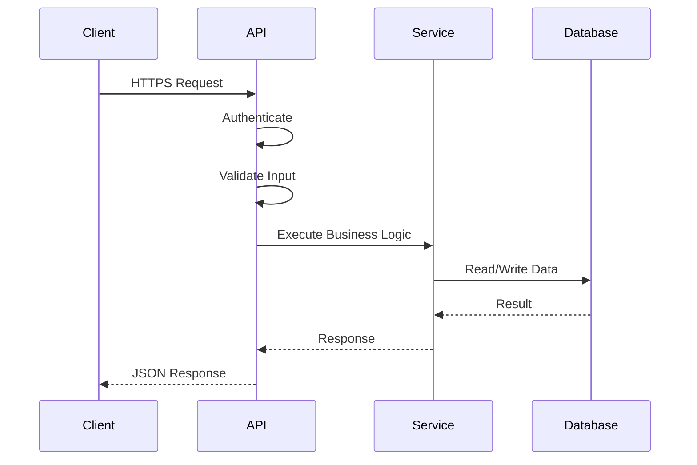

---

# 7.16 Standard Request Flow

Each API request follows the same processing pipeline:

1. HTTPS request received.
2. Rate limit checked.
3. Authentication performed (if required).
4. Authorization validated.
5. Input validation executed.
6. Business rules applied.
7. Database and blockchain interactions performed (or queued).
8. Audit log created.
9. JSON response returned.

---

# 7.17 Response Standard

All successful responses use a consistent structure:

```json
{
  "success": true,
  "message": "Operation completed successfully.",
  "data": {
    "...": "..."
  },
  "meta": {
    "requestId": "...",
    "timestamp": "..."
  }
}
```

Benefits:

* Predictable responses
* Easier frontend integration
* Simpler SDK generation
* Better API documentation

---

# 7.18 Error Response Standard

Errors follow a unified schema:

```json
{
  "success": false,
  "error": {
    "code": "CERTIFICATE_NOT_FOUND",
    "message": "Certificate could not be located."
  },
  "meta": {
    "requestId": "...",
    "timestamp": "..."
  }
}
```

Common HTTP status codes:

| Code | Meaning                                      |
| ---- | -------------------------------------------- |
| 200  | Success                                      |
| 201  | Resource created                             |
| 202  | Request accepted for asynchronous processing |
| 204  | No content                                   |
| 400  | Bad request                                  |
| 401  | Unauthorized                                 |
| 403  | Forbidden                                    |
| 404  | Resource not found                           |
| 409  | Conflict                                     |
| 422  | Validation failed                            |
| 429  | Too many requests                            |
| 500  | Internal server error                        |
| 503  | Service unavailable                          |

---

# 7.19 Rate Limiting

To protect the platform against abuse:

Public APIs:

* Moderate rate limits
* CAPTCHA where appropriate

Authenticated APIs:

* User-specific limits
* Organization-specific quotas

Administrative APIs:

* Strict limits
* Enhanced monitoring

Rate limit information is returned through standard HTTP headers.

---

# 7.20 API Security

Security measures include:

* HTTPS/TLS only
* JWT authentication
* SIWE (EIP-4361) wallet authentication
* Role-Based Access Control (RBAC)
* Multi-Factor Authentication (MFA) for privileged users
* Input validation and output encoding
* Idempotency keys for write operations
* HMAC-signed webhooks
* API key management for enterprise clients
* Audit logging
* Secrets stored in a secure vault

---

# 7.21 API Documentation

The API is documented using the **OpenAPI Specification (Swagger)**.

Documentation includes:

* Endpoint descriptions
* Authentication requirements
* Request and response examples
* Error definitions
* Rate limits
* Webhook specifications
* Version history

Interactive documentation is provided for developers to test endpoints.

---

# 7.22 API Performance & Scalability

To meet the PRD performance target (p95 < 500 ms):

* Redis caching for frequently accessed data
* Database indexing
* Pagination for list endpoints
* Compression of responses
* Connection pooling
* Background job processing for blockchain writes
* Horizontal scaling of API instances behind a load balancer

---

# 7.23 Third-Party Integration Strategy

SkillChain APIs are designed to integrate with:

* Learning Management Systems (LMS)
* Human Resource Information Systems (HRIS)
* Student Information Systems (SIS)
* Government education portals
* Employer recruitment platforms
* Identity providers
* Future mobile SDKs

Enterprise integrations should use API keys, OAuth (future enhancement), and webhooks for event-driven synchronization.

---

# 7.24 API Design Principles

The API architecture is guided by:

* **Consistency:** Uniform naming, payloads, and error handling.
* **Security:** Strong authentication, authorization, and transport security.
* **Scalability:** Stateless services with asynchronous processing where appropriate.
* **Reliability:** Idempotent operations and resilient webhook delivery.
* **Developer Experience:** Comprehensive documentation, predictable behavior, and versioned endpoints.
* **Extensibility:** APIs designed to support future clients and integrations without breaking existing consumers.

I have reviewed **Section 7 – API Architecture**. It is already strong and aligns well with the SkillChain PRD. For the **System Architecture Document**, I would keep this section but refine a few areas so it reads like a professional enterprise blockchain architecture specification.

The main improvements I recommend before finalizing Section 7 are:

---

# Section 7 – API Architecture (Architecture Review Notes)

## 1. Add API Technology Stack

The document explains what the API does but not the recommended implementation technologies.

Add:

## 7.25 API Technology Stack

The SkillChain API layer will be implemented using a scalable backend framework supporting modular services, security middleware, and blockchain integration.

Recommended stack:

| Component                | Technology            |
| ------------------------ | --------------------- |
| Backend Framework        | NestJS (Node.js)      |
| API Style                | REST + OpenAPI        |
| API Gateway              | Kong / NGINX Gateway  |
| Authentication           | JWT + SIWE (EIP-4361) |
| Database Access          | Prisma ORM / TypeORM  |
| Primary Database         | PostgreSQL            |
| Cache Layer              | Redis                 |
| Background Jobs          | BullMQ / RabbitMQ     |
| Blockchain Communication | ethers.js             |
| File Storage             | IPFS                  |
| API Documentation        | Swagger/OpenAPI       |
| Monitoring               | Prometheus + Grafana  |

---

# 2. Add Endpoint Naming Convention

The architecture should define naming rules.

Add:

## 7.26 Endpoint Naming Standards

SkillChain follows REST naming conventions.

Example:

### Authentication

```
POST /api/v1/auth/register

POST /api/v1/auth/login

POST /api/v1/auth/refresh

POST /api/v1/auth/logout
```

### Users

```
GET /api/v1/users/me

PATCH /api/v1/users/me

GET /api/v1/users/{userId}
```

### Certificates

```
POST /api/v1/certificates

GET /api/v1/certificates/{certificateId}

GET /api/v1/certificates

POST /api/v1/certificates/{certificateId}/revoke
```

### Verification

```
GET /api/v1/verify/{certificateId}

POST /api/v1/verify/qr
```

Naming rules:

* Use nouns instead of verbs.
* Use plural resources.
* Use HTTP methods correctly.
* Use lowercase paths.
* Use UUID identifiers.

---

# 3. Add Blockchain Transaction Handling

Because SkillChain is a Web3 application, API architecture should explain blockchain operations.

Add:

## 7.27 Blockchain Transaction Workflow

Blockchain operations are processed asynchronously to maintain API performance.

Example certificate issuance flow:

```
User
 |
 | POST /certificates
 |
API Gateway
 |
Certificate Service
 |
Database Transaction
 |
Message Queue
 |
Blockchain Worker
 |
Electroneum Smart Contract
 |
Transaction Hash Stored
 |
Notification Service
 |
User Receives Certificate
```

Benefits:

* Faster API response
* Protection against blockchain delays
* Retry capability
* Transaction monitoring

---

# 4. Add API Gateway Responsibilities

The recommendation at the end is good, but it should become part of the architecture.

Add:

## 7.28 API Gateway Responsibilities

The API Gateway acts as the entry point for all external requests.

Responsibilities:

### Security

* TLS termination
* JWT validation
* API key verification
* IP filtering

### Traffic Management

* Rate limiting
* Request throttling
* Load balancing

### Observability

* Request logging
* Metrics collection
* Distributed tracing

### Routing

Example:

```
/api/v1/auth/*
        |
        ---> Authentication Service


/api/v1/certificates/*
        |
        ---> Certificate Service


/api/v1/admin/*
        |
        ---> Admin Service
```

---

# 5. Add API Availability Targets

The PRD already has performance goals. Add reliability targets.

## 7.29 API Reliability Objectives

SkillChain targets:

| Metric                      | Target               |
| --------------------------- | -------------------- |
| API Availability            | 99.9%                |
| API Response Time           | p95 < 500ms          |
| Blockchain Queue Processing | < 60 seconds average |
| Webhook Delivery Success    | >99%                 |
| Error Rate                  | <1%                  |

---

# 6. Add API Version Lifecycle

The document mentions `/v1` but should define lifecycle.

Add:

## 7.30 API Version Management

API versions follow semantic lifecycle:

```
v1
 |
 | Stable Release
 |
 v2
 |
 | Migration Period
 |
 Deprecated v1
```

Rules:

* Breaking changes require a new version.
* Existing versions receive security updates.
* Minimum 6-month migration period before retirement.

---

# Final Assessment

Current Section 7 Score:

| Area                   | Rating |
| ---------------------- | ------ |
| REST Design            | ⭐⭐⭐⭐⭐  |
| Security               | ⭐⭐⭐⭐⭐  |
| Blockchain Integration | ⭐⭐⭐⭐   |
| Scalability            | ⭐⭐⭐⭐⭐  |
| Enterprise Integration | ⭐⭐⭐⭐⭐  |
| Developer Experience   | ⭐⭐⭐⭐   |

Overall:

**9/10 — Enterprise-ready API Architecture**

After adding the refinements above, it becomes suitable for:

* Enterprise LMS integrations
* Government verification systems
* Employer credential checking
* Mobile SDK development
* Large-scale certificate issuance

# Section 8: Authentication & Authorization Architecture

## 8.1 Overview

Authentication and authorization form the security foundation of SkillChain.

Because SkillChain manages **verifiable digital credentials, blockchain certificates, institutional identities, and user-owned wallets**, the identity architecture must provide:

* Strong user authentication
* Decentralized identity support
* Enterprise-grade access control
* Secure wallet integration
* Privacy protection
* Auditability
* Regulatory readiness

SkillChain uses a **hybrid identity model** combining:

* Traditional Web2 authentication
* Web3 wallet authentication
* Role-Based Access Control (RBAC)
* Multi-Factor Authentication (MFA)
* Organization-based permissions

This allows users to interact with SkillChain using either:

* Email/password accounts
* Blockchain wallets
* Enterprise identity providers (future)

---

# 8.2 Authentication Architecture Overview

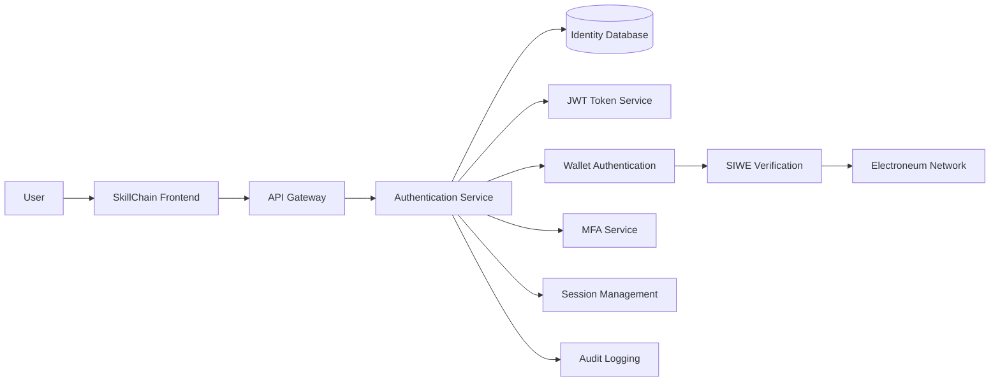

---

# 8.3 Identity Model

SkillChain separates:

## Authentication

Determines:

> "Who is the user?"

Examples:

* Email verification
* Password authentication
* Wallet signature verification
* MFA challenge

---

## Authorization

Determines:

> "What is the user allowed to do?"

Examples:

* Issue certificates
* Manage students
* Approve institutions
* View analytics
* Access administration tools

---

# 8.4 Supported Authentication Methods

SkillChain supports multiple authentication methods.

| Method                  | Purpose                   |
| ----------------------- | ------------------------- |
| Email + Password        | Standard user login       |
| Wallet Signature (SIWE) | Web3 identity login       |
| MFA                     | Additional security layer |
| API Keys                | Enterprise integrations   |
| OAuth                   | Future identity providers |

---

# 8.5 User Identity Types

SkillChain supports the following identity categories:

## 1. Individual Identity

Used by:

* Students
* Certificate holders
* Employers
* Independent users

Identity attributes:

```
User ID
Name
Email
Phone
Wallet Address
Profile Information
Verification Status
```

---

## 2. Organization Identity

Used by:

* Universities
* Training providers
* Certification bodies
* Companies

Organization attributes:

```
Organization ID
Legal Name
Registration Information
KYB Status
Members
Wallet Address
Subscription Plan
```

---

## 3. System Identity

Used by:

* Backend services
* Blockchain workers
* Integration services

Examples:

```
Certificate Worker
Notification Service
Analytics Engine
Webhook Processor
```

---

# 8.6 Authentication Flow

## Email & Password Login Flow

```mermaid
sequenceDiagram

participant User

participant Frontend

participant Auth

participant Database

participant JWT


User->>Frontend: Enter credentials

Frontend->>Auth: Login request

Auth->>Database: Validate user

Database-->>Auth: User record

Auth->>JWT: Generate tokens

JWT-->>Auth: Access + Refresh Token

Auth-->>Frontend: Authentication response

Frontend-->>User: Logged in

```

---

# 8.7 JWT Token Architecture

SkillChain uses JWT-based authentication.

Two tokens are generated:

## Access Token

Purpose:

* API authorization
* Short-lived authentication

Recommended lifetime:

```
15 minutes
```

Contains:

```json
{
 "sub": "user_uuid",
 "role": "institution_admin",
 "permissions": [
   "certificate:create",
   "certificate:view"
 ],
 "iat": 1720000000,
 "exp": 1720000900
}
```

---

## Refresh Token

Purpose:

* Generate new access tokens
* Maintain user sessions

Recommended lifetime:

```
7 - 30 days
```

Stored:

* Secure HTTP-only cookie
* Encrypted database record

---

# 8.8 JWT Lifecycle

```mermaid
flowchart LR

Login --> Access["Generate Access Token"]

Login --> Refresh["Generate Refresh Token"]

Access --> API["API Requests"]

Refresh --> Expired["Access Token Expired"]

Expired --> New["Generate New Access Token"]

New --> API

Logout --> Revoke["Revoke Refresh Token"]

```

---

# 8.9 Wallet Authentication (SIWE)

SkillChain supports **Sign-In With Ethereum (SIWE)** compatible wallet authentication.

The wallet proves ownership by signing a unique message.

Authentication does not require users to expose private keys.

---

# 8.10 SIWE Authentication Flow

```mermaid
sequenceDiagram

participant User

participant Wallet

participant Frontend

participant Backend

participant Blockchain


User->>Frontend: Connect Wallet

Frontend->>Backend: Request Login Challenge

Backend-->>Frontend: SIWE Message

Frontend->>Wallet: Sign Message

Wallet-->>Frontend: Signature

Frontend->>Backend: Submit Signature

Backend->>Blockchain: Verify Address

Blockchain-->>Backend: Valid Signature

Backend->>JWT: Generate Tokens

JWT-->>User: Login Complete

```

---

# 8.11 Wallet Security Rules

SkillChain follows these principles:

* Private keys never touch SkillChain servers
* Wallet ownership verified through signatures
* Nonce prevents replay attacks
* Messages include timestamps
* Chain ID validation required
* Wallet address normalized before storage

---

# 8.12 Managed Wallet Architecture

Some users may not own blockchain wallets.

SkillChain supports optional managed wallets.

Examples:

* Students receiving certificates
* Beginners entering Web3
* Institutions onboarding users

Managed wallets provide:

* Automatic wallet creation
* Secure key custody
* Recovery mechanism
* Blockchain interaction support

---

# 8.13 Managed Wallet Security Model

Managed wallets use:

* Hardware Security Modules (HSM)
* Key encryption
* Multi-layer access control
* Transaction approval policies

Private keys are never stored as plain text.

---

# 8.14 Multi-Factor Authentication (MFA)

MFA is required for:

* Administrators
* Institution owners
* Financial operations
* Security-sensitive actions

Supported methods:

| Method                | Usage       |
| --------------------- | ----------- |
| TOTP Authenticator    | Primary MFA |
| Email OTP             | Recovery    |
| SMS OTP               | Optional    |
| Hardware Security Key | Enterprise  |

---

# 8.15 Role-Based Access Control (RBAC)

SkillChain uses RBAC to control platform permissions.

## Roles

| Role               | Description              |
| ------------------ | ------------------------ |
| Super Admin        | Full platform control    |
| Platform Admin     | Platform management      |
| Organization Owner | Institution management   |
| Organization Admin | Staff management         |
| Issuer             | Certificate creation     |
| Verifier           | Certificate verification |
| Student            | Certificate holder       |
| Employer           | Credential checker       |

---

# 8.16 Permission Model

Permissions follow:

```
Resource:Action
```

Examples:

```
certificate:create

certificate:view

certificate:revoke

organization:update

user:manage

analytics:view
```

---

# 8.17 Authorization Flow

```mermaid
sequenceDiagram

participant User

participant API

participant Auth

participant RBAC

participant Service


User->>API: Request resource

API->>Auth: Validate token

Auth-->>API: User identity

API->>RBAC: Check permission

RBAC-->>API: Allowed/Denied

API->>Service: Execute action

Service-->>API: Response

API-->>User: Result

```

---

# 8.18 Session Management

SkillChain manages sessions securely.

Features:

* Active session listing
* Device tracking
* Remote logout
* Token revocation
* Suspicious login detection

Stored session data:

```
Session ID
User ID
Device
IP Hash
Created Date
Last Activity
Expiration
```

---

# 8.19 Account Recovery

Recovery methods:

## Email Recovery

Process:

1. User requests password reset.
2. Secure token generated.
3. Email sent.
4. User creates new password.

---

## Wallet Recovery

For managed wallets:

* Identity verification required
* Recovery approval process
* Security review
* New wallet association

---

# 8.20 Authentication Security Controls

SkillChain implements:

* Password hashing using Argon2id
* Login rate limiting
* Brute-force detection
* Device monitoring
* Token rotation
* Secure cookies
* CSRF protection
* Audit logging
* Suspicious activity alerts

---

# 8.21 Audit Logging

All security events are recorded.

Examples:

```
LOGIN_SUCCESS

LOGIN_FAILED

PASSWORD_CHANGED

WALLET_CONNECTED

MFA_ENABLED

ROLE_CHANGED

TOKEN_REVOKED

ADMIN_ACTION
```

Audit records include:

```
User ID
Action
Timestamp
IP Hash
Device Information
Result
```

---

# 8.22 Enterprise Authentication Support

Future enterprise integrations:

* OAuth 2.0
* OpenID Connect
* SAML
* Active Directory
* Google Workspace
* Microsoft Entra ID

# Section 9: Wallet Flow Architecture

## 9.1 Overview

The SkillChain wallet architecture defines how users, organizations, and platform services interact with blockchain wallets for identity verification, certificate ownership, transaction authorization, and decentralized credential management.

Wallet functionality is designed according to the approved PRD and follows a **hybrid wallet architecture**:

* **User-Controlled Wallets** for Web3-native users
* **Managed Wallets** for users requiring simplified onboarding
* **Organization Wallets** for certificate issuing institutions
* **System Wallets** for blockchain operations

The wallet layer provides:

* Secure wallet connection
* Wallet ownership verification
* Blockchain identity association
* Transaction signing
* Certificate ownership management
* Smart contract interaction
* Recovery mechanisms
* Auditability

---

# 9.2 Wallet Architecture Principles

SkillChain follows these principles:

## Non-Custodial First

Where possible:

* Users control their private keys.
* SkillChain never stores user private keys.
* Blockchain ownership remains with the user.

---

## Optional Managed Wallet Experience

To support mass adoption:

* New users can receive credentials without prior Web3 knowledge.
* Managed wallets simplify onboarding.
* Users may later migrate to self-custody.

---

## Separation of Responsibilities

Wallets are separated by purpose:

| Wallet Type         | Purpose                    |
| ------------------- | -------------------------- |
| User Wallet         | Credential ownership       |
| Organization Wallet | Certificate issuance       |
| System Wallet       | Blockchain automation      |
| Treasury Wallet     | Platform payments and fees |

---

# 9.3 Wallet Architecture Overview

```mermaid
flowchart LR

User["User"]

Frontend["SkillChain Frontend"]

WalletProvider["Wallet Provider"]

MetaMask["External Wallet"]

ManagedWallet["Managed Wallet Service"]

Gateway["API Gateway"]

WalletService["Wallet Service"]

BlockchainWorker["Blockchain Worker"]

ETN["Electroneum Smart Chain"]

SmartContract["SkillChain Smart Contracts"]

IPFS["IPFS Storage"]

Database[(PostgreSQL)]


User --> Frontend

Frontend --> WalletProvider

WalletProvider --> MetaMask

Frontend --> Gateway

Gateway --> WalletService

WalletService --> ManagedWallet

WalletService --> Database

WalletService --> BlockchainWorker

BlockchainWorker --> ETN

ETN --> SmartContract

SmartContract --> IPFS

```

---

# 9.4 Supported Wallet Models

SkillChain supports three wallet models.

---

# 9.4.1 External User Wallet

Used by:

* Web3 users
* Employers
* Institutions
* Advanced users

Examples:

* Browser wallets
* Mobile wallets
* Hardware wallets

Characteristics:

```
Private Key:
Owned by User

Signing:
Performed by Wallet

Storage:
External

Control:
User
```

---

# 9.4.2 Managed Wallet

Used by:

* Students
* Beginners
* Organizations onboarding large numbers of users

Characteristics:

```
Private Key:
Encrypted Custody

Signing:
Managed Wallet Service

Storage:
Secure Key Management System

Control:
Platform-controlled with user recovery
```

---

# 9.4.3 Organization Wallet

Used by:

* Universities
* Training providers
* Certification bodies

Purpose:

* Sign certificate issuance transactions
* Represent institutional identity
* Verify credential origin

---

# 9.5 Wallet Lifecycle

A wallet follows this lifecycle:

```mermaid
stateDiagram-v2

[Initial] --> Created

Created --> Connected

Connected --> Verified

Verified --> Active

Active --> Suspended

Suspended --> Revoked

Active --> Removed

```

---

# 9.6 External Wallet Connection Flow

## Purpose

Allows users to connect existing blockchain wallets.

Flow:

```mermaid
sequenceDiagram

participant User

participant Frontend

participant Wallet

participant Backend

participant Blockchain


User->>Frontend: Click Connect Wallet

Frontend->>Wallet: Request Connection

Wallet-->>Frontend: Wallet Address

Frontend->>Backend: Submit Address

Backend->>Blockchain: Generate Verification Challenge

Blockchain-->>Backend: Challenge

Backend-->>Frontend: SIWE Message

Frontend->>Wallet: Sign Message

Wallet-->>Frontend: Signature

Frontend->>Backend: Submit Signature

Backend->>Blockchain: Verify Signature

Blockchain-->>Backend: Valid

Backend->>Database: Save Wallet Association

Backend-->>Frontend: Wallet Connected

```

---

# 9.7 Wallet Verification Requirements

A wallet is considered verified only after:

1. Address ownership is proven.
2. Signature validation succeeds.
3. Nonce is consumed.
4. Chain ID matches SkillChain network.
5. User authorization is confirmed.

---

# 9.8 Wallet Data Model

Wallet information is stored separately from user profiles.

Example:

```sql
Wallet

id
user_id
wallet_address
wallet_type
network
verification_status
created_at
last_used_at
```

---

# 9.9 Wallet Database Architecture

```mermaid
erDiagram


USER {

uuid id

string email

}


WALLET {

uuid id

uuid user_id

string address

string type

string network

boolean verified

}


TRANSACTION {

uuid id

uuid wallet_id

string tx_hash

string status

}


USER ||--o{ WALLET : owns

WALLET ||--o{ TRANSACTION : creates

```

---

# 9.10 Managed Wallet Creation Flow

## Purpose

Provide Web3 access without requiring users to install wallets.

```mermaid
sequenceDiagram

participant User

participant Frontend

participant WalletService

participant KeyManager

participant Database


User->>Frontend: Request Wallet

Frontend->>WalletService: Create Managed Wallet

WalletService->>KeyManager: Generate Key Pair

KeyManager-->>WalletService: Encrypted Keys

WalletService->>Database: Store Wallet Metadata

WalletService-->>Frontend: Wallet Created

Frontend-->>User: Wallet Ready

```

---

# 9.11 Managed Wallet Security Controls

Managed wallets require stronger protection.

Controls:

* Hardware Security Module (HSM)
* Key encryption
* Access policies
* Transaction approval rules
* Key rotation
* Audit logging
* Recovery procedures

Private keys:

```
Never stored:
- Plain text
- Application database
- Logs
```

---

# 9.12 Certificate Ownership Flow

When a certificate is issued:

```mermaid
flowchart LR

Organization["Institution Wallet"]

CertificateService["Certificate Service"]

BlockchainWorker["Blockchain Worker"]

Contract["Credential Smart Contract"]

Recipient["Student Wallet"]


Organization --> CertificateService

CertificateService --> BlockchainWorker

BlockchainWorker --> Contract

Contract --> Recipient

```

---

# 9.13 Wallet Signature Flow

Certain actions require wallet confirmation.

Examples:

* Connect wallet
* Transfer ownership
* Approve organization
* Confirm sensitive transactions

Flow:

```mermaid
sequenceDiagram

User->>Frontend: Approve Action

Frontend->>Wallet: Request Signature

Wallet->>User: Confirmation

User->>Wallet: Approve

Wallet-->>Frontend: Signature

Frontend->>Backend: Submit Signature

Backend->>Blockchain: Validate

Blockchain-->>Backend: Success

```

---

# 9.14 Wallet Security Threat Protection

| Threat               | Protection             |
| -------------------- | ---------------------- |
| Replay Attack        | Nonce validation       |
| Fake Wallet          | Signature verification |
| Address Replacement  | Re-authentication      |
| Private Key Exposure | Never stored           |
| Phishing             | Domain validation      |
| Unauthorized Signing | User confirmation      |
| Transaction Abuse    | Rate limiting          |

---

# 9.15 Wallet Permissions Model

Wallets have permission scopes.

Example:

```
wallet:connect

wallet:verify

wallet:sign

wallet:issue_certificate

wallet:manage
```

---

# 9.16 Wallet Service Interfaces

Internal services communicate through APIs.

Example:

## Create Wallet

```
POST /api/v1/wallets
```

Request:

```json
{
"type":"managed",
"userId":"uuid"
}
```

Response:

```json
{
"walletId":"uuid",
"address":"0x123...",
"status":"active"
}
```

---

## Verify Wallet

```
POST /api/v1/wallets/verify
```

Request:

```json
{
"address":"0x123...",
"signature":"..."
}
```

---

# 9.17 Blockchain Transaction Handling

Wallet transactions are processed asynchronously.

Flow:

```mermaid
flowchart LR

Request["Transaction Request"]

Queue["Transaction Queue"]

Worker["Blockchain Worker"]

RPC["Electroneum RPC"]

Contract["Smart Contract"]

Receipt["Transaction Receipt"]

Database["Transaction Database"]


Request --> Queue

Queue --> Worker

Worker --> RPC

RPC --> Contract

Contract --> Receipt

Receipt --> Database

```

---

# 9.18 Transaction Monitoring

Tracked information:

```
Transaction ID

Wallet Address

Contract Address

Gas Used

Block Number

Transaction Status

Timestamp

Failure Reason
```

---

# 9.19 Operational Considerations

## Wallet Backup

Managed wallets require:

* Encrypted backup
* Recovery testing
* Key rotation

---

## Wallet Monitoring

System monitors:

* Failed transactions
* Suspicious activity
* Abnormal signing patterns
* Network failures

---

## Wallet Availability

Targets:

| Metric                    | Target    |
| ------------------------- | --------- |
| Wallet Connection Success | >99%      |
| Transaction Monitoring    | Real-time |
| Recovery Availability     | 99.9%     |

# Section 10: Certificate Issuance Flow Architecture

## 10.1 Overview

The Certificate Issuance Flow defines how SkillChain creates, validates, records, and delivers blockchain-backed digital certificates.

This is the core business workflow of the SkillChain platform and connects:

* Organizations
* Certificate Issuers
* Certificate Service
* Blockchain Worker
* Electroneum Smart Chain
* Smart Contracts
* IPFS Storage
* Certificate Holders
* Verification System

The architecture follows the approved PRD principles:

* **Secure issuance**
* **Tamper-resistant credentials**
* **Blockchain-backed proof**
* **Institution-controlled issuance**
* **Privacy-preserving data storage**
* **Auditable lifecycle management**

---

# 10.2 Certificate Issuance Architecture Principles

SkillChain certificate issuance follows these principles:

## Authenticity

Every certificate must prove:

* Who issued it
* Who received it
* When it was issued
* Whether it has been modified or revoked

---

## Integrity

Certificate records are protected using:

* Cryptographic hashing
* Blockchain transactions
* Smart contract validation

---

## Privacy

Sensitive information is not stored directly on-chain.

Stored off-chain:

* Personal information
* Academic records
* Documents

Stored on-chain:

* Certificate identifier
* Hash proof
* Issuer identity
* Timestamp
* Status

---

## Scalability

Certificate issuance supports:

* Single issuance
* Bulk issuance
* Batch processing
* Asynchronous blockchain operations

---

# 10.3 Certificate Issuance Architecture Overview

```mermaid
flowchart LR

Issuer["Certificate Issuer"]

Frontend["SkillChain Dashboard"]

Gateway["API Gateway"]

CertService["Certificate Service"]

Database[(PostgreSQL)]

IPFS["IPFS Storage"]

Queue["Message Queue"]

Worker["Blockchain Worker"]

ETN["Electroneum Smart Chain"]

Contract["Certificate Smart Contract"]

Holder["Certificate Holder"]

Notification["Notification Service"]


Issuer --> Frontend

Frontend --> Gateway

Gateway --> CertService

CertService --> Database

CertService --> IPFS

CertService --> Queue

Queue --> Worker

Worker --> ETN

ETN --> Contract

Contract --> Holder

CertService --> Notification

Notification --> Holder

```

---

# 10.4 Certificate Lifecycle

A certificate follows a controlled lifecycle.

```mermaid
stateDiagram-v2

[Initial] --> Draft

Draft --> PendingApproval

PendingApproval --> Approved

Approved --> Issuing

Issuing --> Issued

Issued --> Active

Active --> Expired

Active --> Revoked

Revoked --> Archived

Expired --> Archived

```

---

# 10.5 Certificate Components

A SkillChain certificate consists of:

## Certificate Metadata

Example:

```
Certificate ID
Title
Description
Category
Issue Date
Expiry Date
Issuer ID
Recipient ID
Status
```

---

## Recipient Information

```
Name
Email
Wallet Address
User ID
Verification Status
```

---

## Issuer Information

```
Organization ID
Organization Name
Issuer Wallet
Authorization Status
```

---

## Blockchain Proof

```
Transaction Hash
Block Number
Contract Address
Token ID
Certificate Hash
Timestamp
```

---

# 10.6 Certificate Data Architecture

SkillChain uses a hybrid storage model.

```mermaid
flowchart LR

Certificate["Certificate"]

Certificate --> Metadata["Certificate Metadata"]

Certificate --> Hash["Certificate Hash"]

Certificate --> Document["Certificate Document"]

Metadata --> Database[(PostgreSQL)]

Document --> IPFS[(IPFS)]

Hash --> Blockchain["Electroneum Smart Contract"]

```

---

# 10.7 Certificate Issuance Sequence Flow

```mermaid
sequenceDiagram

participant Issuer

participant Frontend

participant API

participant CertificateService

participant Database

participant IPFS

participant Queue

participant Worker

participant Blockchain

participant Holder


Issuer->>Frontend: Create Certificate

Frontend->>API: Submit Certificate Data

API->>CertificateService: Validate Request

CertificateService->>Database: Save Draft

CertificateService->>IPFS: Upload Certificate Document

IPFS-->>CertificateService: Return CID

CertificateService->>CertificateService: Generate Certificate Hash

CertificateService->>Queue: Create Blockchain Job

Queue->>Worker: Process Issuance

Worker->>Blockchain: Submit Transaction

Blockchain-->>Worker: Transaction Receipt

Worker->>Database: Store Blockchain Proof

CertificateService->>Holder: Send Notification

Holder->>Frontend: View Certificate

```

---

# 10.8 Certificate Creation Process

## Step 1: Issuer Authentication

Before issuing certificates:

System verifies:

* User identity
* Organization membership
* Issuer permission
* MFA requirement

---

## Step 2: Certificate Data Validation

Validation includes:

* Required fields
* Recipient information
* Organization authorization
* Duplicate detection

---

## Step 3: Certificate Generation

System creates:

* Unique certificate ID
* Digital certificate file
* Certificate hash

Example:

```
SHA-256(
certificate_data + timestamp
)
```

---

## Step 4: Document Storage

Certificate documents are stored in IPFS.

Stored:

```
Certificate PDF
Certificate Image
Metadata JSON
```

Returns:

```
IPFS CID
```

---

## Step 5: Blockchain Registration

Blockchain worker submits:

```
Certificate ID

Certificate Hash

Issuer Address

Recipient Address

IPFS CID

Timestamp
```

to the smart contract.

---

# 10.9 Certificate Smart Contract Interaction

Example:

```solidity
issueCertificate(
 certificateId,
 recipient,
 issuer,
 metadataHash,
 ipfsCID
)
```

The contract records:

```
Certificate Exists = True

Owner = Recipient

Issuer = Organization

Status = Active
```

---

# 10.10 Batch Certificate Issuance

SkillChain supports bulk issuance.

Example:

Institution uploads:

```
CSV File

Student Name
Email
Certificate Type
Completion Date
```

Flow:

```mermaid
flowchart LR

CSV["CSV Upload"]

Validator["Data Validator"]

Batch["Batch Processor"]

Queue["Issuance Queue"]

Worker["Blockchain Worker"]

Contract["Smart Contract"]


CSV --> Validator

Validator --> Batch

Batch --> Queue

Queue --> Worker

Worker --> Contract

```

Benefits:

* Reduced transaction cost
* Faster processing
* Institution scalability

---

# 10.11 Certificate API Interfaces

## Create Certificate

```
POST /api/v1/certificates
```

Request:

```json
{
"title":"Blockchain Fundamentals",
"recipientId":"uuid",
"organizationId":"uuid",
"expiryDate":"2027-01-01"
}
```

Response:

```json
{
"certificateId":"CERT-001",
"status":"pending"
}
```

---

## Retrieve Certificate

```
GET /api/v1/certificates/{id}
```

Response:

```json
{
"id":"CERT-001",
"title":"Blockchain Fundamentals",
"status":"active",
"issuer":"Skill Academy",
"verificationUrl":"..."
}
```

---

## Revoke Certificate

```
POST /api/v1/certificates/{id}/revoke
```

---

# 10.12 Certificate Security Controls

Security controls include:

## Authorization

Only approved issuers can create certificates.

---

## Duplicate Prevention

Uses:

* Unique certificate ID
* Idempotency keys
* Database constraints

---

## Blockchain Integrity

Certificate hashes prevent:

* Modification
* Forgery
* Unauthorized replacement

---

## Audit Logging

Tracked events:

```
CERTIFICATE_CREATED

CERTIFICATE_APPROVED

CERTIFICATE_ISSUED

CERTIFICATE_REVOKED

CERTIFICATE_EXPIRED
```

---

# 10.13 Certificate Verification Relationship

Issued certificates become publicly verifiable.

Verification checks:

```mermaid
flowchart LR

Verifier["Verifier"]

QR["QR Code"]

VerificationAPI["Verification API"]

Database[(Database)]

Blockchain["Blockchain"]

Verifier --> QR

QR --> VerificationAPI

VerificationAPI --> Database

VerificationAPI --> Blockchain

Blockchain --> VerificationAPI

VerificationAPI --> Verifier

```

---

# 10.14 Certificate Revocation Flow

```mermaid
sequenceDiagram

participant Admin

participant API

participant CertificateService

participant Worker

participant Contract


Admin->>API: Request Revocation

API->>CertificateService: Validate Permission

CertificateService->>Worker: Create Revocation Job

Worker->>Contract: Update Status

Contract-->>Worker: Confirmation

Worker->>CertificateService: Update Database

CertificateService-->>Admin: Revoked

```

---

# 10.15 Operational Considerations

## Monitoring

Monitor:

* Issuance success rate
* Failed transactions
* Blockchain confirmation time
* IPFS availability
* Queue processing time

---

## Recovery

If blockchain transaction fails:

1. Retry transaction.
2. Keep issuance pending.
3. Alert operations team.
4. Preserve audit history.

---

## Availability Targets

| Component            | Target      |
| -------------------- | ----------- |
| Certificate API      | 99.9%       |
| Issuance Processing  | 99% success |
| IPFS Availability    | 99.9%       |
| Verification Service | 99.9%       |

# Section 11: Certificate Verification Flow Architecture

## 11.1 Overview

The Certificate Verification Flow defines how SkillChain enables individuals, employers, institutions, and third-party systems to verify the authenticity and validity of blockchain-backed digital certificates.

Verification is one of the core trust mechanisms of SkillChain. It ensures that any authorized verifier can confirm:

* Certificate existence
* Certificate ownership
* Issuing institution authenticity
* Blockchain integrity
* Current certificate status
* Revocation status
* Expiration status

The verification architecture follows the approved PRD principles:

* **Public verifiability**
* **Cryptographic authenticity**
* **Blockchain-backed trust**
* **Privacy preservation**
* **Fast verification response**
* **Enterprise integration readiness**

---

# 11.2 Verification Architecture Principles

## Trust Without Intermediaries

Verification does not require contacting the issuing institution.

The verifier can independently confirm:

* Certificate data
* Blockchain proof
* Issuer identity

---

## Privacy by Design

Public verification exposes only approved information.

Protected information:

* Personal identifiers
* Academic records
* Internal institution data

requires authorization.

---

## Multi-Layer Verification

SkillChain verifies certificates through multiple sources:

1. Database verification
2. Hash verification
3. Blockchain verification
4. Smart contract state verification

---

## High Availability

Verification must remain available because employers and institutions may depend on real-time credential checks.

Target:

```
Verification API Availability: 99.9%
```

---

# 11.3 Certificate Verification Architecture Overview

```mermaid
flowchart LR

Verifier["Employer / Institution / Public User"]

Frontend["Verification Portal"]

API["Verification API"]

Gateway["API Gateway"]

VerificationService["Verification Service"]

Database[(PostgreSQL)]

IPFS["IPFS Storage"]

Blockchain["Electroneum Smart Chain"]

Contract["Certificate Smart Contract"]

Audit["Audit Logging"]


Verifier --> Frontend

Frontend --> Gateway

Gateway --> API

API --> VerificationService

VerificationService --> Database

VerificationService --> Blockchain

Blockchain --> Contract

VerificationService --> IPFS

VerificationService --> Audit

```

---

# 11.4 Verification Methods

SkillChain supports multiple verification methods.

| Method           | Description                                |
| ---------------- | ------------------------------------------ |
| Certificate ID   | Search using unique certificate identifier |
| QR Code          | Scan certificate QR code                   |
| Blockchain Proof | Verify smart contract record               |
| Verification URL | Public web verification                    |
| API Verification | Enterprise integration                     |

---

# 11.5 Certificate Verification Lifecycle

```mermaid
stateDiagram-v2

[Initial] --> Submitted

Submitted --> Processing

Processing --> Valid

Processing --> Invalid

Valid --> Expired

Valid --> Revoked

Expired --> Archived

Revoked --> Archived

```

---

# 11.6 QR Code Verification Flow

QR codes provide fast certificate verification.

The QR code contains:

```
Verification URL

Certificate ID

Checksum
```

Example:

```
https://skillchain.io/verify/CERT-001
```

---

## QR Verification Sequence

```mermaid
sequenceDiagram

participant User

participant Scanner

participant VerificationPortal

participant API

participant Blockchain


User->>Scanner: Scan QR Code

Scanner->>VerificationPortal: Open Verification URL

VerificationPortal->>API: Request Certificate

API->>Blockchain: Validate Proof

Blockchain-->>API: Certificate Status

API-->>VerificationPortal: Verification Result

VerificationPortal-->>User: Display Certificate Status

```

---

# 11.7 Certificate ID Verification Flow

Users can manually verify certificates.

Example:

Input:

```
CERT-2026-001234
```

Flow:

```mermaid
flowchart LR

User["Verifier"]

Portal["Verification Portal"]

API["Verification API"]

DB[(Certificate Database)]

Chain["Blockchain"]


User --> Portal

Portal --> API

API --> DB

API --> Chain

Chain --> API

API --> Portal

Portal --> User

```

---

# 11.8 Blockchain Verification Process

The Verification Service validates:

## 1. Certificate Existence

Checks:

```
Does certificate exist?
```

---

## 2. Ownership

Checks:

```
Recipient wallet address
```

---

## 3. Issuer Authenticity

Checks:

```
Authorized issuer wallet
```

---

## 4. Integrity

Compares:

```
Stored certificate hash

vs

Blockchain certificate hash
```

---

## 5. Status

Checks:

```
Active

Revoked

Expired
```

---

# 11.9 Verification Decision Engine

Verification follows a decision process:

```mermaid
flowchart TD

Start["Verification Request"]

Exists{"Certificate Exists?"}

Hash{"Hash Valid?"}

Blockchain{"Blockchain Match?"}

Status{"Certificate Active?"}

Valid["VALID"]

Invalid["INVALID"]


Start --> Exists

Exists -->|No| Invalid

Exists -->|Yes| Hash

Hash -->|No| Invalid

Hash -->|Yes| Blockchain

Blockchain -->|No| Invalid

Blockchain -->|Yes| Status

Status -->|Active| Valid

Status -->|Revoked/Expired| Invalid

```

---

# 11.10 Verification Response Model

Successful verification:

```json
{
 "verified": true,
 "certificate": {
   "id": "CERT-001",
   "title": "Blockchain Fundamentals",
   "issuer": "Skill Academy",
   "issuedDate": "2026-07-17",
   "status": "ACTIVE"
 },
 "proof": {
   "transactionHash": "0x123...",
   "network": "Electroneum"
 }
}
```

---

Invalid verification:

```json
{
 "verified": false,
 "reason": "CERTIFICATE_REVOKED"
}
```

---

# 11.11 Verification API Interfaces

## Public Verification

```
GET /api/v1/verify/{certificateId}
```

Purpose:

Public certificate validation.

---

## QR Verification

```
POST /api/v1/verify/qr
```

Request:

```json
{
 "qrData":"CERT-001234"
}
```

---

## Blockchain Proof Verification

```
GET /api/v1/verify/{id}/proof
```

Response:

```json
{
 "transactionHash":"0xabcd",
 "blockNumber":123456,
 "contract":"0xcontract"
}
```

---

# 11.12 Employer Verification Workflow

Employers can verify candidate credentials.

```mermaid
sequenceDiagram

participant Employer

participant Portal

participant VerificationAPI

participant Blockchain


Employer->>Portal: Enter Certificate ID

Portal->>VerificationAPI: Verify Credential

VerificationAPI->>Blockchain: Check Proof

Blockchain-->>VerificationAPI: Result

VerificationAPI-->>Portal: Verification Report

Portal-->>Employer: Display Result

```

---

# 11.13 Enterprise Verification API

Organizations can integrate directly.

Supported integrations:

* HR systems
* Recruitment platforms
* Universities
* Government portals

Authentication:

* API Keys
* OAuth 2.0 (future)
* Signed requests

Example:

```
GET /api/v1/enterprise/verify/{certificateId}
```

---

# 11.14 Verification Report Generation

SkillChain can generate verification reports.

Report includes:

```
Certificate ID

Certificate Title

Recipient

Issuer

Issue Date

Blockchain Transaction

Verification Timestamp

Verification Result
```

Formats:

* JSON
* PDF
* API Response

---

# 11.15 Fraud Detection Controls

SkillChain detects:

## Modified Certificates

Protection:

* Hash comparison
* Blockchain verification

---

## Fake Issuers

Protection:

* Organization wallet validation
* KYB approval status

---

## Duplicate Credentials

Protection:

* Unique certificate identifiers
* Database constraints

---

## Expired Credentials

Protection:

* Smart contract status check
* Expiry validation

---

# 11.16 Security Controls

Verification security includes:

## API Protection

* HTTPS only
* Rate limiting
* DDoS protection
* Input validation

---

## Blockchain Security

* Contract validation
* Transaction confirmation checks
* Network validation

---

## Privacy Security

* Minimal public disclosure
* Data masking
* Consent-based access

---

## Audit Security

Tracked events:

```
CERTIFICATE_VERIFICATION_REQUESTED

CERTIFICATE_VERIFIED

CERTIFICATE_INVALID

VERIFICATION_API_USED

REPORT_GENERATED
```

---

# 11.17 Verification Data Flow

```mermaid
flowchart LR

Request["Verification Request"]

Gateway["API Gateway"]

Service["Verification Service"]

DB["Certificate Database"]

Blockchain["Electroneum Blockchain"]

Result["Verification Result"]


Request --> Gateway

Gateway --> Service

Service --> DB

Service --> Blockchain

DB --> Service

Blockchain --> Service

Service --> Result

```

---

# 11.18 Performance Architecture

To achieve:

```
p95 response time < 500ms
```

SkillChain uses:

* Redis caching
* Indexed certificate IDs
* Blockchain proof caching
* Asynchronous audit logging
* Read replicas

---

# 11.19 Operational Considerations

## Monitoring

Monitor:

* Verification requests
* Failed verification attempts
* API latency
* Blockchain availability
* Smart contract status

---

## Disaster Recovery

If blockchain is temporarily unavailable:

System should:

1. Return cached verification state.
2. Mark blockchain confirmation pending.
3. Retry verification.
4. Alert operations.

---

## Availability Targets

| Component             | Target |
| --------------------- | ------ |
| Verification API      | 99.9%  |
| Public Portal         | 99.9%  |
| Blockchain Validation | 99%    |
| Report Generation     | 99%    |

# Section 12: QR Verification Architecture

## 12.1 Overview

The QR Verification Flow defines how SkillChain enables fast, secure, and user-friendly certificate verification through QR codes embedded on digital certificates, downloadable certificates, and verification documents.

The QR verification system provides a bridge between traditional certificate usage and blockchain-backed verification.

A verifier can scan a QR code using any compatible device and immediately access the SkillChain Verification Portal to confirm certificate authenticity.

The architecture follows the approved PRD requirements:

* Public verification access
* Fast verification experience
* Blockchain-backed validation
* Fraud prevention
* Privacy protection
* Enterprise integration support
* Auditability

---

# 12.2 QR Verification Architecture Principles

## Simple User Experience

Verification should require:

1. Scan QR code
2. Open verification page
3. View authenticity result

No blockchain knowledge is required.

---

## Secure Reference Design

The QR code does not contain sensitive certificate data.

Instead, it contains a secure reference:

```
Verification URL
+
Certificate Identifier
+
Integrity Check
```

Example:

```
https://verify.skillchain.io/CERT-2026-001234
```

---

## Tamper Resistance

QR verification relies on:

* Unique certificate identifiers
* Cryptographic hashes
* Blockchain confirmation
* Verification API validation

---

## Privacy Protection

The QR code should never expose:

* Personal documents
* Academic records
* Private organization information
* Wallet private data

---

# 12.3 QR Verification Architecture Overview

```mermaid
flowchart LR

Certificate["Digital Certificate"]

QRCode["QR Code"]

Scanner["Mobile Device / Scanner"]

Portal["SkillChain Verification Portal"]

Gateway["API Gateway"]

VerificationAPI["Verification Service"]

Database[(Certificate Database)]

Blockchain["Electroneum Blockchain"]

Contract["Certificate Smart Contract"]

Audit["Audit Logging"]


Certificate --> QRCode

QRCode --> Scanner

Scanner --> Portal

Portal --> Gateway

Gateway --> VerificationAPI

VerificationAPI --> Database

VerificationAPI --> Blockchain

Blockchain --> Contract

VerificationAPI --> Audit

```

---

# 12.4 QR Code Data Structure

The QR code contains a minimal payload.

Example:

```json
{
 "type":"certificate",
 "id":"CERT-2026-001234",
 "url":"https://verify.skillchain.io/CERT-2026-001234",
 "checksum":"a84f92..."
}
```

---

## QR Payload Design Decision

SkillChain does **not** store complete certificate information inside QR codes.

Reason:

| Approach                         | Decision   |
| -------------------------------- | ---------- |
| Full certificate data inside QR  | ❌ Rejected |
| Certificate ID reference         | ✅ Approved |
| Blockchain transaction hash only | ❌ Rejected |
| Secure verification URL          | ✅ Approved |

Benefits:

* Smaller QR codes
* Better privacy
* Easier certificate updates
* Prevents data leakage

---

# 12.5 QR Generation Flow

QR codes are generated automatically after certificate issuance.

```mermaid
sequenceDiagram

participant Issuer

participant CertificateService

participant QRService

participant Database

participant Holder


Issuer->>CertificateService: Issue Certificate

CertificateService->>QRService: Generate QR Request

QRService->>QRService: Create Verification URL

QRService->>Database: Store QR Metadata

QRService-->>CertificateService: QR Image

CertificateService-->>Holder: Certificate With QR Code

```

---

# 12.6 QR Verification User Flow

```mermaid
sequenceDiagram

participant Verifier

participant Scanner

participant Portal

participant API

participant Blockchain


Verifier->>Scanner: Scan QR Code

Scanner->>Portal: Open Verification URL

Portal->>API: Request Certificate Verification

API->>Blockchain: Validate Certificate Proof

Blockchain-->>API: Return Status

API-->>Portal: Verification Result

Portal-->>Verifier: Display Certificate Status

```

---

# 12.7 Verification Result States

The QR verification page displays one of the following states:

## Valid Certificate

```
✓ Verified Certificate

Status:
ACTIVE

Issuer:
Organization Name

Blockchain Proof:
Confirmed
```

---

## Revoked Certificate

```
⚠ Certificate Revoked

Status:
REVOKED

Revoked Date:
Date
```

---

## Expired Certificate

```
⚠ Certificate Expired

Status:
EXPIRED
```

---

## Invalid Certificate

```
✕ Verification Failed

Reason:
Certificate Not Found
```

---

# 12.8 QR Verification Processing Flow

```mermaid
flowchart TD

Start["QR Scan"]

Extract["Extract Certificate ID"]

Lookup{"Certificate Exists?"}

Hash{"Hash Matches?"}

Chain{"Blockchain Valid?"}

Status{"Status Active?"}

Valid["Certificate Verified"]

Invalid["Verification Failed"]


Start --> Extract

Extract --> Lookup

Lookup -->|No| Invalid

Lookup -->|Yes| Hash

Hash -->|No| Invalid

Hash -->|Yes| Chain

Chain -->|No| Invalid

Chain -->|Yes| Status

Status -->|Yes| Valid

Status -->|No| Invalid

```

---

# 12.9 QR Verification API Interfaces

## Verify QR Code

Endpoint:

```
POST /api/v1/verify/qr
```

---

Request:

```json
{
 "qrData":
 "https://verify.skillchain.io/CERT-2026-001234"
}
```

---

Response:

```json
{
 "success":true,
 "verified":true,
 "certificate":{
   "id":"CERT-2026-001234",
   "title":"Blockchain Fundamentals",
   "issuer":"Skill Academy",
   "status":"ACTIVE"
 },
 "proof":{
   "network":"Electroneum",
   "confirmed":true
 }
}
```

---

# 12.10 Public Verification URL Architecture

Each certificate receives a permanent verification URL.

Example:

```
verify.skillchain.io/{certificateId}
```

Architecture:

```mermaid
flowchart LR

Browser["Browser"]

CDN["CDN"]

Gateway["API Gateway"]

Verification["Verification Service"]

Cache["Redis Cache"]

Database["Certificate Database"]

Blockchain["Blockchain"]


Browser --> CDN

CDN --> Gateway

Gateway --> Verification

Verification --> Cache

Verification --> Database

Verification --> Blockchain

```

---

# 12.11 QR Security Controls

## Certificate ID Protection

Certificate identifiers use:

* UUID format
* Non-sequential IDs
* Collision prevention

---

## QR Tampering Protection

Protection methods:

* Checksum validation
* Signed verification URLs
* Blockchain proof validation

---

## Replay Protection

Controls:

* Timestamp validation
* Request logging
* Rate limiting

---

## Fake QR Prevention

A fake QR code pointing to an external website fails because:

* Verification domain is controlled by SkillChain
* Blockchain proof must match
* Certificate hash validation is required

---

# 12.12 QR Code Lifecycle

```mermaid
stateDiagram-v2

Created --> Active

Active --> Scanned

Scanned --> Verified

Active --> Disabled

Disabled --> Archived

```

---

# 12.13 QR Metadata Storage

Database model:

```sql
QR_CODE

id
certificate_id
verification_url
checksum
created_at
scan_count
status
```

---

# 12.14 QR Analytics

SkillChain tracks:

* Number of scans
* Verification locations (optional)
* Verification success rate
* Failed attempts
* API usage

Example events:

```
QR_SCANNED

CERTIFICATE_VERIFIED

VERIFICATION_FAILED

SUSPICIOUS_SCAN_DETECTED
```

---

# 12.15 Enterprise QR Verification

Organizations can use QR verification in:

* Printed certificates
* Digital certificates
* Graduation documents
* Training completion records
* Professional licenses

---

Enterprise systems can call:

```
POST /api/v1/enterprise/verify/qr
```

Authentication:

* API Key
* OAuth 2.0 (future)
* Signed requests

---

# 12.16 Performance Considerations

Target:

```
QR Verification Response:
p95 < 500ms
```

Optimizations:

* Redis certificate caching
* CDN-hosted verification pages
* Database indexing
* Blockchain proof caching
* Asynchronous analytics logging

---

# 12.17 Operational Considerations

## Monitoring

Track:

* QR generation failures
* Verification latency
* Blockchain availability
* Suspicious scanning activity

---

## Failure Handling

If blockchain is temporarily unavailable:

1. Retrieve latest confirmed certificate state.
2. Mark blockchain verification pending.
3. Retry blockchain confirmation.
4. Record incident.

---

## Disaster Recovery

Required backups:

* QR metadata
* Certificate identifiers
* Verification configuration
* Audit logs

# Section 13: Admin Dashboard Architecture

## 13.1 Overview

The SkillChain Admin Dashboard provides authorized platform operators with centralized management, monitoring, governance, and operational control over the entire SkillChain ecosystem.

The dashboard is designed according to the approved PRD and serves as the operational command center for:

* User management
* Organization approval
* Certificate governance
* Blockchain monitoring
* Security operations
* Compliance management
* Platform analytics
* System configuration

Because SkillChain manages trusted digital credentials, administrative access requires strict security controls, including:

* Role-Based Access Control (RBAC)
* Multi-Factor Authentication (MFA)
* Audit logging
* Privileged access management
* Approval workflows

---

# 13.2 Admin Dashboard Architecture Principles

## Security First

Administrative operations are highly privileged.

Every action must have:

* Authentication
* Authorization
* Audit tracking
* Permission validation

---

## Separation of Duties

Critical actions should not rely on a single administrator.

Examples:

Certificate revocation:

```
Admin Request
      |
      |
Approval Workflow
      |
      |
Execution
```

---

## Operational Visibility

Administrators require real-time visibility into:

* Platform health
* Blockchain transactions
* User activities
* Security events
* System performance

---

## Scalability

The dashboard supports:

* Multiple administrators
* Multiple organizations
* Large certificate volumes
* Enterprise operations

---

# 13.3 Admin Dashboard Architecture Overview

```mermaid
flowchart LR

Admin["Platform Administrator"]

Frontend["Admin Dashboard UI"]

Gateway["API Gateway"]

AdminService["Admin Service"]

Auth["Authentication Service"]

RBAC["Authorization Engine"]

Database[(PostgreSQL)]

Audit["Audit Service"]

Analytics["Analytics Service"]

Blockchain["Blockchain Monitoring Service"]

Queue["Background Jobs"]

Monitoring["Monitoring System"]


Admin --> Frontend

Frontend --> Gateway

Gateway --> Auth

Gateway --> AdminService

AdminService --> RBAC

AdminService --> Database

AdminService --> Audit

AdminService --> Analytics

AdminService --> Blockchain

AdminService --> Queue

Monitoring --> AdminService

```

---

# 13.4 Admin User Roles

The Admin Dashboard supports multiple administrative roles.

| Role             | Responsibility                            |
| ---------------- | ----------------------------------------- |
| Super Admin      | Complete platform control                 |
| Platform Admin   | Daily platform operations                 |
| Compliance Admin | Compliance and audit review               |
| Support Admin    | User support management                   |
| Security Admin   | Security monitoring                       |
| Finance Admin    | Subscription and payment management       |
| Blockchain Admin | Smart contract and transaction monitoring |

---

# 13.5 Admin Authentication Flow

Administrative authentication requires stronger security than normal users.

```mermaid
sequenceDiagram

participant Admin

participant Dashboard

participant Auth

participant MFA

participant RBAC

participant AdminService


Admin->>Dashboard: Login

Dashboard->>Auth: Authenticate

Auth->>MFA: Request Verification

MFA-->>Auth: Verified

Auth->>RBAC: Check Admin Role

RBAC-->>Auth: Permission Granted

Auth-->>Dashboard: Admin Session

Dashboard->>AdminService: Access Dashboard

```

---

# 13.6 Admin Dashboard Modules

The dashboard contains the following modules:

| Module                  | Purpose                     |
| ----------------------- | --------------------------- |
| Overview Dashboard      | Platform health summary     |
| User Management         | Manage users and accounts   |
| Organization Management | Manage institutions         |
| Certificate Management  | Monitor credentials         |
| Verification Analytics  | Track verification activity |
| Blockchain Monitor      | Track transactions          |
| Security Center         | Security events             |
| Audit Logs              | Compliance records          |
| System Configuration    | Platform settings           |
| Support Management      | User issues                 |

---

# 13.7 Overview Dashboard

The overview page provides real-time metrics.

Metrics:

## Platform Metrics

```
Total Users

Active Organizations

Certificates Issued

Certificates Verified

Monthly Active Users
```

---

## Blockchain Metrics

```
Transactions Submitted

Confirmed Transactions

Failed Transactions

Average Confirmation Time

Gas Consumption
```

---

## Security Metrics

```
Failed Login Attempts

Suspicious Activities

Blocked Requests

Admin Actions
```

---

# 13.8 User Management Flow

Administrators can:

* View users
* Search users
* Suspend accounts
* Restore accounts
* Manage roles
* Review activity

Flow:

```mermaid
sequenceDiagram

participant Admin

participant Dashboard

participant UserService

participant Database

participant Audit


Admin->>Dashboard: Search User

Dashboard->>UserService: Request User Data

UserService->>Database: Query User

Database-->>UserService: User Record

UserService-->>Dashboard: Display User

Admin->>Dashboard: Suspend Account

Dashboard->>UserService: Update Status

UserService->>Audit: Record Action

```

---

# 13.9 Organization Management

Responsibilities:

* Review organization registration
* Approve KYB verification
* Manage organization status
* Review documents
* Assign permissions

Organization lifecycle:

```mermaid
stateDiagram-v2

Registered --> UnderReview

UnderReview --> Approved

UnderReview --> Rejected

Approved --> Active

Active --> Suspended

Suspended --> Reactivated

```

---

# 13.10 Certificate Administration

Admin capabilities:

* View certificates
* Investigate suspicious certificates
* Approve revocations
* Monitor issuance activity

Certificate actions:

```
View

Approve

Reject

Revoke

Restore

Export Report
```

---

# 13.11 Certificate Revocation Approval Flow

Critical actions require approval.

```mermaid
sequenceDiagram

participant Admin

participant Dashboard

participant ApprovalService

participant CertificateService

participant BlockchainWorker

participant SmartContract


Admin->>Dashboard: Request Revocation

Dashboard->>ApprovalService: Create Approval Request

ApprovalService->>Admin: Request Approval

Admin->>ApprovalService: Confirm

ApprovalService->>CertificateService: Execute Revocation

CertificateService->>BlockchainWorker: Submit Transaction

BlockchainWorker->>SmartContract: Update Status

```

---

# 13.12 Blockchain Monitoring Module

Provides visibility into blockchain operations.

Tracks:

```
Transaction Hash

Wallet Address

Contract Address

Block Number

Gas Used

Transaction Status

Failure Reason
```

---

## Blockchain Monitoring Flow

```mermaid
flowchart LR

Blockchain["Electroneum Network"]

Indexer["Blockchain Indexer"]

Monitor["Blockchain Monitor"]

Database[(Analytics Database)]

Dashboard["Admin Dashboard"]


Blockchain --> Indexer

Indexer --> Monitor

Monitor --> Database

Database --> Dashboard

```

---

# 13.13 Security Center

The Security Center monitors:

## Authentication Events

```
Failed Logins

Password Changes

Wallet Connections

MFA Events
```

---

## Platform Threats

```
Suspicious Requests

API Abuse

Unauthorized Access

Fraud Attempts
```

---

# 13.14 Audit Log Management

Every administrative action is recorded.

Example:

```json
{
 "admin":"uuid",
 "action":"CERTIFICATE_REVOKED",
 "resource":"CERT-001",
 "timestamp":"2026-07-17",
 "result":"SUCCESS"
}
```

---

Audit logs are:

* Immutable
* Searchable
* Exportable
* Retained according to compliance requirements

---

# 13.15 Admin Dashboard API Interfaces

## Dashboard Statistics

```
GET /api/v1/admin/dashboard/stats
```

Response:

```json
{
 "users":50000,
 "organizations":500,
 "certificates":1000000,
 "transactions":950000
}
```

---

## Manage Users

```
GET /api/v1/admin/users
```

---

## Suspend User

```
POST /api/v1/admin/users/{id}/suspend
```

---

## Organization Approval

```
POST /api/v1/admin/organizations/{id}/approve
```

---

# 13.16 Admin Security Controls

Administrative security includes:

## Authentication

* Mandatory MFA
* Short session lifetime
* Secure cookies
* Device verification

---

## Authorization

* RBAC permissions
* Least privilege access
* Permission reviews

---

## Data Protection

* Encryption at rest
* Encryption in transit
* Sensitive data masking

---

## Monitoring

* Real-time alerts
* Security event tracking
* Admin behavior monitoring

---

# 13.17 Performance Architecture

Dashboard targets:

| Metric            | Target         |
| ----------------- | -------------- |
| Dashboard Load    | <2 seconds     |
| API Response      | p95 <500ms     |
| Analytics Refresh | Near real-time |
| Audit Search      | <1 second      |

Optimization:

* Redis caching
* Aggregated analytics tables
* Background processing
* Read replicas

---

# 13.18 Operational Considerations

## Backup

Critical data:

* Audit logs
* Configuration
* Admin permissions
* Reports

---

## Disaster Recovery

If dashboard services fail:

1. APIs remain available.
2. Administrative access restored from backup.
3. Audit history preserved.
4. Security alerts triggered.

---

## Monitoring

Monitor:

* Admin availability
* API errors
* Unauthorized attempts
* Database performance
* Blockchain connectivity

# Section 14: File Storage Architecture

## 14.1 Overview

The File Storage Architecture defines how SkillChain securely stores, retrieves, protects, and manages digital assets throughout their lifecycle.

The platform stores several categories of files, including:

* Digital certificate PDFs
* Certificate images
* QR code images
* Organization KYB documents
* User profile images
* Supporting evidence and attachments
* System-generated reports
* Metadata files

To satisfy the approved PRD, SkillChain adopts a **hybrid storage architecture** that combines:

* **PostgreSQL** for structured metadata
* **IPFS (InterPlanetary File System)** for immutable certificate assets
* **Object Storage** (e.g., S3-compatible storage such as MinIO or AWS S3) for operational files
* **Redis** for temporary caching and download optimization

This design balances decentralization, performance, cost, security, and long-term availability.

---

# 14.2 Storage Architecture Principles

The file storage subsystem follows these principles:

## Immutable Certificate Storage

Issued certificate assets are immutable.

Once a certificate is issued:

* Certificate content cannot be modified.
* Any correction requires issuance of a new certificate version or formal revocation.

---

## Hybrid Storage Strategy

Not every file belongs on the blockchain or IPFS.

SkillChain separates files according to business requirements.

| Storage Layer  | Purpose                                                     |
| -------------- | ----------------------------------------------------------- |
| PostgreSQL     | File metadata and references                                |
| IPFS           | Certificate PDFs, certificate metadata, verification assets |
| Object Storage | KYB documents, profile photos, reports, temporary uploads   |
| Redis          | Temporary download cache and frequently accessed metadata   |

---

## Privacy by Design

Only cryptographic references are stored on-chain.

Sensitive documents remain off-chain with controlled access.

---

## Durability

Critical files are replicated and backed up to ensure high availability and disaster recovery.

---

# 14.3 File Storage Architecture Overview

```mermaid
flowchart LR

User["User / Organization"]

Frontend["SkillChain Frontend"]

Gateway["API Gateway"]

StorageService["File Storage Service"]

MetadataDB[(PostgreSQL)]

ObjectStorage["Object Storage"]

IPFS["IPFS Network"]

Blockchain["Electroneum Smart Contracts"]

Redis["Redis Cache"]

CDN["Content Delivery Network"]


User --> Frontend

Frontend --> Gateway

Gateway --> StorageService

StorageService --> MetadataDB

StorageService --> ObjectStorage

StorageService --> IPFS

StorageService --> Redis

StorageService --> Blockchain

ObjectStorage --> CDN

```

---

# 14.4 File Categories

SkillChain classifies files according to purpose.

| Category                   | Storage Location                  | Immutable |
| -------------------------- | --------------------------------- | --------- |
| Certificate PDF            | IPFS                              | Yes       |
| Certificate Image          | IPFS                              | Yes       |
| Certificate Metadata JSON  | IPFS                              | Yes       |
| QR Code Image              | Object Storage + Regenerable      | No        |
| Organization KYB Documents | Object Storage                    | No        |
| User Profile Photos        | Object Storage                    | No        |
| Generated Reports          | Object Storage                    | No        |
| Audit Exports              | Object Storage                    | No        |
| Temporary Uploads          | Object Storage (temporary bucket) | No        |

---

# 14.5 File Upload Flow

```mermaid
sequenceDiagram

participant User

participant Frontend

participant API

participant StorageService

participant ObjectStorage

participant MetadataDB


User->>Frontend: Select File

Frontend->>API: Upload Request

API->>StorageService: Validate File

StorageService->>ObjectStorage: Store File

ObjectStorage-->>StorageService: File URL

StorageService->>MetadataDB: Save Metadata

StorageService-->>Frontend: Upload Success

Frontend-->>User: Upload Complete

```

---

# 14.6 Certificate Storage Flow

Certificate storage differs from ordinary file uploads.

```mermaid
sequenceDiagram

participant CertificateService

participant StorageService

participant IPFS

participant Blockchain

participant Database


CertificateService->>StorageService: Generate Certificate Files

StorageService->>IPFS: Upload PDF

StorageService->>IPFS: Upload Metadata JSON

IPFS-->>StorageService: CID

StorageService->>Blockchain: Store CID Reference

StorageService->>Database: Save Metadata

```

---

# 14.7 Storage Data Model

Example metadata stored in PostgreSQL:

```sql
FILE

id
owner_id
organization_id
category
filename
mime_type
size
storage_provider
storage_path
ipfs_cid
checksum
status
created_at
updated_at
```

Only metadata is stored in the relational database.

Large binary files remain in external storage.

---

# 14.8 IPFS Storage Architecture

Certificate assets are uploaded to IPFS.

Stored assets include:

```
Certificate PDF

Certificate Metadata JSON

Certificate Image
```

Returned:

```
Content Identifier (CID)
```

Example:

```
bafybeifk5j2...
```

The CID is:

* Stored in PostgreSQL
* Anchored in the smart contract
* Used during verification

---

# 14.9 Object Storage Architecture

Operational files are stored in object storage.

Examples:

* KYB documentation
* Organization logos
* User avatars
* Generated reports
* Temporary uploads

Features:

* Bucket isolation
* Lifecycle policies
* Versioning (where appropriate)
* Server-side encryption

---

# 14.10 File Retrieval Flow

```mermaid
sequenceDiagram

participant User

participant API

participant StorageService

participant Redis

participant ObjectStorage

participant IPFS


User->>API: Request File

API->>StorageService: Validate Access

StorageService->>Redis: Cache Lookup

alt Cache Hit
Redis-->>StorageService: Cached Response
else Cache Miss
StorageService->>ObjectStorage: Retrieve File
StorageService->>IPFS: Retrieve Immutable Asset
end

StorageService-->>API: File Stream

API-->>User: Download File

```

---

# 14.11 File Access Control

Access depends on file classification.

| File Type                         |    Public    | Authenticated | Admin |
| --------------------------------- | :----------: | :-----------: | :---: |
| Public Certificate                |       ✅      |       ✅       |   ✅   |
| Verification Metadata             |       ✅      |       ✅       |   ✅   |
| Certificate PDF (publicly shared) |       ✅      |       ✅       |   ✅   |
| Organization KYB                  |       ❌      |       ❌       |   ✅   |
| User Profile Image                | Configurable |       ✅       |   ✅   |
| Audit Export                      |       ❌      |       ❌       |   ✅   |
| Temporary Upload                  |       ❌      |       ✅       |   ✅   |

Authorization is enforced before file retrieval.

---

# 14.12 File Security Controls

Security measures include:

## Upload Validation

* MIME type validation
* File extension validation
* Maximum file size
* Malware scanning
* Content inspection

---

## Storage Protection

* Encryption at rest
* TLS during transfer
* Bucket access policies
* Signed download URLs
* Private storage buckets

---

## Integrity Protection

Each uploaded file receives:

```
SHA-256 Checksum
```

The checksum is stored in PostgreSQL and verified during integrity checks.

---

# 14.13 File Lifecycle Management

```mermaid
stateDiagram-v2

[Initial] --> Uploaded

Uploaded --> Validated

Validated --> Stored

Stored --> Active

Active --> Archived

Archived --> Deleted

```

Retention policies determine whether deletion is permitted.

Immutable certificate assets are never physically modified.

---

# 14.14 Backup and Recovery

Critical storage components:

* PostgreSQL metadata
* Object storage buckets
* IPFS pinning infrastructure
* Configuration files

Recovery objectives:

| Metric                         | Target       |
| ------------------------------ | ------------ |
| Recovery Point Objective (RPO) | ≤ 15 minutes |
| Recovery Time Objective (RTO)  | ≤ 2 hours    |

Certificate assets stored on IPFS should be pinned across multiple nodes to improve resilience.

---

# 14.15 File Storage APIs

### Upload File

```
POST /api/v1/files
```

---

### Retrieve File Metadata

```
GET /api/v1/files/{fileId}
```

---

### Download File

```
GET /api/v1/files/{fileId}/download
```

---

### Delete File

```
DELETE /api/v1/files/{fileId}
```

Deletion is subject to authorization rules and retention policies.

---

# 14.16 Monitoring and Observability

The storage subsystem monitors:

* Upload success rate
* Download latency
* Storage utilization
* IPFS availability
* Object storage availability
* Failed uploads
* Integrity verification failures
* Malware detection events

Metrics are exported to the platform monitoring system.

---

# 14.17 Operational Considerations

## Scalability

Storage architecture supports:

* Horizontal scaling of storage services
* CDN integration for public assets
* Multipart uploads for large files
* Background processing for file optimization

---

## Compliance

Storage complies with platform governance by supporting:

* Data retention policies
* Audit logging
* Secure deletion for eligible files
* Access history tracking
* Privacy-preserving storage of sensitive documents

---

## Disaster Recovery

If object storage becomes unavailable:

1. Retry upload/download operations.
2. Serve cached metadata where possible.
3. Queue failed uploads for retry.
4. Alert operations staff.
5. Preserve audit records.

For IPFS connectivity issues:

* Retry retrieval through alternative pinned nodes.
* Validate retrieved content against stored checksums and blockchain references.

# Section 15: Security Architecture

## 15.1 Overview

Security is a foundational pillar of the SkillChain platform. As a decentralized certificate issuance and verification system built on the **Electroneum Smart Chain**, SkillChain must protect user identities, institutional data, blockchain assets, certificates, and system infrastructure against cyber threats while maintaining availability, integrity, and confidentiality.

The Security Architecture adopts a **Defense-in-Depth** strategy, implementing multiple independent security layers across the application, APIs, infrastructure, blockchain, storage, and operational processes.

The architecture aligns with the approved PRD and is designed to support:

* Confidentiality
* Integrity
* Availability
* Authenticity
* Non-repudiation
* Privacy by Design
* Zero Trust principles
* Regulatory compliance
* Enterprise-grade security

---

# 15.2 Security Architecture Principles

The SkillChain security model is guided by the following principles.

## Defense in Depth

Multiple independent security controls protect every system layer.

## Least Privilege

Users, administrators, services, and smart contracts receive only the minimum permissions necessary.

## Zero Trust

No request is trusted by default.

Every request must be:

* Authenticated
* Authorized
* Validated
* Logged

## Secure by Default

Security features are enabled automatically rather than being optional.

## Privacy by Design

Only necessary data is collected, stored, and exposed.

---

# 15.3 Security Architecture Overview

```mermaid
flowchart TB

User["User / Organization"]

Frontend["Frontend"]

Gateway["API Gateway"]

WAF["Web Application Firewall"]

Auth["Authentication Service"]

RBAC["Authorization Service"]

API["Application Services"]

Storage["File Storage"]

Database[(PostgreSQL)]

Redis[(Redis)]

Blockchain["Electroneum Smart Chain"]

SmartContracts["Smart Contracts"]

Vault["Secrets Vault"]

Audit["Audit Logging"]

Monitoring["Security Monitoring / SIEM"]


User --> Frontend

Frontend --> WAF

WAF --> Gateway

Gateway --> Auth

Gateway --> RBAC

Gateway --> API

API --> Database

API --> Storage

API --> Redis

API --> Blockchain

Blockchain --> SmartContracts

API --> Vault

API --> Audit

Audit --> Monitoring

```

---

# 15.4 Security Domains

SkillChain security is divided into the following domains.

| Domain                  | Purpose                                   |
| ----------------------- | ----------------------------------------- |
| Identity Security       | User authentication and authorization     |
| API Security            | Protect platform APIs                     |
| Application Security    | Secure backend and frontend               |
| Blockchain Security     | Secure smart contract interactions        |
| Infrastructure Security | Protect servers and networks              |
| Data Security           | Protect stored and transmitted data       |
| Operational Security    | Monitoring, incident response, governance |
| Compliance Security     | Regulatory and audit support              |

---

# 15.5 Identity & Access Security

Identity protection includes:

* JWT authentication
* Refresh token rotation
* SIWE (Sign-In With Ethereum)
* Multi-Factor Authentication (MFA)
* RBAC
* Device/session management
* Password hashing using Argon2id

Administrative accounts require:

* Mandatory MFA
* Short session duration
* Device verification
* Continuous audit logging

---

# 15.6 Authentication Security Flow

```mermaid
sequenceDiagram

participant User
participant Gateway
participant Auth
participant MFA
participant RBAC
participant API

User->>Gateway: Login Request

Gateway->>Auth: Authenticate

Auth->>MFA: Challenge (if required)

MFA-->>Auth: Verified

Auth->>RBAC: Resolve Roles & Permissions

RBAC-->>Auth: Authorized

Auth-->>Gateway: JWT + Refresh Token

Gateway->>API: Authorized Request

API-->>User: Response

```

---

# 15.7 API Security

All APIs are protected through layered controls.

Security measures include:

* HTTPS/TLS 1.3
* JWT validation
* API key authentication
* Request validation
* Rate limiting
* Idempotency keys
* Input sanitization
* Output encoding
* CORS policy
* Content Security Policy (CSP)
* Request size limits

---

# 15.8 Application Security

The application layer implements:

* Secure coding standards
* Dependency vulnerability scanning
* Static Application Security Testing (SAST)
* Dynamic Application Security Testing (DAST)
* Secure CI/CD pipeline
* Secrets management
* Code reviews
* Secure error handling
* Server-side validation

---

# 15.9 Blockchain Security

Blockchain operations are protected through:

* Verified smart contracts
* Role-restricted contract functions
* Multi-signature administrative operations (future enhancement)
* Transaction confirmation monitoring
* Replay attack protection
* Chain ID validation
* Smart contract event monitoring

No private keys are stored in application code.

---

# 15.10 Data Security

Sensitive information is protected using:

## Encryption in Transit

* TLS 1.3
* HTTPS only
* HSTS

## Encryption at Rest

* AES-256 encryption
* Encrypted database volumes
* Encrypted object storage

## Hashing

Used for:

* Passwords (Argon2id)
* File integrity (SHA-256)
* Certificate integrity
* Refresh token storage

---

# 15.11 File Security

File uploads undergo:

* File type validation
* MIME validation
* Malware scanning
* File size limits
* Virus detection
* Metadata validation

Sensitive files use:

* Private storage buckets
* Signed download URLs
* Access logging

---

# 15.12 Database Security

Database protections include:

* Parameterized queries
* ORM-based data access
* Principle of least privilege
* Encrypted backups
* Row-level authorization (where applicable)
* Read replicas for reporting
* Database activity monitoring

---

# 15.13 Secrets Management

Sensitive secrets are never stored in source code.

Managed secrets include:

* JWT signing keys
* Database credentials
* API keys
* Blockchain RPC credentials
* Encryption keys
* SMTP credentials

Architecture:

```mermaid
flowchart LR

Application["Application Services"]

Vault["Secrets Vault"]

CloudKMS["Cloud KMS / HSM"]


Application --> Vault

Vault --> CloudKMS

```

Secrets are:

* Encrypted
* Rotated periodically
* Access controlled
* Fully audited

---

# 15.14 Infrastructure Security

Infrastructure protections include:

* Network segmentation
* Private subnets
* Security groups/firewalls
* DDoS protection
* Web Application Firewall (WAF)
* Bastion host for administration
* Automatic patch management
* Immutable infrastructure (where applicable)

---

# 15.15 Logging & Audit Security

All security-sensitive events are logged.

Examples:

```text
LOGIN_SUCCESS
LOGIN_FAILURE
PASSWORD_RESET
MFA_ENABLED
CERTIFICATE_ISSUED
CERTIFICATE_REVOKED
ROLE_CHANGED
ORGANIZATION_APPROVED
API_KEY_CREATED
BLOCKCHAIN_TRANSACTION_FAILED
```

Audit records include:

* Timestamp
* User ID
* Resource
* IP hash
* Device information
* Action result

Audit logs are:

* Immutable
* Searchable
* Exportable
* Retained according to policy

---

# 15.16 Threat Detection & Monitoring

Security monitoring detects:

* Brute-force attacks
* API abuse
* Suspicious logins
* Unusual wallet activity
* High error rates
* DDoS attempts
* Unauthorized admin actions

Architecture:

```mermaid
flowchart LR

Applications["Applications"]

Audit["Audit Logs"]

Metrics["Security Metrics"]

SIEM["SIEM / Monitoring"]

Alerts["Alerting"]

SOC["Operations Team"]


Applications --> Audit

Applications --> Metrics

Audit --> SIEM

Metrics --> SIEM

SIEM --> Alerts

Alerts --> SOC

```

---

# 15.17 Incident Response Workflow

```mermaid
flowchart TD

Detect["Security Event Detected"]

Classify["Classify Severity"]

Contain["Contain Threat"]

Investigate["Investigate"]

Recover["Recover Services"]

Review["Post-Incident Review"]


Detect --> Classify

Classify --> Contain

Contain --> Investigate

Investigate --> Recover

Recover --> Review

```

Incident response includes:

* Alerting
* Isolation
* Evidence preservation
* Recovery
* Root cause analysis
* Corrective actions

---

# 15.18 Security API Interfaces

Security-related endpoints include:

### Login

```text
POST /api/v1/auth/login
```

### Refresh Token

```text
POST /api/v1/auth/refresh
```

### Enable MFA

```text
POST /api/v1/auth/mfa/enable
```

### Verify Wallet

```text
POST /api/v1/wallets/verify
```

### Rotate API Key

```text
POST /api/v1/api-keys/{id}/rotate
```

---

# 15.19 Compliance & Governance

The architecture supports alignment with:

* OWASP Top 10
* OWASP API Security Top 10
* CIS Controls
* ISO/IEC 27001
* SOC 2 (future)
* GDPR principles (where applicable)
* Nigeria Data Protection Act (NDPA)
* FERPA-inspired educational privacy principles (where applicable)

Compliance capabilities include:

* Audit trails
* Access reviews
* Data retention policies
* Consent management
* Secure deletion workflows

---

# 15.20 Security Performance Targets

| Metric                             | Target                    |
| ---------------------------------- | ------------------------- |
| Authentication Success             | >99.9%                    |
| API Availability                   | 99.9%                     |
| Critical Vulnerability Remediation | <24 hours                 |
| Security Event Detection           | Near real-time            |
| MFA Enforcement                    | 100% for privileged users |
| Audit Log Integrity                | 100%                      |

---

# 15.21 Operational Considerations

## Security Operations

Continuous activities include:

* Vulnerability scanning
* Dependency updates
* Penetration testing
* Certificate rotation
* Secret rotation
* Security awareness training
* Backup verification

---

## Disaster Recovery

Security components maintain:

* Encrypted backups
* Secret recovery procedures
* Key escrow (where appropriate)
* High availability authentication services
* Redundant monitoring infrastructure

---

## Business Continuity

During incidents:

* Core verification services remain available where possible.
* Administrative access follows emergency procedures.
* Blockchain transactions are queued until services recover.
* Security alerts continue to be processed.

# Section 16: Logging & Monitoring Architecture

## 16.1 Overview

The Logging & Monitoring Architecture provides comprehensive observability across the SkillChain platform, enabling real-time visibility into system health, user activity, certificate operations, blockchain transactions, security events, and infrastructure performance.

As a blockchain-enabled certificate platform, SkillChain requires end-to-end observability to ensure:

* Platform reliability
* Security monitoring
* Regulatory compliance
* Operational troubleshooting
* Performance optimization
* Blockchain transaction tracking
* Audit readiness
* Incident response

The architecture follows the approved PRD and adopts the three pillars of observability:

* **Logs** (What happened?)
* **Metrics** (How is the system performing?)
* **Traces** (Where did the request travel?)

---

# 16.2 Logging & Monitoring Principles

## Centralized Visibility

All platform components must report telemetry to centralized monitoring systems.

---

## Real-Time Detection

Critical failures and security incidents must be detected immediately.

---

## Immutable Audit Trails

Administrative and security events must be tamper-resistant and retained according to policy.

---

## Operational Intelligence

Monitoring should provide actionable insights, not just raw data.

---

## Scalability

Observability systems must scale alongside certificate issuance, verification, and blockchain transaction volumes.

---

# 16.3 Observability Architecture Overview

```mermaid
flowchart LR

Frontend["Frontend Applications"]

Gateway["API Gateway"]

Services["Backend Services"]

Database[(PostgreSQL)]

Redis[(Redis)]

Blockchain["Electroneum Smart Chain"]

Worker["Blockchain Worker"]

Audit["Audit Service"]

Collector["Telemetry Collector"]

Logs["Log Platform"]

Metrics["Metrics Platform"]

Tracing["Distributed Tracing"]

Alerting["Alerting Engine"]

Dashboard["Operations Dashboard"]

SOC["Operations Team"]


Frontend --> Collector

Gateway --> Collector

Services --> Collector

Database --> Collector

Redis --> Collector

Worker --> Collector

Blockchain --> Collector

Audit --> Collector

Collector --> Logs

Collector --> Metrics

Collector --> Tracing

Logs --> Dashboard

Metrics --> Dashboard

Tracing --> Dashboard

Metrics --> Alerting

Logs --> Alerting

Alerting --> SOC

```

---

# 16.4 Logging Architecture

SkillChain captures logs from all platform components.

Log sources include:

| Source                 | Description                        |
| ---------------------- | ---------------------------------- |
| Frontend               | UI events and client errors        |
| API Gateway            | Request and routing logs           |
| Authentication Service | Login and authorization events     |
| Certificate Service    | Issuance and revocation activities |
| Verification Service   | Verification requests              |
| Blockchain Worker      | Transaction processing             |
| Smart Contract Indexer | Blockchain event ingestion         |
| Database               | Query and performance logs         |
| Infrastructure         | System-level events                |

---

# 16.5 Log Categories

## Application Logs

Business operations and application behavior.

Examples:

```text
CERTIFICATE_CREATED
CERTIFICATE_ISSUED
CERTIFICATE_REVOKED
CERTIFICATE_VERIFIED
ORGANIZATION_APPROVED
```

---

## Security Logs

Security-sensitive events.

Examples:

```text
LOGIN_SUCCESS
LOGIN_FAILURE
MFA_ENABLED
ROLE_CHANGED
API_KEY_CREATED
PERMISSION_DENIED
```

---

## Infrastructure Logs

Operational system events.

Examples:

```text
SERVER_RESTART
DATABASE_FAILOVER
QUEUE_FAILURE
CACHE_MISS_RATE_HIGH
```

---

## Blockchain Logs

Blockchain transaction tracking.

Examples:

```text
TRANSACTION_SUBMITTED
TRANSACTION_CONFIRMED
TRANSACTION_FAILED
SMART_CONTRACT_EVENT
```

---

# 16.6 Log Data Model

All logs follow a standardized structure.

Example:

```json
{
  "timestamp":"2026-07-17T12:00:00Z",
  "service":"certificate-service",
  "level":"INFO",
  "event":"CERTIFICATE_ISSUED",
  "requestId":"req_123",
  "userId":"user_uuid",
  "resource":"CERT-001",
  "message":"Certificate issued successfully"
}
```

Benefits:

* Searchability
* Consistency
* Correlation across systems
* Automated alerting

---

# 16.7 Request Tracing Architecture

Every request receives a unique correlation identifier.

Example:

```text
X-Request-ID
```

Request tracing flow:

```mermaid
sequenceDiagram

participant Client

participant Gateway

participant API

participant Database

participant BlockchainWorker


Client->>Gateway: Request

Gateway->>Gateway: Generate Request ID

Gateway->>API: Forward Request

API->>Database: Query

API->>BlockchainWorker: Submit Job

BlockchainWorker-->>API: Result

API-->>Gateway: Response

Gateway-->>Client: Response

```

---

# 16.8 Distributed Tracing

Tracing tracks request execution across services.

Captured information:

* Request path
* Service latency
* Database latency
* Blockchain processing time
* Queue processing time
* External service calls

Architecture:

```mermaid
flowchart LR

Request["Incoming Request"]

Gateway["API Gateway"]

Service["Business Service"]

Queue["Queue"]

Worker["Blockchain Worker"]

Database["Database"]

Trace["Distributed Trace"]


Request --> Gateway

Gateway --> Service

Service --> Queue

Queue --> Worker

Service --> Database

Gateway --> Trace

Service --> Trace

Worker --> Trace

Database --> Trace

```

---

# 16.9 Metrics Architecture

SkillChain collects platform metrics continuously.

Metrics categories:

| Category    | Examples            |
| ----------- | ------------------- |
| Application | Requests per second |
| API         | Response time       |
| Database    | Query latency       |
| Blockchain  | Confirmation time   |
| Queue       | Queue depth         |
| Storage     | Upload success rate |
| Security    | Failed login count  |

---

# 16.10 Core Platform Metrics

## User Metrics

```text
Active Users
New Registrations
Wallet Connections
Organization Registrations
```

---

## Certificate Metrics

```text
Certificates Issued
Certificates Revoked
Certificates Expired
Verification Requests
```

---

## Blockchain Metrics

```text
Transactions Submitted
Transactions Confirmed
Failed Transactions
Average Confirmation Time
Gas Consumption
```

---

## Infrastructure Metrics

```text
CPU Usage
Memory Usage
Disk Utilization
Network Throughput
```

---

# 16.11 Monitoring Dashboards

The Operations Dashboard provides visibility into:

### Platform Health

* Service availability
* API status
* Database status

### Business Metrics

* Certificate issuance
* Verification activity
* Organization growth

### Blockchain Operations

* Pending transactions
* Confirmation rates
* Contract activity

### Security Monitoring

* Failed logins
* MFA adoption
* Suspicious activity

---

# 16.12 Alerting Architecture

Alerting detects abnormal conditions.

```mermaid
flowchart LR

Metrics["Metrics"]

Logs["Logs"]

Rules["Alert Rules"]

Alerts["Alerts"]

Notification["Notification Service"]

Operations["Operations Team"]


Metrics --> Rules

Logs --> Rules

Rules --> Alerts

Alerts --> Notification

Notification --> Operations

```

---

# 16.13 Alert Severity Levels

| Severity | Description               |
| -------- | ------------------------- |
| Critical | Platform outage           |
| High     | Major service degradation |
| Medium   | Partial service issue     |
| Low      | Informational warning     |

Examples:

### Critical

```text
Database Unavailable
API Gateway Failure
Authentication Outage
```

### High

```text
Blockchain Transaction Backlog
Certificate Issuance Failures
```

### Medium

```text
High API Latency
Storage Errors
```

---

# 16.14 Blockchain Monitoring

Specialized monitoring tracks blockchain interactions.

Monitored items:

```text
Transaction Hash
Block Number
Confirmation Status
Contract Events
Gas Usage
Failed Transactions
```

Flow:

```mermaid
flowchart LR

Blockchain["Electroneum Smart Chain"]

Indexer["Blockchain Indexer"]

Monitor["Blockchain Monitor"]

Database[(Analytics DB)]

Dashboard["Admin Dashboard"]


Blockchain --> Indexer

Indexer --> Monitor

Monitor --> Database

Database --> Dashboard

```

---

# 16.15 Audit Logging

Audit logs provide compliance-grade event records.

Tracked events:

```text
CERTIFICATE_ISSUED
CERTIFICATE_REVOKED
USER_SUSPENDED
ROLE_CHANGED
ORGANIZATION_APPROVED
SYSTEM_CONFIGURATION_CHANGED
```

Audit log requirements:

* Immutable storage
* Time synchronization
* Export capability
* Long-term retention

---

# 16.16 Security Monitoring

Security monitoring includes:

### Authentication Monitoring

* Failed login attempts
* Account lockouts
* MFA failures

### API Monitoring

* Rate limit violations
* Unauthorized requests
* Abuse detection

### Administrative Monitoring

* Privileged actions
* Permission changes
* Configuration updates

---

# 16.17 Monitoring APIs

### Platform Metrics

```text
GET /api/v1/admin/metrics
```

---

### System Health

```text
GET /api/v1/health
```

---

### Service Status

```text
GET /api/v1/admin/services
```

---

### Blockchain Status

```text
GET /api/v1/admin/blockchain/status
```

---

# 16.18 Log Retention Policy

| Log Type            | Retention |
| ------------------- | --------- |
| Application Logs    | 90 Days   |
| Security Logs       | 1 Year    |
| Audit Logs          | 7 Years   |
| Blockchain Logs     | 3 Years   |
| Infrastructure Logs | 180 Days  |

Retention periods may be adjusted based on legal and compliance requirements.

---

# 16.19 Operational Considerations

## Capacity Planning

Monitor:

* Log growth rate
* Storage consumption
* Metrics cardinality
* Trace volume

---

## Disaster Recovery

Critical observability components require:

* Backup storage
* Multi-zone deployment
* Redundant collectors
* Log replication

---

## Compliance

Monitoring supports:

* Audit requirements
* Incident investigations
* Security reporting
* Regulatory reviews

---

# 16.20 Performance Targets

| Metric                      | Target        |
| --------------------------- | ------------- |
| Alert Delivery              | <60 seconds   |
| Log Ingestion Delay         | <10 seconds   |
| Dashboard Refresh           | <30 seconds   |
| Metrics Collection Interval | 15–60 seconds |
| Trace Availability          | >99.9%        |

# Section 17: Deployment Architecture

## 17.1 Overview

The Deployment Architecture defines how SkillChain is built, deployed, operated, and scaled across development, staging, and production environments.

As a decentralized certificate issuance and verification platform built on the **Electroneum Smart Chain**, SkillChain requires a deployment strategy that delivers:

* High availability
* Scalability
* Security
* Reliability
* Zero-downtime deployments
* Disaster recovery
* Automated delivery
* Infrastructure consistency

The deployment architecture follows cloud-native principles and supports containerized microservices, Infrastructure as Code (IaC), and automated CI/CD pipelines.

---

# 17.2 Deployment Architecture Principles

The deployment strategy is guided by the following principles.

## Cloud-Native

Services are designed to run in containers and scale horizontally.

---

## Immutable Infrastructure

Infrastructure changes are performed through automation rather than manual server modifications.

---

## Infrastructure as Code (IaC)

All infrastructure is version-controlled and reproducible.

---

## Automated Delivery

Application deployments are automated to reduce operational risk and improve consistency.

---

## High Availability

Critical services are deployed redundantly across multiple availability zones.

---

# 17.3 High-Level Deployment Architecture

```mermaid
flowchart TB

Developer["Developer"]

Git["Git Repository"]

CI["CI Pipeline"]

Registry["Container Registry"]

CD["CD Pipeline"]

Kubernetes["Kubernetes Cluster"]

Ingress["Ingress Controller / Load Balancer"]

Gateway["API Gateway"]

Frontend["Frontend Service"]

Backend["Backend Services"]

Workers["Blockchain Workers"]

Database[(PostgreSQL)]

Redis[(Redis)]

ObjectStorage["Object Storage"]

IPFS["IPFS Cluster"]

Blockchain["Electroneum Smart Chain"]

Monitoring["Monitoring & Logging"]


Developer --> Git

Git --> CI

CI --> Registry

Registry --> CD

CD --> Kubernetes

Kubernetes --> Ingress

Ingress --> Gateway

Gateway --> Frontend

Gateway --> Backend

Backend --> Workers

Backend --> Database

Backend --> Redis

Backend --> ObjectStorage

Backend --> IPFS

Workers --> Blockchain

Kubernetes --> Monitoring

```

---

# 17.4 Deployment Environments

SkillChain maintains isolated environments throughout the software lifecycle.

| Environment | Purpose                             |
| ----------- | ----------------------------------- |
| Development | Feature development and integration |
| Testing     | Automated and manual testing        |
| Staging     | Production-like validation          |
| Production  | Live user environment               |

Each environment has:

* Separate databases
* Independent configuration
* Dedicated secrets
* Independent blockchain endpoints (where applicable)

---

# 17.5 Environment Promotion Flow

```mermaid
flowchart LR

Development --> Testing

Testing --> Staging

Staging --> Production

```

Promotion requires successful:

* Code review
* Automated testing
* Security scanning
* Quality assurance approval

---

# 17.6 Container Architecture

Each platform component runs as an independent container.

Example services include:

| Service                | Container |
| ---------------------- | --------- |
| API Gateway            | Container |
| Authentication Service | Container |
| Certificate Service    | Container |
| Verification Service   | Container |
| Notification Service   | Container |
| Blockchain Worker      | Container |
| Admin Dashboard        | Container |
| Frontend               | Container |

Benefits:

* Independent deployment
* Fault isolation
* Horizontal scaling
* Simplified maintenance

---

# 17.7 Kubernetes Deployment Model

```mermaid
flowchart TB

Ingress["Ingress Controller"]

Gateway["API Gateway"]

Auth["Authentication Pods"]

Certificate["Certificate Service Pods"]

Verification["Verification Service Pods"]

Notification["Notification Pods"]

Workers["Blockchain Worker Pods"]

Redis["Redis"]

Postgres["PostgreSQL"]

Ingress --> Gateway

Gateway --> Auth

Gateway --> Certificate

Gateway --> Verification

Gateway --> Notification

Certificate --> Workers

Certificate --> Postgres

Verification --> Redis

Workers --> Postgres

```

Key features:

* Horizontal Pod Autoscaling (HPA)
* Self-healing pods
* Rolling updates
* Service discovery
* Resource limits and requests

---

# 17.8 Continuous Integration Pipeline

Every code change follows an automated CI process.

```mermaid
flowchart LR

Commit["Code Commit"]

Build["Build"]

Test["Unit Tests"]

Security["Security Scans"]

Package["Container Build"]

Registry["Container Registry"]


Commit --> Build

Build --> Test

Test --> Security

Security --> Package

Package --> Registry

```

Pipeline stages:

1. Code checkout
2. Dependency installation
3. Static code analysis
4. Unit testing
5. Security scanning
6. Container image build
7. Image signing
8. Push to registry

---

# 17.9 Continuous Deployment Pipeline

```mermaid
flowchart LR

Registry["Container Registry"]

Deploy["Deployment Pipeline"]

Staging["Staging Cluster"]

Approval["Manual Approval"]

Production["Production Cluster"]


Registry --> Deploy

Deploy --> Staging

Staging --> Approval

Approval --> Production

```

Deployment strategies include:

* Rolling deployments
* Blue-Green deployments (for major releases)
* Canary deployments (future enhancement)

---

# 17.10 Infrastructure as Code (IaC)

All infrastructure is defined as code.

Managed resources include:

* Kubernetes clusters
* Networking
* Databases
* Object storage
* Load balancers
* Monitoring stack
* Secrets configuration

Benefits:

* Reproducibility
* Version control
* Automated provisioning
* Disaster recovery support

---

# 17.11 Network Architecture

```mermaid
flowchart LR

Internet["Internet"]

CDN["Content Delivery Network"]

LoadBalancer["Load Balancer"]

Gateway["API Gateway"]

PrivateNetwork["Private Network"]

Database[(PostgreSQL)]

Redis[(Redis)]

Workers["Blockchain Workers"]


Internet --> CDN

CDN --> LoadBalancer

LoadBalancer --> Gateway

Gateway --> PrivateNetwork

PrivateNetwork --> Database

PrivateNetwork --> Redis

PrivateNetwork --> Workers

```

Security controls:

* Private subnets
* Security groups
* Network policies
* TLS termination
* Firewall rules

---

# 17.12 Secrets & Configuration Management

Sensitive configuration is managed separately from application code.

Examples:

* Database credentials
* JWT signing keys
* API keys
* Blockchain RPC endpoints
* SMTP credentials
* Encryption keys

Requirements:

* Encrypted storage
* Access control
* Secret rotation
* Audit logging

---

# 17.13 Deployment Security Controls

Every deployment includes:

* Signed container images
* Dependency vulnerability scanning
* Secret scanning
* Image provenance verification
* Least-privilege service accounts
* Admission policy checks

Production deployments require:

* Change approval
* Deployment logging
* Rollback capability

---

# 17.14 Scalability Strategy

SkillChain scales horizontally.

Scalable components include:

* API Gateway
* Backend services
* Blockchain workers
* Notification services
* Verification services

Autoscaling decisions are based on:

* CPU utilization
* Memory usage
* Request rate
* Queue depth
* Transaction backlog

---

# 17.15 High Availability

Critical services run across multiple availability zones.

Components with redundancy:

* API Gateway
* Backend services
* Kubernetes control plane
* PostgreSQL (primary/replica)
* Redis (replication)
* Monitoring services

Target availability:

```
99.9% or higher
```

---

# 17.16 Backup & Disaster Recovery

Protected assets include:

* PostgreSQL databases
* Object storage
* Configuration
* Secrets
* Kubernetes manifests
* Audit logs

Recovery objectives:

| Objective                      | Target       |
| ------------------------------ | ------------ |
| Recovery Point Objective (RPO) | ≤ 15 minutes |
| Recovery Time Objective (RTO)  | ≤ 2 hours    |

Disaster recovery plans include:

* Automated backups
* Cross-region replication (where supported)
* Infrastructure restoration through IaC
* Periodic recovery testing

---

# 17.17 Deployment Monitoring

Deployment health is continuously monitored.

Metrics include:

* Deployment success rate
* Pod health
* Startup failures
* Rollback frequency
* Resource utilization
* API latency
* Certificate issuance latency

Alerts are triggered for:

* Failed deployments
* Crash loops
* Resource exhaustion
* Service outages

---

# 17.18 Deployment Rollback Strategy

Rollback is supported for failed deployments.

```mermaid
flowchart TD

Deploy["Deploy New Version"]

Health{"Health Checks Pass?"}

Success["Deployment Successful"]

Rollback["Rollback to Previous Version"]

Investigate["Investigate Failure"]


Deploy --> Health

Health -->|Yes| Success

Health -->|No| Rollback

Rollback --> Investigate

```

Rollback preserves:

* Database integrity
* Certificate records
* Blockchain transaction state
* User sessions (where possible)

---

# 17.19 Operational Considerations

## Release Management

Production releases should follow:

1. Feature freeze
2. Release candidate creation
3. Staging validation
4. Security review
5. Production deployment
6. Post-deployment verification

---

## Maintenance

Routine operational tasks include:

* Kubernetes upgrades
* Dependency updates
* Certificate renewal
* Secret rotation
* Capacity planning
* Backup verification

---

## Business Continuity

To minimize disruption:

* Deployments should occur during planned maintenance windows when appropriate.
* Rolling updates should avoid service interruption.
* Background workers should complete or safely resume queued blockchain operations after restart.
* Health checks should prevent unhealthy instances from receiving traffic.

---

# 17.20 Deployment Performance Targets

| Metric                      | Target                |
| --------------------------- | --------------------- |
| Production Deployment Time  | < 15 minutes          |
| Rolling Update Downtime     | Zero planned downtime |
| Rollback Initiation         | < 5 minutes           |
| Service Startup Time        | < 60 seconds          |
| Infrastructure Provisioning | Automated via IaC     |
| Platform Availability       | ≥ 99.9%               |

# Section 18: CI/CD Architecture

## 18.1 Overview

The Continuous Integration and Continuous Delivery (CI/CD) Architecture defines how SkillChain's source code is built, tested, secured, packaged, and deployed in a consistent, automated, and reliable manner.

As a blockchain-enabled platform handling verifiable credentials and institutional data, SkillChain requires a CI/CD pipeline that prioritizes:

* Automation
* Security
* Quality assurance
* Repeatable deployments
* Zero-downtime releases
* Compliance
* Auditability
* Rapid recovery

The CI/CD architecture follows **DevSecOps** principles by integrating security controls throughout the software delivery lifecycle rather than treating security as a final deployment step.

---

# 18.2 CI/CD Architecture Principles

The pipeline is designed around the following principles.

## Automation First

All build, test, security, and deployment activities should be automated wherever possible.

---

## Shift Left Security

Security validation begins during development and continues throughout the deployment pipeline.

---

## Immutable Artifacts

Each successful build produces versioned, immutable deployment artifacts.

---

## Continuous Validation

Every change is validated before promotion to the next environment.

---

## Traceability

Every deployment can be traced back to:

* Source code commit
* Build number
* Container image
* Deployment record
* Approval history

---

# 18.3 High-Level CI/CD Architecture

```mermaid
flowchart LR

Developer["Developer"]

Repository["Git Repository"]

CI["CI Pipeline"]

Security["Security Scanning"]

Testing["Automated Testing"]

Build["Container Build"]

Registry["Container Registry"]

CD["CD Pipeline"]

Development["Development"]

Staging["Staging"]

Production["Production"]

Monitoring["Monitoring"]

Rollback["Rollback"]


Developer --> Repository

Repository --> CI

CI --> Security

Security --> Testing

Testing --> Build

Build --> Registry

Registry --> CD

CD --> Development

Development --> Staging

Staging --> Production

Production --> Monitoring

Monitoring --> Rollback

```

---

# 18.4 Source Control Strategy

All source code is maintained in a centralized Git repository.

Recommended branching model:

| Branch    | Purpose               |
| --------- | --------------------- |
| main      | Production-ready code |
| develop   | Integration branch    |
| feature/* | New features          |
| release/* | Release preparation   |
| hotfix/*  | Emergency fixes       |

Branch protection rules include:

* Pull request approval
* Required status checks
* Successful automated tests
* Signed commits (recommended)

---

# 18.5 Continuous Integration Workflow

Every commit triggers the CI pipeline.

```mermaid
sequenceDiagram

participant Developer

participant Git

participant CI

participant Test

participant Registry


Developer->>Git: Push Code

Git->>CI: Trigger Build

CI->>Test: Execute Tests

Test-->>CI: Test Results

CI->>Registry: Publish Image

Registry-->>Developer: Build Complete

```

Pipeline stages:

1. Source checkout
2. Dependency installation
3. Code formatting validation
4. Static analysis
5. Unit testing
6. Security scanning
7. Build application
8. Build container image
9. Publish artifacts

---

# 18.6 Build Pipeline

The build pipeline produces versioned deployment artifacts.

Artifacts include:

* Backend container images
* Frontend build assets
* Smart contract artifacts
* API documentation
* Database migration scripts

Container images are:

* Version tagged
* Immutable
* Signed
* Stored in a secure registry

---

# 18.7 Automated Testing Strategy

Testing is performed at multiple levels.

| Test Type            | Purpose                        |
| -------------------- | ------------------------------ |
| Unit Tests           | Validate individual components |
| Integration Tests    | Validate service interactions  |
| API Tests            | Verify REST endpoints          |
| Smart Contract Tests | Validate blockchain logic      |
| End-to-End Tests     | Validate user workflows        |
| Performance Tests    | Measure scalability            |
| Security Tests       | Detect vulnerabilities         |

Pipeline promotion requires all mandatory tests to pass.

---

# 18.8 DevSecOps Security Pipeline

Security is integrated into every build.

```mermaid
flowchart TD

Commit["Code Commit"]

SAST["Static Analysis"]

Dependency["Dependency Scan"]

Secrets["Secret Detection"]

Container["Container Scan"]

Policy["Policy Validation"]

Approval["Deployment Approval"]


Commit --> SAST

SAST --> Dependency

Dependency --> Secrets

Secrets --> Container

Container --> Policy

Policy --> Approval

```

Security controls include:

* Static Application Security Testing (SAST)
* Dependency vulnerability scanning
* Secret detection
* Container image scanning
* Infrastructure-as-Code scanning
* License compliance validation

---

# 18.9 Continuous Delivery Workflow

```mermaid
flowchart LR

Registry["Container Registry"]

DeployDev["Deploy to Development"]

DeployStage["Deploy to Staging"]

Approval["Manual Approval"]

DeployProd["Deploy to Production"]


Registry --> DeployDev

DeployDev --> DeployStage

DeployStage --> Approval

Approval --> DeployProd

```

Promotion gates include:

* Test success
* Security approval
* Manual approval (production)
* Deployment validation

---

# 18.10 Database Migration Strategy

Database schema changes are managed through version-controlled migration scripts.

Deployment sequence:

```mermaid
flowchart TD

Build["Application Build"]

Migration["Run Database Migrations"]

Validation["Validate Schema"]

Deploy["Deploy Application"]


Build --> Migration

Migration --> Validation

Validation --> Deploy

```

Migration principles:

* Backward compatibility where possible
* Reversible migrations
* Automated validation
* Version tracking

---

# 18.11 Smart Contract Deployment

Smart contracts follow a controlled deployment process.

```mermaid
sequenceDiagram

participant Developer

participant Testnet

participant Audit

participant Mainnet


Developer->>Testnet: Deploy Contract

Testnet-->>Developer: Validation

Developer->>Audit: Security Review

Audit-->>Developer: Approved

Developer->>Mainnet: Production Deployment

```

Requirements:

* Automated testing
* Security review
* Version tracking
* Deployment documentation

---

# 18.12 Release Management

Each production release includes:

* Release version
* Changelog
* Migration plan
* Rollback plan
* Deployment approval
* Post-deployment verification

Semantic versioning is recommended:

```
Major.Minor.Patch

Example:

1.4.2
```

---

# 18.13 Deployment Strategies

SkillChain supports multiple deployment strategies.

| Strategy       | Use Case                  |
| -------------- | ------------------------- |
| Rolling Update | Routine releases          |
| Blue-Green     | Major releases            |
| Canary         | Gradual rollout           |
| Hotfix         | Critical production fixes |

Rolling updates are the default deployment strategy.

---

# 18.14 Rollback Workflow

```mermaid
flowchart TD

Deploy["Deploy New Version"]

Health["Health Checks"]

Decision{"Healthy?"}

Success["Deployment Complete"]

Rollback["Rollback Previous Version"]

Investigation["Investigate Failure"]


Deploy --> Health

Health --> Decision

Decision -->|Yes| Success

Decision -->|No| Rollback

Rollback --> Investigation

```

Rollback triggers include:

* Failed health checks
* High error rates
* Performance degradation
* Security issues

---

# 18.15 Artifact Management

All deployment artifacts are stored centrally.

Managed artifacts include:

* Container images
* Build logs
* Release packages
* Test reports
* Security scan reports
* Smart contract binaries

Artifacts are:

* Versioned
* Immutable
* Retained according to policy
* Digitally signed where applicable

---

# 18.16 Pipeline Monitoring

The CI/CD platform continuously monitors:

* Build success rate
* Build duration
* Test failures
* Deployment duration
* Rollback frequency
* Pipeline availability
* Security scan results

Alerts are generated for:

* Failed builds
* Deployment failures
* Security vulnerabilities
* Test regressions

---

# 18.17 Security Controls

The CI/CD pipeline enforces:

* Multi-factor authentication for repository access
* Branch protection rules
* Least-privilege service accounts
* Signed container images
* Secure secrets management
* Audit logging
* Approval workflows
* Automated policy enforcement

Production deployments require authenticated and authorized approvals.

---

# 18.18 Operational Considerations

## Pipeline Availability

The CI/CD platform should be highly available to minimize disruption to development and release processes.

---

## Disaster Recovery

Critical CI/CD assets include:

* Source repositories
* Build configurations
* Container registry
* Deployment manifests
* Secrets
* Release history

Regular backups and restoration testing should be performed.

---

## Governance

Release governance includes:

* Change approval records
* Release documentation
* Deployment audits
* Compliance reporting
* Separation of duties

---

# 18.19 Performance Targets

| Metric                   | Target       |
| ------------------------ | ------------ |
| Build Duration           | < 10 minutes |
| Unit Test Execution      | < 5 minutes  |
| Security Scan Completion | < 10 minutes |
| Staging Deployment       | < 10 minutes |
| Production Deployment    | < 15 minutes |
| Rollback Initiation      | < 5 minutes  |
| Pipeline Availability    | ≥ 99.9%      |

# Section 19: Scalability Architecture

## 19.1 Overview

The Scalability Architecture defines how SkillChain maintains performance, reliability, and availability as the platform grows from a small pilot deployment to a global decentralized credential verification platform.

The architecture is designed to support growth in:

* Users
* Organizations
* Certificates
* Verification requests
* Blockchain transactions
* API traffic
* Storage capacity
* Geographic distribution

The scalability strategy follows the approved PRD and is built on **cloud-native**, **microservices**, and **event-driven** architectural principles.

---

# 19.2 Scalability Objectives

The architecture aims to provide:

* Horizontal scalability
* High availability
* Fault isolation
* Elastic resource allocation
* Low-latency verification
* Zero-downtime scaling
* Cost-efficient resource utilization
* Future multi-region deployment

---

# 19.3 Scalability Principles

## Horizontal Scaling

Application services are scaled by adding additional instances instead of increasing server size wherever practical.

---

## Stateless Services

Backend services remain stateless so that any instance can process any request.

Session state is managed through:

* JWT tokens
* Redis
* Persistent databases

---

## Asynchronous Processing

Long-running tasks are processed in background workers.

Examples include:

* Certificate issuance
* Blockchain transaction submission
* Notification delivery
* Report generation
* Analytics aggregation

---

## Event-Driven Architecture

Services communicate asynchronously through message queues where appropriate, reducing coupling and improving resilience.

---

# 19.4 High-Level Scalability Architecture

```mermaid
flowchart TB

Users["Users"]

CDN["Content Delivery Network"]

LoadBalancer["Load Balancer"]

Gateway["API Gateway"]

Frontend["Frontend Instances"]

Services["Backend Service Cluster"]

Queue["Message Queue"]

Workers["Worker Cluster"]

Redis["Redis Cluster"]

Postgres["PostgreSQL Cluster"]

ObjectStorage["Object Storage"]

IPFS["IPFS Cluster"]

Blockchain["Electroneum Smart Chain"]

Monitoring["Monitoring"]


Users --> CDN

CDN --> LoadBalancer

LoadBalancer --> Gateway

Gateway --> Frontend

Gateway --> Services

Services --> Queue

Queue --> Workers

Services --> Redis

Services --> Postgres

Workers --> Blockchain

Services --> ObjectStorage

Services --> IPFS

Services --> Monitoring

```

---

# 19.5 Application Layer Scalability

Each microservice scales independently.

Scalable services include:

| Service                | Scaling Strategy    |
| ---------------------- | ------------------- |
| API Gateway            | Horizontal replicas |
| Authentication Service | Horizontal replicas |
| Certificate Service    | Horizontal replicas |
| Verification Service   | Horizontal replicas |
| Notification Service   | Horizontal replicas |
| Blockchain Worker      | Worker pool scaling |
| Analytics Service      | Independent scaling |

This approach prevents one service from becoming a bottleneck.

---

# 19.6 API Scalability

API scalability is achieved through:

* Stateless REST APIs
* Horizontal service replication
* Load balancing
* API Gateway routing
* Connection pooling
* Response compression
* Pagination
* Redis caching

Target:

```
p95 API response time < 500 ms
```

---

# 19.7 Database Scalability

PostgreSQL scales using a combination of vertical and horizontal strategies.

Architecture:

```mermaid
flowchart LR

Application["Application Services"]

Primary["Primary Database"]

Replica1["Read Replica 1"]

Replica2["Read Replica 2"]

Analytics["Analytics Queries"]


Application --> Primary

Application --> Replica1

Application --> Replica2

Replica1 --> Analytics

Replica2 --> Analytics

```

Strategies include:

* Read replicas
* Connection pooling
* Query optimization
* Indexing
* Table partitioning (for large datasets)
* Routine maintenance and vacuuming

---

# 19.8 Redis Scalability

Redis supports:

* Session caching
* Certificate metadata caching
* Rate limiting
* Temporary verification data
* Frequently accessed analytics

Redis Cluster enables:

* Sharding
* Replication
* Automatic failover

---

# 19.9 Object Storage & IPFS Scalability

## Object Storage

Operational files scale through:

* Virtually unlimited storage
* Lifecycle policies
* CDN integration
* Multipart uploads

---

## IPFS

Immutable certificate assets scale through:

* Multiple pinning nodes
* Distributed retrieval
* Content addressing
* Horizontal gateway scaling

---

# 19.10 Blockchain Scalability

Blockchain operations are processed asynchronously.

```mermaid
flowchart LR

CertificateService["Certificate Service"]

Queue["Message Queue"]

Worker["Blockchain Worker"]

Electroneum["Electroneum Smart Chain"]


CertificateService --> Queue

Queue --> Worker

Worker --> Electroneum

```

Benefits:

* Non-blocking API responses
* Retry mechanisms
* Transaction batching (where supported)
* Improved user experience

---

# 19.11 Certificate Issuance Scalability

Bulk issuance is optimized through asynchronous workflows.

```mermaid
sequenceDiagram

participant Organization

participant API

participant Queue

participant Workers

participant Blockchain


Organization->>API: Batch Certificate Request

API->>Queue: Create Jobs

Queue->>Workers: Process Certificates

Workers->>Blockchain: Submit Transactions

Workers-->>API: Completion Status

```

This architecture supports high-volume institutional issuance without blocking client requests.

---

# 19.12 Verification Scalability

Certificate verification is optimized using:

* Redis caching
* Database indexing
* Blockchain proof caching
* CDN-hosted verification pages
* Stateless verification services

Expected workload:

* High read frequency
* Low write frequency

---

# 19.13 Auto-Scaling Strategy

Kubernetes Horizontal Pod Autoscaler (HPA) automatically adjusts service instances.

Scaling metrics include:

* CPU utilization
* Memory utilization
* Request rate
* Queue depth
* Response latency

Worker services additionally scale based on blockchain transaction backlog.

---

# 19.14 Geographic Scalability

Future multi-region deployment supports:

* Regional API gateways
* CDN edge caching
* Regional object storage replication
* Read-only database replicas
* Local verification endpoints

Objectives:

* Lower latency
* Increased resilience
* Regulatory flexibility

---

# 19.15 Load Balancing

```mermaid
flowchart LR

Users["Users"]

CDN["CDN"]

LB["Global Load Balancer"]

Gateway1["API Gateway A"]

Gateway2["API Gateway B"]

Gateway3["API Gateway C"]


Users --> CDN

CDN --> LB

LB --> Gateway1

LB --> Gateway2

LB --> Gateway3

```

Load balancing strategies:

* Round robin
* Least connections
* Health-based routing
* Session-independent routing

---

# 19.16 Capacity Planning

Capacity planning considers:

* Active users
* Organizations
* Certificates issued per day
* Verification requests
* Storage growth
* Blockchain throughput
* Queue depth

Infrastructure should be reviewed periodically to anticipate future growth.

---

# 19.17 Performance Optimization

Optimization techniques include:

* Redis caching
* HTTP compression
* Database indexing
* Connection pooling
* Lazy loading
* Background processing
* Asynchronous I/O
* CDN caching
* Efficient API pagination

---

# 19.18 Monitoring & Scaling Metrics

Key metrics include:

| Metric               | Purpose                |
| -------------------- | ---------------------- |
| CPU Utilization      | Compute capacity       |
| Memory Usage         | Resource consumption   |
| Request Rate         | API traffic            |
| Response Time        | User experience        |
| Queue Depth          | Background workload    |
| Database Connections | Database health        |
| Cache Hit Ratio      | Redis efficiency       |
| Blockchain Backlog   | Transaction throughput |

Alerts should trigger when thresholds exceed operational limits.

---

# 19.19 Failure Handling

Scalability also requires graceful degradation.

Strategies include:

* Queue retries
* Circuit breakers
* Timeouts
* Rate limiting
* Cached responses
* Fallback services
* Automatic failover

Non-critical services (e.g., analytics) should not impact certificate verification or issuance.

---

# 19.20 Operational Considerations

## Cost Optimization

Resources should scale automatically to match demand, reducing unnecessary infrastructure costs during low-traffic periods.

---

## Resilience

Scaling events should not interrupt active users or certificate processing.

---

## Continuous Capacity Review

Operational teams should:

* Monitor growth trends
* Review scaling thresholds
* Test peak-load scenarios
* Validate autoscaling behavior

---

# 19.21 Scalability Performance Targets

| Metric                      | Target                               |
| --------------------------- | ------------------------------------ |
| API Response (p95)          | < 500 ms                             |
| Certificate Verification    | < 2 seconds                          |
| Horizontal Scaling Reaction | < 2 minutes                          |
| System Availability         | ≥ 99.9%                              |
| Queue Processing Latency    | < 30 seconds (normal load)           |
| Bulk Certificate Processing | Scales linearly with worker capacity |

# Section 20: Disaster Recovery & Business Continuity Architecture

## 20.1 Overview

The Disaster Recovery (DR) and Business Continuity Architecture defines how SkillChain maintains service availability, protects critical data, and restores operations following infrastructure failures, cyberattacks, human error, or natural disasters.

As a decentralized certificate issuance and verification platform, SkillChain must ensure that digital credentials remain trustworthy, verifiable, and accessible even during disruptive events.

The Disaster Recovery strategy follows the approved PRD and is based on:

* High Availability (HA)
* Business Continuity Planning (BCP)
* Automated Backups
* Infrastructure as Code (IaC)
* Multi-zone deployment
* Future multi-region readiness

The objectives are to:

* Minimize downtime
* Prevent data loss
* Maintain certificate verification services
* Protect institutional and user data
* Ensure rapid restoration of critical services

---

# 20.2 Disaster Recovery Objectives

The architecture is designed to achieve:

* High platform availability
* Fast service restoration
* Minimal data loss
* Automated recovery procedures
* Secure backup management
* Operational resilience
* Continuous certificate verification
* Regulatory and audit compliance

---

# 20.3 Business Continuity Principles

The Disaster Recovery strategy follows these principles.

## Availability First

Critical services should remain operational whenever possible through redundancy and failover mechanisms.

---

## Automated Recovery

Recovery processes should be automated where practical to reduce recovery time and human error.

---

## Infrastructure as Code

Infrastructure can be recreated consistently from version-controlled definitions.

---

## Data Integrity

All recovery procedures must preserve certificate authenticity, blockchain references, and audit logs.

---

## Continuous Improvement

Recovery procedures should be regularly tested and updated.

---

# 20.4 High-Level Disaster Recovery Architecture

```mermaid
flowchart TB

Users["Users"]

CDN["Content Delivery Network"]

Primary["Primary Region"]

Secondary["Disaster Recovery Region"]

PrimaryDB[(Primary PostgreSQL)]

ReplicaDB[(Replica PostgreSQL)]

ObjectStorage["Object Storage"]

BackupStorage["Encrypted Backup Storage"]

Redis["Redis Cluster"]

IPFS["IPFS Cluster"]

Blockchain["Electroneum Smart Chain"]

Monitoring["Monitoring & Alerting"]


Users --> CDN

CDN --> Primary

Primary --> PrimaryDB

PrimaryDB --> ReplicaDB

Primary --> ObjectStorage

ObjectStorage --> BackupStorage

Primary --> Redis

Primary --> IPFS

Primary --> Blockchain

Monitoring --> Primary

Monitoring --> Secondary

ReplicaDB --> Secondary

```

---

# 20.5 Disaster Scenarios

The platform is designed to respond to multiple disaster scenarios.

| Scenario                       | Recovery Strategy          |
| ------------------------------ | -------------------------- |
| Server failure                 | Automatic failover         |
| Database failure               | Replica promotion          |
| Kubernetes cluster failure     | Cluster recreation via IaC |
| Storage failure                | Backup restoration         |
| Network outage                 | Load balancer rerouting    |
| Accidental data deletion       | Point-in-time recovery     |
| Ransomware attack              | Clean backup restoration   |
| Cloud availability zone outage | Multi-zone failover        |

---

# 20.6 High Availability Architecture

Critical services are deployed redundantly.

```mermaid
flowchart LR

LoadBalancer["Load Balancer"]

GatewayA["API Gateway A"]

GatewayB["API Gateway B"]

ServiceA["Service Cluster A"]

ServiceB["Service Cluster B"]

Database["Primary Database"]

Replica["Database Replica"]


LoadBalancer --> GatewayA

LoadBalancer --> GatewayB

GatewayA --> ServiceA

GatewayB --> ServiceB

ServiceA --> Database

ServiceB --> Database

Database --> Replica

```

High availability features include:

* Multiple application instances
* Automatic health checks
* Load balancing
* Database replication
* Self-healing Kubernetes workloads

---

# 20.7 Backup Architecture

All critical data is backed up automatically.

Protected assets include:

* PostgreSQL databases
* Object storage
* IPFS metadata
* Configuration
* Secrets (encrypted)
* Audit logs
* Deployment manifests

Backup flow:

```mermaid
flowchart LR

Application["Application"]

Database["PostgreSQL"]

Storage["Object Storage"]

Backup["Backup Service"]

Encrypted["Encrypted Backup Repository"]


Application --> Database

Application --> Storage

Database --> Backup

Storage --> Backup

Backup --> Encrypted

```

---

# 20.8 Backup Strategy

| Asset                    | Frequency                                             | Retention                 |
| ------------------------ | ----------------------------------------------------- | ------------------------- |
| Database                 | Continuous point-in-time recovery + Daily full backup | 35 days (minimum)         |
| Object Storage           | Incremental daily                                     | 90 days                   |
| Audit Logs               | Daily                                                 | 7 years                   |
| Configuration            | On change + Daily snapshot                            | 1 year                    |
| Kubernetes Manifests     | Version controlled                                    | Permanent while supported |
| Smart Contract Artifacts | Version controlled                                    | Permanent                 |

Retention periods may be adjusted to meet organizational or regulatory requirements.

---

# 20.9 Database Recovery

Database recovery supports:

* Point-in-time recovery (PITR)
* Replica promotion
* Automated failover
* Consistency validation
* Backup verification

Recovery sequence:

```mermaid
sequenceDiagram

participant Failure

participant Backup

participant Recovery

participant Database


Failure->>Recovery: Database Failure

Recovery->>Backup: Retrieve Backup

Backup-->>Recovery: Backup Data

Recovery->>Database: Restore

Database-->>Recovery: Validation

Recovery-->>Failure: Service Restored

```

---

# 20.10 Object Storage Recovery

Stored assets include:

* Certificate PDFs
* Certificate images
* Organization documents
* Verification assets

Recovery mechanisms:

* Versioning
* Object replication
* Lifecycle policies
* Integrity validation using checksums

---

# 20.11 Blockchain Recovery Considerations

Blockchain records on the Electroneum Smart Chain remain immutable and are not restored from platform backups.

Recovery focuses on:

* Restoring transaction indexes
* Rebuilding blockchain event caches
* Synchronizing worker state
* Re-indexing smart contract events
* Verifying on-chain/off-chain consistency

This ensures that blockchain data remains the authoritative source for certificate integrity.

---

# 20.12 Infrastructure Recovery

Infrastructure is recreated using Infrastructure as Code (IaC).

Recoverable resources include:

* Kubernetes clusters
* Networking
* Load balancers
* Databases
* Storage
* Monitoring systems

Benefits:

* Consistent recovery
* Reduced manual effort
* Faster provisioning
* Auditability

---

# 20.13 Failover Workflow

```mermaid
flowchart TD

Failure["Service Failure"]

Detection["Health Monitoring"]

Decision{"Recover Automatically?"}

Failover["Activate Standby Resources"]

Restore["Restore Service"]

Notify["Notify Operations Team"]


Failure --> Detection

Detection --> Decision

Decision -->|Yes| Failover

Decision -->|No| Notify

Failover --> Restore

```

---

# 20.14 Recovery Objectives

| Objective                             | Target                                             |
| ------------------------------------- | -------------------------------------------------- |
| Recovery Point Objective (RPO)        | ≤ 15 minutes                                       |
| Recovery Time Objective (RTO)         | ≤ 2 hours                                          |
| Platform Availability                 | ≥ 99.9%                                            |
| Certificate Verification Availability | Continuous whenever blockchain connectivity exists |

These targets should be reviewed periodically as the platform scales.

---

# 20.15 Business Continuity Plan

Business continuity includes:

* Incident management procedures
* Defined operational roles and responsibilities
* Communication plans
* Alternative operational procedures
* Service prioritization
* Recovery checklists

Critical service priority:

1. Authentication
2. Certificate verification
3. Certificate issuance
4. Blockchain worker synchronization
5. Notifications
6. Analytics

---

# 20.16 Disaster Recovery Testing

Recovery procedures should be tested regularly.

Testing activities include:

| Test                         | Frequency |
| ---------------------------- | --------- |
| Backup restoration           | Monthly   |
| Database failover            | Quarterly |
| Kubernetes recovery          | Quarterly |
| Disaster recovery simulation | Annually  |
| Business continuity exercise | Annually  |

Each exercise should be documented with lessons learned and improvement actions.

---

# 20.17 Security Controls

The Disaster Recovery environment follows the same security controls as production.

Controls include:

* Encrypted backups
* Multi-factor authentication for recovery operations
* Role-Based Access Control (RBAC)
* Immutable audit logging
* Backup integrity verification
* Secure key management
* Restricted access to backup repositories

Recovery activities must be logged and subject to review.

---

# 20.18 Monitoring & Incident Response

Monitoring systems detect:

* Infrastructure failures
* Database outages
* Backup failures
* Replication delays
* Storage issues
* High error rates
* Blockchain synchronization failures

Critical incidents automatically generate alerts for the operations team.

---

# 20.19 Operational Considerations

## Documentation

Maintain current:

* Recovery runbooks
* Architecture diagrams
* Contact lists
* Escalation procedures
* Service inventories

---

## Personnel Readiness

Operational teams should receive regular training on:

* Disaster recovery procedures
* Incident response
* Recovery validation
* Business continuity processes

# Section 21: Future Expansion Architecture

## 21.1 Overview

The Future Expansion Architecture defines how SkillChain can evolve beyond its initial release while maintaining compatibility, security, scalability, and performance.

The platform has been designed using **modular**, **API-first**, and **cloud-native** architectural principles to support new features, integrations, and deployment models without requiring major redesigns.

Future expansion focuses on:

* Global adoption
* Enterprise integrations
* Multi-chain interoperability
* Decentralized Identity (DID)
* Artificial Intelligence (AI)
* Mobile platforms
* Advanced analytics
* Ecosystem partnerships

The objective is to ensure SkillChain remains adaptable to emerging technologies, regulatory requirements, and user needs.

---

# 21.2 Expansion Principles

Future enhancements will follow these principles.

## Backward Compatibility

New functionality should avoid breaking existing APIs and integrations. Major breaking changes will be introduced through versioned APIs.

---

## Modular Design

New capabilities should be implemented as independent services or modules wherever practical.

---

## API-First Development

All new platform features must expose secure, documented APIs before frontend implementation.

---

## Security by Design

Every expansion must follow the same authentication, authorization, encryption, and auditing standards established for the core platform.

---

## Standards Compliance

Future integrations should prioritize open standards to maximize interoperability and reduce vendor lock-in.

---

# 21.3 Future Expansion Architecture

```mermaid
flowchart TB

Core["SkillChain Core Platform"]

API["API Gateway"]

Clients["Web & Mobile Clients"]

Enterprise["Enterprise Systems"]

Identity["Decentralized Identity (DID)"]

AI["AI & Analytics Services"]

Mobile["Native Mobile Apps"]

Marketplace["Partner Ecosystem"]

Blockchain["Additional Blockchain Networks"]

Government["Government Services"]


Core --> API

API --> Clients

API --> Enterprise

API --> Identity

API --> AI

API --> Mobile

API --> Marketplace

API --> Blockchain

API --> Government

```

---

# 21.4 Multi-Chain Support

The initial release targets the **Electroneum Smart Chain**.

The architecture is designed to support additional blockchain networks in the future through an abstraction layer.

Potential future networks include:

* Ethereum
* Polygon
* BNB Smart Chain
* Avalanche
* Base
* Hyperledger Besu (private deployments)

Benefits:

* Reduced vendor dependence
* Broader ecosystem compatibility
* Flexible deployment options
* Cross-chain credential verification

Blockchain-specific logic should remain isolated from business services to simplify future integrations.

---

# 21.5 Decentralized Identity (DID)

Future releases may integrate Decentralized Identity standards.

Potential capabilities include:

* DID creation and management
* Verifiable Credentials (VC)
* Selective disclosure
* Identity wallets
* Cross-platform identity portability

Standards under consideration include:

* W3C Decentralized Identifiers (DID)
* W3C Verifiable Credentials (VC)

These capabilities would complement the existing SIWE authentication model.

---

# 21.6 Enterprise Identity Integration

Future enterprise authentication options include:

* OAuth 2.0
* OpenID Connect (OIDC)
* SAML 2.0
* Microsoft Entra ID
* Google Workspace
* LDAP / Active Directory

This will enable organizations to integrate SkillChain with existing identity providers and simplify user onboarding.

---

# 21.7 Mobile Platform Expansion

Future native mobile applications may be developed for:

* Android
* iOS

Planned capabilities:

* Wallet integration
* QR verification
* Certificate storage
* Push notifications
* Offline certificate viewing
* Biometric authentication

The existing REST APIs are intended to support both web and mobile clients without significant changes.

---

# 21.8 AI & Intelligent Automation

Future AI-powered capabilities may include:

* Fraud detection
* Duplicate certificate detection
* Anomaly detection
* Smart verification insights
* Predictive analytics
* Automated support assistants
* Document classification

AI services should operate independently of the core issuance and verification processes to avoid affecting critical platform operations.

---

# 21.9 Advanced Analytics

Future analytics enhancements may provide:

* Institution benchmarking
* Verification trends
* Geographic adoption
* Workforce credential insights
* Certificate lifecycle analytics
* Executive dashboards

Large-scale analytics workloads should be processed asynchronously using dedicated analytics services.

---

# 21.10 Public Developer Platform

A public developer ecosystem may include:

* Software Development Kits (SDKs)
* API client libraries
* Sample applications
* Sandbox environments
* API usage dashboards
* Developer portal

Supported SDKs may include:

* JavaScript / TypeScript
* Python
* Java
* .NET
* PHP
* Go

This would encourage third-party integrations while maintaining secure API governance.

---

# 21.11 Marketplace & Partner Ecosystem

Future releases may introduce a partner ecosystem supporting:

* Educational institutions
* Employers
* Government agencies
* Certification providers
* Recruitment platforms
* Learning Management Systems (LMS)
* Human Resource Information Systems (HRIS)

Example integration flow:

```mermaid
sequenceDiagram

participant Partner

participant API

participant SkillChain

participant Webhook


Partner->>API: Submit Request

API->>SkillChain: Process

SkillChain-->>API: Response

SkillChain->>Webhook: Event Notification

Webhook-->>Partner: Status Update

```

---

# 21.12 Government & Regulatory Integration

Potential future integrations include:

* National education registries
* Government verification portals
* Licensing authorities
* Accreditation agencies

Objectives:

* Improve trust
* Reduce manual verification
* Support digital public services

Such integrations should follow applicable legal and regulatory requirements.

---

# 21.13 Internationalization & Localization

Future expansion should support global users through:

* Multiple languages
* Regional date and time formats
* Localized notifications
* Multi-currency subscription billing (where applicable)
* Accessibility improvements

Language resources should be externalized to simplify translation and maintenance.

---

# 21.14 Multi-Region Deployment

Future deployments may extend beyond a single region.

```mermaid
flowchart LR

Users["Global Users"]

CDN["Global CDN"]

Region1["Region A"]

Region2["Region B"]

Region3["Region C"]

Blockchain["Electroneum Smart Chain"]


Users --> CDN

CDN --> Region1

CDN --> Region2

CDN --> Region3

Region1 --> Blockchain

Region2 --> Blockchain

Region3 --> Blockchain

```

Benefits include:

* Lower latency
* Improved resilience
* Regulatory flexibility
* Disaster recovery improvements

---

# 21.15 Future Security Enhancements

Potential security improvements include:

* Passkey authentication (WebAuthn)
* Passwordless login
* Hardware-backed cryptographic keys
* Adaptive authentication
* Continuous risk assessment
* Confidential computing
* Zero Trust network architecture

All enhancements should align with industry best practices and organizational security policies.

---

# 21.16 Emerging Technology Support

The architecture is designed to accommodate future technologies such as:

* Decentralized storage improvements
* Digital identity frameworks
* Privacy-enhancing technologies
* AI-assisted compliance
* Cross-chain interoperability protocols

New technologies should be evaluated through architectural reviews before adoption.

---

# 21.17 Operational Considerations

Future expansion requires:

* API version management
* Backward compatibility testing
* Capacity planning
* Security assessments
* Change management
* Updated documentation
* Staff training

New modules should be independently deployable wherever practical.

---

# 21.18 Governance

Future enhancements should follow a structured governance process:

1. Business requirement definition
2. Architecture review
3. Security assessment
4. Prototype or proof of concept (if needed)
5. Stakeholder approval
6. Development and testing
7. Production deployment
8. Post-implementation review

Major architectural changes should be documented through Architecture Decision Records (ADRs).

---

# 21.19 Future Expansion Roadmap

| Phase   | Focus                                                                       |
| ------- | --------------------------------------------------------------------------- |
| Phase 1 | Core certificate platform and institutional onboarding                      |
| Phase 2 | Mobile applications, expanded enterprise integrations, advanced analytics   |
| Phase 3 | DID/Verifiable Credentials, public developer platform, AI-assisted services |
| Phase 4 | Multi-chain interoperability, multi-region deployment, global partnerships  |

This roadmap is indicative and may evolve based on user feedback, organizational priorities, and technological developments.

