# SkillChain — Backend Architecture Blueprint
**Stack:** NestJS · Prisma · PostgreSQL · JWT · ethers.js · Hardhat · TypeScript
**Chain:** Electroneum Smart Chain (EVM-compatible)

---

## 1. Overall Backend Architecture

SkillChain follows a **layered, modular monolith** (with clear seams for future service extraction). The blockchain concerns are isolated behind a dedicated abstraction layer so the rest of the app never talks to `ethers.js` directly.

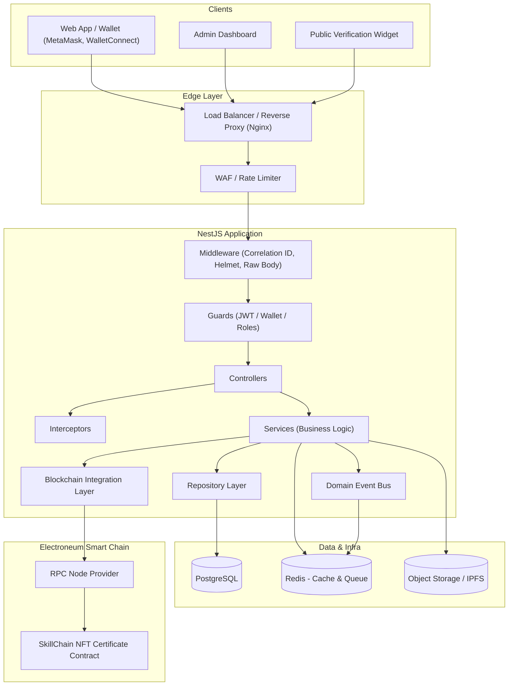

**Key principles**
- Controllers are thin — validation + delegation only.
- Services contain all business logic and orchestrate repositories, blockchain calls, and events.
- The **Blockchain Integration Layer** is the only module aware of `ethers.js`, contract ABIs, and gas logic.
- Domain events decouple side effects (notifications, cache invalidation, audit logging) from the core write path.
- All state-changing on-chain operations are queued and idempotent — never fired synchronously inside an HTTP request/response cycle without a durable job record.

---

## 2. Module Structure

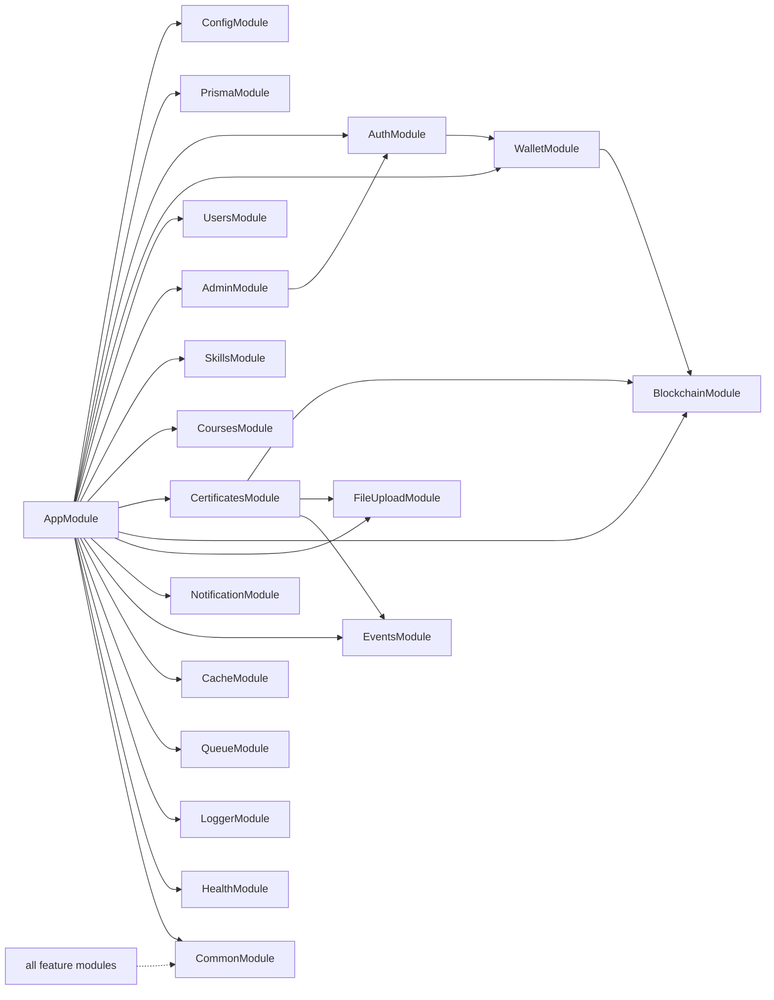

| Module | Responsibility |
|---|---|
| `ConfigModule` | Typed, validated environment configuration (`@nestjs/config` + schema validation) |
| `PrismaModule` | Global `PrismaService` provider, connection lifecycle |
| `AuthModule` | JWT issuance/refresh, session management, auth strategies |
| `WalletModule` | Wallet linking, SIWE nonce/signature verification |
| `UsersModule` | User profile CRUD, role management |
| `AdminModule` | Admin-only operations, issuer management, platform configuration |
| `SkillsModule` | Skill taxonomy CRUD |
| `CoursesModule` | Course/track definitions, enrollment, progress tracking |
| `CertificatesModule` | Certificate lifecycle: generation, issuance, revocation, verification |
| `BlockchainModule` | ethers.js provider, contract bindings, tx queue, chain event listeners |
| `FileUploadModule` | Multer config, S3/IPFS upload, PDF/image generation |
| `NotificationModule` | Email/webhook notifications, templating |
| `EventsModule` | Internal domain event bus (EventEmitter2) + outbox pattern |
| `CacheModule` | Redis cache abstraction |
| `QueueModule` | BullMQ queues for async/background jobs |
| `LoggerModule` | Structured logging provider |
| `HealthModule` | Liveness/readiness probes (Terminus) |
| `CommonModule` | Shared guards, pipes, decorators, filters, DTOs, utils |

---

## 3. Controllers

| Controller | Route Prefix | Key Responsibilities |
|---|---|---|
| `AuthController` | `/api/v1/auth` | Login, refresh token, logout |
| `WalletController` | `/api/v1/wallet` | Request nonce, verify signature, link/unlink wallet |
| `UsersController` | `/api/v1/users` | Profile read/update, list (admin-scoped) |
| `AdminAuthController` | `/api/v1/admin/auth` | Admin login (elevated flow) |
| `AdminController` | `/api/v1/admin` | Platform settings, issuer whitelist, role assignment |
| `SkillsController` | `/api/v1/skills` | CRUD for skill taxonomy |
| `CoursesController` | `/api/v1/courses` | Course CRUD, enrollment, completion marking |
| `CertificatesController` | `/api/v1/certificates` | Issue, list, get by ID, revoke |
| `CertificateVerificationController` | `/api/v1/verify` | **Public**, unauthenticated verification endpoint |
| `FilesController` | `/api/v1/files` | Signed upload URLs, file metadata |
| `HealthController` | `/api/v1/health` | Liveness/readiness/deep health checks |
| `WebhookController` | `/api/v1/webhooks` | Inbound webhooks (payment provider, IPFS pinning service) — raw body verified |

Controllers never call `PrismaService` or `ethers.js` directly — only injected services.

---

## 4. Services

| Service | Role |
|---|---|
| `AuthService` | Credential validation, JWT signing/verification, refresh rotation |
| `WalletAuthService` | Nonce lifecycle, SIWE message construction/verification |
| `UserService` | User CRUD, role assignment |
| `AdminService` | Admin-specific orchestration, issuer registry |
| `SkillService` | Skill taxonomy logic |
| `CourseService` | Enrollment, progress, completion evaluation |
| `CertificateService` | Orchestrates: eligibility check → asset generation → pin → mint → persist |
| `CertificateVerificationService` | Cross-checks DB record against on-chain state |
| `BlockchainService` | Low-level chain reads/writes, gas estimation, nonce management for issuer wallet |
| `ContractEventListenerService` | Subscribes to contract events, reconciles DB state |
| `TransactionQueueService` | Durable queue for outbound transactions with retry/backoff |
| `FileUploadService` | Handles multipart upload, virus scan trigger, storage abstraction |
| `CertificateRendererService` | Generates certificate PDF/image from template |
| `IpfsPinningService` | Pins metadata/assets to IPFS, returns CID |
| `NotificationService` | Sends email/webhook on domain events |
| `AuditLogService` | Writes immutable audit trail entries |
| `CacheService` | Get/set/invalidate wrapper around Redis |

---

## 5. DTOs

DTOs are grouped by module and split into **Request** and **Response** shapes, all validated via `class-validator` (implementation omitted per instructions — described conceptually).

- **Auth:** `LoginRequestDto`, `RefreshTokenRequestDto`, `AuthTokenResponseDto`
- **Wallet:** `NonceRequestDto`, `WalletVerifySignatureDto`, `LinkedWalletResponseDto`
- **Users:** `UpdateProfileDto`, `UserResponseDto`, `AssignRoleDto`
- **Skills:** `CreateSkillDto`, `UpdateSkillDto`, `SkillResponseDto`
- **Courses:** `CreateCourseDto`, `EnrollCourseDto`, `MarkCompletionDto`, `CourseResponseDto`
- **Certificates:** `IssueCertificateRequestDto`, `RevokeCertificateDto`, `CertificateResponseDto`, `CertificateVerificationResponseDto`
- **Files:** `SignedUploadRequestDto`, `FileMetadataResponseDto`
- **Common:** `PaginationQueryDto`, `ApiResponseEnvelopeDto<T>`, `ErrorResponseDto`

Conventions:
- Every list endpoint accepts a shared `PaginationQueryDto` (page, limit, sort, filter).
- Every response is wrapped in a consistent envelope (`success`, `data`, `meta`, `error`).
- Blockchain-facing DTOs never accept raw private keys or unvalidated addresses — addresses are checksummed and validated against EVM address format.

---

## 6. Guards

| Guard | Purpose |
|---|---|
| `JwtAuthGuard` | Validates access token, attaches `user` to request |
| `WalletAuthGuard` | Validates a wallet-signature-derived session (used during linking flow) |
| `RolesGuard` | Enforces `@Roles()` metadata (e.g., `LEARNER`, `ISSUER`, `ADMIN`, `SUPER_ADMIN`) |
| `AdminGuard` | Extra check for admin-scoped routes, combined with `RolesGuard` |
| `RefreshTokenGuard` | Validates refresh token against stored hash/rotation record |
| `ThrottlerGuard` | Global + route-level rate limiting |
| `WebhookSignatureGuard` | Verifies HMAC signature on inbound webhooks using raw body |
| `OwnershipGuard` | Ensures a user can only act on resources they own (e.g., their own certificate) |

Guard execution order: `ThrottlerGuard` → `JwtAuthGuard`/`WalletAuthGuard` → `RolesGuard`/`AdminGuard` → `OwnershipGuard`.

---

## 7. Interceptors

| Interceptor | Purpose |
|---|---|
| `ResponseTransformInterceptor` | Wraps all successful responses in the standard envelope |
| `LoggingInterceptor` | Logs method, route, latency, correlation ID, actor |
| `TimeoutInterceptor` | Enforces per-route timeout, converts to `RequestTimeoutException` |
| `CacheInterceptor` (custom) | Read-through cache for idempotent GET endpoints (e.g., verification, skill catalog) |
| `BlockchainTxInterceptor` | Attaches tx metadata (hash, status, block confirmations) to responses that reference on-chain state |
| `AuditInterceptor` | Emits audit log entries for mutating admin operations |

---

## 8. Filters

| Filter | Scope |
|---|---|
| `GlobalExceptionFilter` | Catches all unhandled exceptions, normalizes error envelope, hides internals in production |
| `PrismaExceptionFilter` | Maps Prisma error codes (`P2002`, `P2025`, etc.) to appropriate HTTP responses |
| `ValidationExceptionFilter` | Formats `class-validator` errors into a field-level error map |
| `BlockchainExceptionFilter` | Maps chain errors (insufficient funds, nonce too low, reverted tx, RPC timeout) to domain-specific error codes |
| `ThrottlerExceptionFilter` | Returns standardized 429 payload with `retryAfter` |

---

## 9. Middleware

| Middleware | Purpose |
|---|---|
| `CorrelationIdMiddleware` | Generates/propagates `X-Correlation-Id` for tracing across logs |
| `HelmetMiddleware` | Security headers |
| `CompressionMiddleware` | Response compression |
| `RawBodyMiddleware` | Preserves raw body on webhook routes for signature verification (applied before JSON body parsing on those routes only) |
| `RequestLoggerMiddleware` | Access-log style logging (method, path, status, duration) |
| `MaintenanceModeMiddleware` | Short-circuits non-health routes during planned maintenance windows |

Middleware is applied globally except `RawBodyMiddleware`, which is scoped only to `/api/v1/webhooks/*`.

---

## 10. Authentication Flow (Standard Email/Password + JWT)

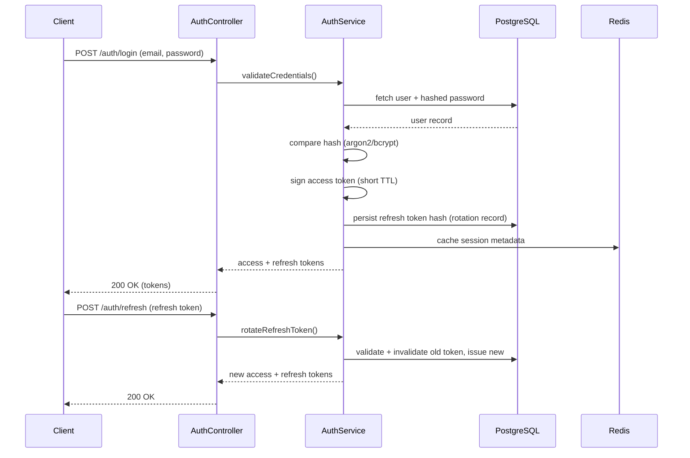

- Access tokens: short-lived (e.g., 15 min), signed with a dedicated secret/key.
- Refresh tokens: rotated on every use, stored hashed, detect reuse → revoke entire session family (theft detection).
- Logout invalidates the refresh token family server-side.

---

## 11. Wallet Authentication (Sign-In-With-Ethereum style)

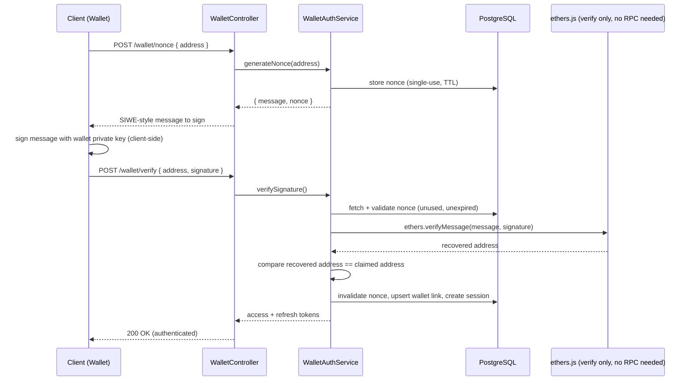

**Security details**
- Nonce is single-use, time-boxed (e.g., 5 minutes), bound to the requesting address.
- Message includes: domain, address, nonce, issued-at timestamp, chain ID — mitigates replay across chains/domains.
- Recovered address is checksum-compared, never trusted from client-supplied fields alone.
- A wallet can be linked to at most one active account (or many, per product rule) — enforced at the DB unique-constraint level.

---

## 12. Admin Authentication

Admins require **elevated assurance** beyond standard login:

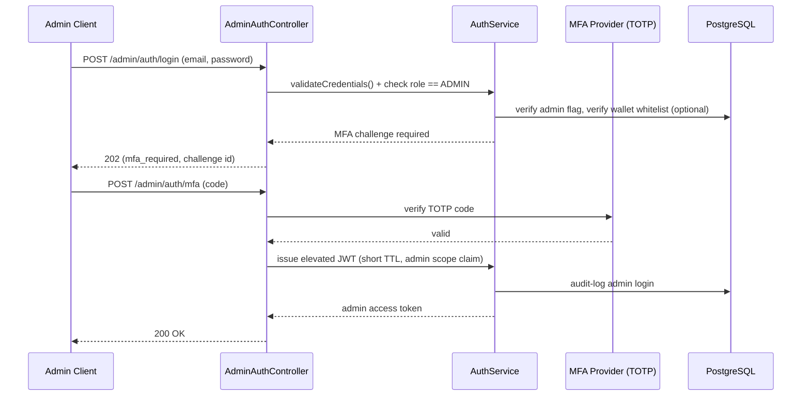

**Additional controls**
- Admin JWTs carry a distinct `scope: admin` claim and shorter TTL than user tokens (e.g., 10 minutes, re-authenticate for sensitive ops).
- Optional: require the admin's linked wallet to match an on-chain issuer whitelist before allowing certificate-minting operations — combines credential auth with wallet-based authorization.
- All admin actions pass through `AuditInterceptor` regardless of MFA — full traceability.
- IP allow-listing / step-up auth for highly destructive actions (revoke certificate, change issuer wallet) is a recommended optional layer.

---

## 13. Database Layer

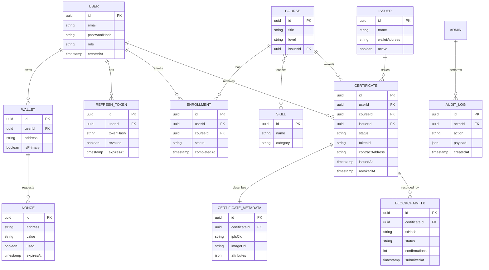

**Notes**
- `CERTIFICATE.status`: `PENDING` → `MINTING` → `ISSUED` → `REVOKED` / `FAILED` — explicit state machine, never inferred.
- `BLOCKCHAIN_TX` keeps a full history per certificate (supports retries — one certificate can have multiple tx attempts).
- Sensitive PII (email) is isolated from blockchain-facing identifiers (wallet address, token ID) to ease future data-minimization/right-to-erasure work — the chain is immutable, the off-chain DB is not.

---

## 14. Repository Layer

- One repository per aggregate root: `UserRepository`, `WalletRepository`, `CourseRepository`, `CertificateRepository`, `IssuerRepository`, `AuditLogRepository`.
- Repositories encapsulate **all** Prisma query logic — services never call `prisma.model.method()` directly.
- Repositories return domain-shaped objects (not raw Prisma types) where mapping adds value, keeping Prisma an implementation detail.
- Complex read queries (e.g., verification lookups joining certificate + metadata + tx) live in the repository, not scattered across services.
- Transactions spanning multiple repositories (e.g., certificate creation + tx record creation) are coordinated via a `UnitOfWork`-style helper wrapping `prisma.$transaction`.

---

## 15. Prisma Integration

- `PrismaService` extends `PrismaClient`, implements `OnModuleInit`/`OnModuleDestroy` for clean connect/disconnect, registered as a **global** provider via `PrismaModule`.
- Connection pooling tuned via `DATABASE_URL` params (`connection_limit`, `pool_timeout`), sized to NestJS instance count × expected concurrency.
- Migrations: `prisma migrate deploy` run as a distinct CI/CD step before app boot — never `migrate dev` in production.
- Schema organized by domain with clear naming (`snake_case` DB columns via `@map`, `PascalCase` models).
- Soft-delete pattern (`deletedAt`) used for `User` and `Course`; certificates are never hard-deleted (immutable audit trail mirrors chain immutability).
- Seeding script for local/dev: skill taxonomy, sample issuers, test contract addresses.
- Read replicas (optional, later stage): Prisma configured with a secondary read-only datasource for verification/read-heavy traffic if scale demands it.

---

## 16. Event System

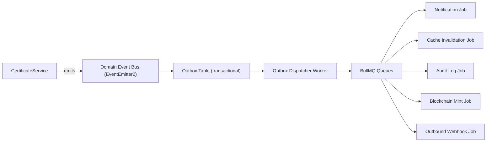

**Key domain events:** `CertificateRequested`, `CertificateMinted`, `CertificateRevoked`, `WalletLinked`, `CourseCompleted`, `EnrollmentCreated`, `AdminActionPerformed`.

- In-process events (`EventEmitter2`) drive same-process reactions (cache invalidation, logging).
- For anything that **must not be lost** (minting a certificate, sending a required notification), the **transactional outbox pattern** is used: the event is written to an `outbox` table in the same DB transaction as the state change, then a background dispatcher reliably relays it to BullMQ — this avoids the classic "DB commit succeeded but event was dropped" failure mode.
- BullMQ (Redis-backed) handles retries, backoff, and dead-letter queues for jobs like blockchain minting, which can fail transiently (RPC timeouts, gas spikes).

---

## 17. File Upload Strategy

- **Multer** (memory storage, not disk) handles multipart parsing at the edge of `FileUploadModule`.
- Strict validation: MIME-type allow-list, max file size, extension/content-type cross-check.
- Files are streamed to **S3-compatible object storage** for general assets (profile images, course thumbnails).
- Certificate assets specifically are pinned to **IPFS** (via a pinning service such as Pinata/Web3.Storage) so the metadata referenced by the NFT `tokenURI` is content-addressed and durable, independent of SkillChain's own infrastructure.
- Flow: upload → optional virus scan (ClamAV or third-party API) → store in S3/IPFS → persist reference (URL/CID) in DB → never store raw binary in PostgreSQL.
- Signed, short-TTL upload URLs are preferred over proxying large files through the API process where feasible.

---

## 18. Certificate Generation Flow

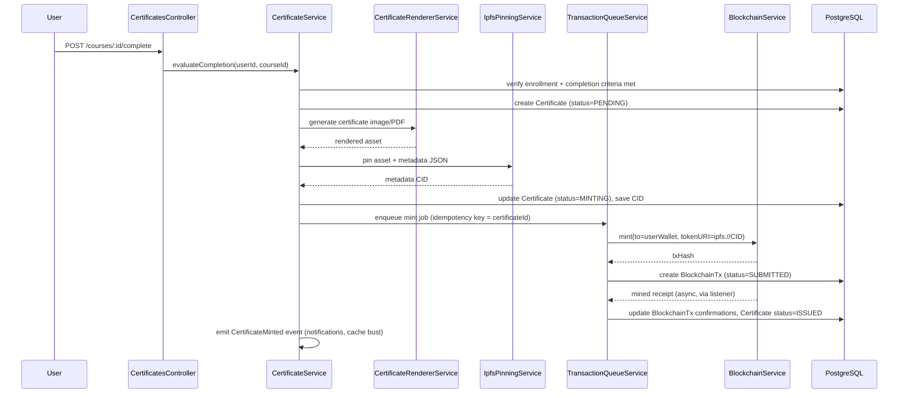

**Idempotency & reliability**
- Mint jobs are keyed by `certificateId`; retries never double-mint because the job checks current DB status before submitting a new transaction.
- If a transaction is dropped/underpriced, the queue resubmits with adjusted gas rather than creating a duplicate certificate record.
- Certificate is only marked `ISSUED` after a configurable number of block confirmations, not immediately on tx submission.

---

## 19. Certificate Verification Flow

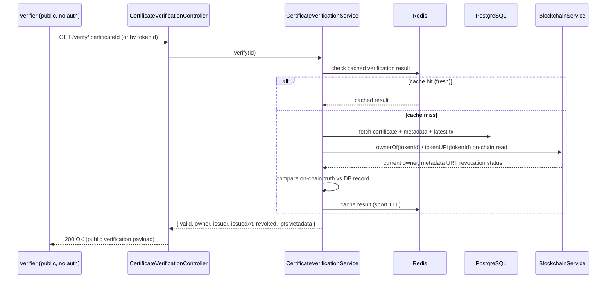

- **On-chain state is the source of truth**; the database is a fast, convenient index. Verification always reconciles both, and on mismatch trusts the chain and flags the DB record for reconciliation.
- Endpoint is public, unauthenticated, but still rate-limited to prevent scraping/abuse.
- Response deliberately excludes any PII beyond what's already public on-chain (wallet address, issuer, course name) — no email, no internal user IDs.

---

## 20. Smart Contract Interaction Layer

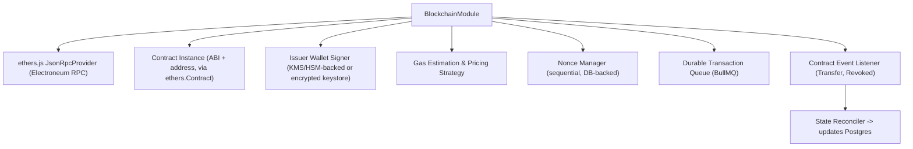

**Responsibilities isolated in this layer:**
- Single, injectable `BlockchainService` exposing domain-level methods (`mintCertificate`, `revokeCertificate`, `getCertificateOwner`, `isRevoked`) — no controller or other service imports `ethers` directly.
- **Nonce management**: sequential nonce tracked in DB (not just relying on the RPC node) to avoid collisions under concurrent job processing; reconciled periodically against on-chain nonce.
- **Gas strategy**: fetch current network fee data, apply configurable buffer/cap, support EIP-1559-style fee fields if supported by Electroneum's client, with a fallback legacy gas price mode.
- **Retry/backoff**: transient RPC errors retried with exponential backoff; permanent reverts (e.g., "already minted") are not retried and surface as domain errors.
- **Event listener service**: subscribes to `Transfer` and custom `CertificateRevoked` events, reconciles DB state on every block/confirmation — protects against missed events with periodic backfill against the last processed block number (stored in DB, not memory).
- **Key management**: issuer's signing key is never stored in plaintext in the DB or repo — sourced from a secrets manager / KMS / HSM, injected at runtime via `ConfigModule`.
- Contract ABI and address are environment-scoped (testnet vs mainnet) and versioned in source control as JSON artifacts (produced by Hardhat compile), not hand-maintained.

---

## 21. API Versioning

- **URI-based versioning**: `/api/v1/...`, using NestJS's built-in `VersioningType.URI`.
- Each module's controllers declare their version explicitly; breaking changes ship as `/api/v2/...` with the old version kept alive during a deprecation window.
- Deprecated versions return a `Deprecation` / `Sunset` HTTP header to signal clients ahead of removal.
- Internal DTOs are versioned alongside controllers where the contract diverges; shared/common DTOs remain version-agnostic.

---

## 22. Error Handling

- Single **error taxonomy**: `DomainException` base class with subclasses (`ValidationException`, `NotFoundException`, `ConflictException`, `BlockchainException`, `UnauthorizedException`, `ForbiddenException`) — each mapped to an HTTP status and a stable machine-readable `errorCode`.
- Standard error envelope:
  - `success: false`
  - `error.code` (e.g., `CERTIFICATE_ALREADY_ISSUED`)
  - `error.message` (human-readable, safe for client display)
  - `error.correlationId`
  - `error.details` (optional field-level validation errors)
- Stack traces and internal details are logged, never returned to the client in production.
- `GlobalExceptionFilter` is the single place that shapes the final HTTP error response; all other filters normalize into `DomainException` first.

---

## 23. Logging

- Structured JSON logging (Pino) — every log line includes `correlationId`, `timestamp`, `level`, `context`, `actorId` (when authenticated), `route`.
- Log levels: `fatal`, `error`, `warn`, `info`, `debug`, `trace` — `debug`/`trace` disabled in production by default, toggle via config.
- Sensitive fields (password hashes, tokens, private keys, full wallet signatures) are redacted via a logging serializer allow-list, never logged by default.
- Blockchain interactions log tx hash, gas used, and confirmation status at `info`; RPC errors logged at `warn`/`error` with retry attempt count.
- Logs are shipped to a centralized aggregator (e.g., ELK/Loki) — not just stdout in production.

---

## 24. Monitoring

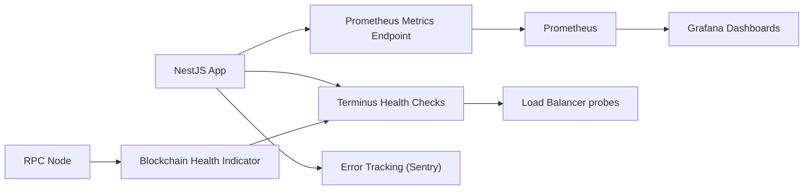

- **Terminus** health module: `/health/liveness` (process up), `/health/readiness` (DB, Redis, RPC node reachable), `/health/deep` (contract read succeeds).
- **Prometheus** metrics: request rate/latency/error-rate (RED metrics), queue depth/lag, pending transaction count, DB pool utilization, cache hit ratio.
- **Custom blockchain metrics**: mempool wait time, average confirmation time, failed-transaction rate, issuer wallet balance (alert on low balance — a common Web3 outage cause).
- **Error tracking** (Sentry or equivalent) captures unhandled exceptions with correlation ID linkage back to structured logs.
- Alerting thresholds: elevated 5xx rate, queue backlog growth, RPC node latency/failure spikes, issuer wallet balance below threshold.

---

## 25. Rate Limiting

- Global baseline via `ThrottlerModule`, tiered by route sensitivity:
  - **Public verification endpoint**: generous but capped per-IP (e.g., 60 req/min) — must stay usable for legitimate embedding/widgets while resisting scraping.
  - **Auth endpoints** (`/login`, `/wallet/nonce`, `/wallet/verify`): tight limits per-IP and per-identifier to blunt credential stuffing and nonce-spam.
  - **Admin/mint-triggering endpoints**: strict per-account limits, since each call may enqueue a paid on-chain transaction.
- Redis-backed throttler storage so limits are correctly enforced across multiple app instances.
- 429 responses include `Retry-After` and are shaped through `ThrottlerExceptionFilter`.

---

## 26. Caching

- **Redis** as the caching layer, accessed only through `CacheService` (no direct Redis calls scattered in services).
- Cached: certificate verification results (short TTL, e.g., 30–60s, since chain state can change), skill/course catalog reads (longer TTL, invalidated on write), issuer public profile data.
- **Cache invalidation** is event-driven: `CertificateMinted`/`CertificateRevoked`/`CourseUpdated` events trigger targeted key invalidation rather than blanket flushes.
- Cache keys are namespaced (`skillchain:cert:verify:{id}`) and versioned to allow safe schema evolution without stale-shape collisions.
- Write-through avoided for volatile chain-dependent data; read-through with short TTL preferred to bound staleness.

---

## 27. Security Best Practices

- **Transport & headers**: HTTPS everywhere, HSTS, Helmet defaults, strict CORS allow-list (no wildcard in production).
- **AuthN/AuthZ**: short-lived JWTs, rotated refresh tokens with reuse detection, RBAC via `RolesGuard`, resource-level ownership checks via `OwnershipGuard`.
- **Wallet security**: nonce single-use + TTL, EIP-191/SIWE-style domain-bound messages to prevent cross-site replay, checksummed address validation.
- **Key management**: issuer private key never in source control or plaintext env files in production — KMS/HSM or encrypted secrets manager; principle of least privilege on who/what can trigger a mint.
- **Input validation**: all DTOs validated and whitelisted (`class-validator` + `ValidationPipe` with `forbidNonWhitelisted`), strict typing on addresses/amounts.
- **Injection protection**: Prisma parameterizes queries by default; raw queries avoided or strictly parameterized when unavoidable.
- **Secrets management**: environment variables sourced from a vault/secrets manager, never committed; `ConfigModule` validates presence/shape at boot (fail fast).
- **Audit trail**: every admin and issuance action recorded immutably in `AuditLog`.
- **Dependency hygiene**: automated vulnerability scanning (`npm audit`/Snyk) in CI, Hardhat contract dependencies pinned and audited separately.
- **Replay/reentrancy on-chain**: mint/revoke functions on the contract side are guarded (access control + reentrancy guard) — verified via Hardhat test suite, not just trusted.
- **Least privilege infra**: DB user for the app has no superuser rights; separate migration-runner credentials with elevated schema privileges used only in CI/CD.

---

## 28. Testing Strategy

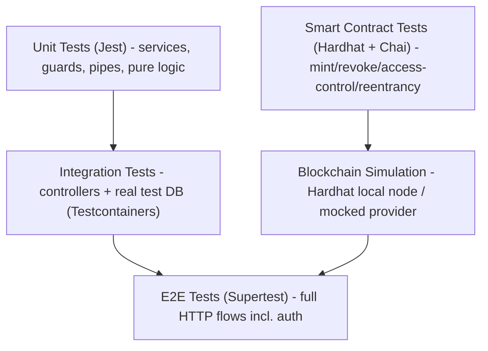

- **Unit tests**: services tested in isolation with mocked repositories/`BlockchainService`; guards and pipes tested with mocked `ExecutionContext`.
- **Integration tests**: real PostgreSQL via Testcontainers (not mocks), verifying repository + Prisma behavior and transaction correctness.
- **Contract tests**: Hardhat + Chai/Waffle-style assertions covering minting, revocation, access control (only issuer role can mint), and reentrancy/edge cases — run independently of the NestJS test suite.
- **E2E tests**: Supertest against a fully bootstrapped Nest app with a local Hardhat node standing in for Electroneum, covering the full certificate issuance and verification journeys.
- **Contract-provider mocking**: `BlockchainService` is designed behind an interface so most Nest-level tests substitute a fake/mock provider — only a small, dedicated E2E suite runs against a real local Hardhat node.
- **CI gating**: unit + integration required to merge; contract + E2E run on every PR against `main` and before deploy.

---

## 29. Deployment Considerations

- **Containerization**: multi-stage Docker build (build stage compiles TypeScript, runtime stage ships only production deps + `dist`).
- **Environment separation**: distinct `.env`/secret sets for `local`, `staging` (Electroneum **testnet**, test contract address), and `production` (Electroneum **mainnet**, audited contract address) — enforced via `ConfigModule` validation so the app refuses to boot with a mismatched chain ID/contract pair.
- **Migrations**: run as a pre-deploy CI/CD step (`prisma migrate deploy`), never on app boot, to avoid race conditions across multiple replicas starting simultaneously.
- **Zero-downtime deploys**: rolling or blue/green deployment behind the load balancer; readiness probes gate traffic cutover.
- **Horizontal scaling**: stateless app instances (sessions/nonces live in Redis/DB, not in-memory), so scaling out is safe; the **transaction queue and nonce manager must remain singleton-consistent** — achieved via DB/Redis-backed locking rather than in-process state.
- **Background workers**: BullMQ workers (mint jobs, event reconciliation, notifications) deployed as separate processes/pods from the HTTP API, scaled independently.
- **Secrets & key custody**: issuer signing key provisioned via the deployment platform's secrets manager/KMS integration, injected at container start, never baked into the image.
- **Disaster recovery**: PostgreSQL automated backups + point-in-time recovery; the on-chain state is inherently durable and serves as the ultimate reconciliation source if the DB needs restoration.
- **Observability on deploy**: canary monitoring of error rate/latency immediately post-deploy, automatic rollback trigger on threshold breach.

---

*This document intentionally omits implementation code, per requirements — it defines contracts, responsibilities, and flows for the engineering team to implement in NestJS.*