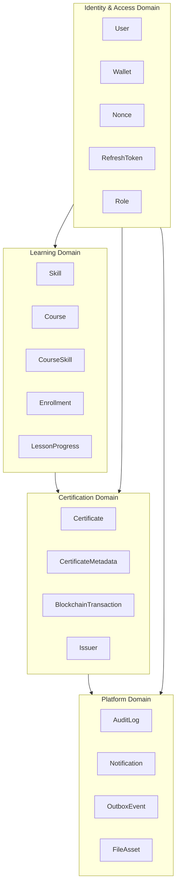
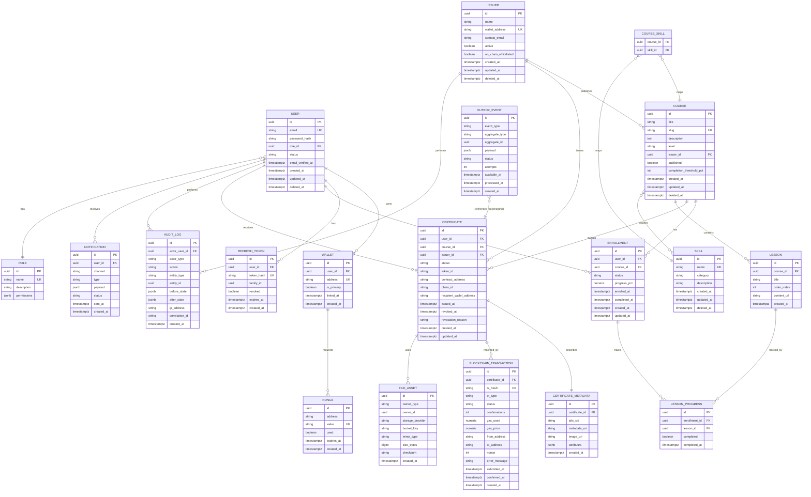
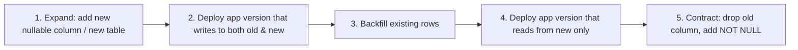
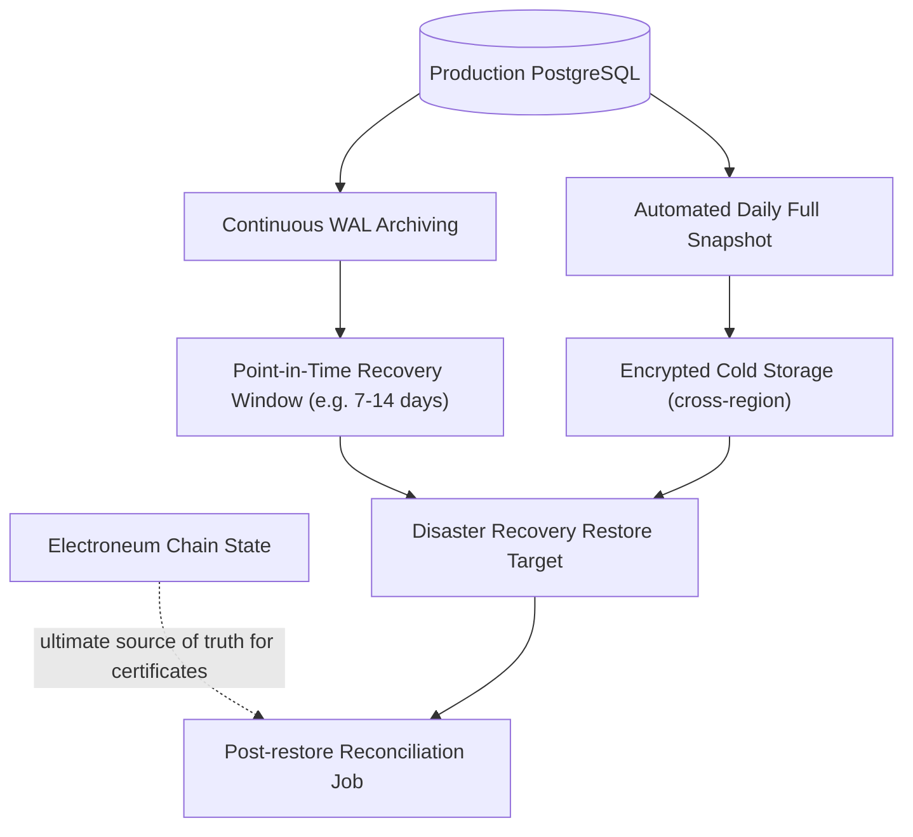

# SkillChain — Database Design Blueprint
**Engine:** PostgreSQL 15+ · **ORM:** Prisma · **Chain:** Electroneum Smart Chain

This document is the authoritative schema blueprint. It is implementation-adjacent (Prisma field mappings are shown because the schema itself *is* the deliverable), but contains no application/business logic code.

---

## 1. Database Architecture

### 1.1 Design Principles

| Principle | Application |
|---|---|
| **On-chain is truth, off-chain is index** | Certificate ownership/revocation ultimately reconciles against the contract; Postgres is a fast, queryable mirror + everything the chain can't store (email, course content, analytics). |
| **Immutability where it matters** | `Certificate`, `BlockchainTransaction`, `AuditLog` rows are never hard-deleted or mutated after finalization — only status transitions are appended. |
| **Soft delete for user-facing entities** | `User`, `Course`, `Skill`, `Issuer` use `deletedAt` — supports GDPR-style "remove from view" without breaking referential/audit history. |
| **UUID primary keys everywhere** | No sequential integer PKs — prevents enumeration attacks on public-facing IDs (especially certificate/verification endpoints) and simplifies future multi-region/sharded writes. |
| **Explicit state machines** | Status fields are Postgres `enum` types, not free-text strings — invalid transitions are unrepresentable at the schema level. |
| **Separation of PII from chain-facing data** | Wallet addresses, token IDs, tx hashes live in tables separate from email/name — narrows the blast radius of any future data-minimization requirement. |
| **Append-only audit trail** | `AuditLog` and `BlockchainTransaction` are insert-only tables; no `UPDATE`/`DELETE` grants for the application DB role on these tables in production. |

### 1.2 Schema Domains



---

## 2. Entity-Relationship Diagram (Full)



---

## 3. Table-by-Table Specification

Conventions used throughout:
- All PKs: `id UUID DEFAULT gen_random_uuid()` (see §5, UUID Strategy).
- All timestamps: `TIMESTAMPTZ`, stored UTC.
- All tables (except append-only logs) carry `created_at` / `updated_at`; soft-deletable tables additionally carry `deleted_at`.

### 3.1 `users`

| Column | Type | Constraints |
|---|---|---|
| `id` | UUID | PK, default `gen_random_uuid()` |
| `email` | CITEXT | UNIQUE, NOT NULL |
| `password_hash` | TEXT | NOT NULL (nullable if wallet-only account — see §9.2) |
| `role_id` | UUID | FK → `roles.id`, NOT NULL |
| `status` | `user_status` ENUM | NOT NULL, DEFAULT `'ACTIVE'` — `ACTIVE`, `SUSPENDED`, `PENDING_VERIFICATION` |
| `display_name` | TEXT | NULL |
| `email_verified_at` | TIMESTAMPTZ | NULL |
| `created_at` | TIMESTAMPTZ | NOT NULL, DEFAULT `now()` |
| `updated_at` | TIMESTAMPTZ | NOT NULL, DEFAULT `now()` (auto via trigger) |
| `deleted_at` | TIMESTAMPTZ | NULL — soft delete |

**Indexes:** unique on `email` (partial: `WHERE deleted_at IS NULL`); btree on `role_id`; btree on `status`.

---

### 3.2 `roles`

| Column | Type | Constraints |
|---|---|---|
| `id` | UUID | PK |
| `name` | TEXT | UNIQUE, NOT NULL — `LEARNER`, `ISSUER_ADMIN`, `ADMIN`, `SUPER_ADMIN` |
| `description` | TEXT | NULL |
| `permissions` | JSONB | NOT NULL, DEFAULT `'{}'` — fine-grained permission flags |

**Indexes:** unique on `name`.

*Rationale for a `roles` table over a plain enum on `users`:* permissions are data (`jsonb`), not hardcoded, so new granular permissions can be added without a migration touching every role check.

---

### 3.3 `wallets`

| Column | Type | Constraints |
|---|---|---|
| `id` | UUID | PK |
| `user_id` | UUID | FK → `users.id`, NOT NULL, `ON DELETE CASCADE` |
| `address` | CITEXT | UNIQUE, NOT NULL — EVM checksum address |
| `is_primary` | BOOLEAN | NOT NULL, DEFAULT `false` |
| `linked_at` | TIMESTAMPTZ | NOT NULL, DEFAULT `now()` |
| `created_at` | TIMESTAMPTZ | NOT NULL, DEFAULT `now()` |

**Constraints:**
- `UNIQUE (address)` — one wallet belongs to exactly one user platform-wide.
- Partial unique index `UNIQUE (user_id) WHERE is_primary = true` — at most one primary wallet per user.

**Indexes:** btree on `user_id`; unique on `address`.

---

### 3.4 `nonces`

| Column | Type | Constraints |
|---|---|---|
| `id` | UUID | PK |
| `address` | CITEXT | NOT NULL |
| `value` | TEXT | UNIQUE, NOT NULL — random nonce string |
| `used` | BOOLEAN | NOT NULL, DEFAULT `false` |
| `expires_at` | TIMESTAMPTZ | NOT NULL |
| `created_at` | TIMESTAMPTZ | NOT NULL, DEFAULT `now()` |

**Indexes:** btree on `(address, used, expires_at)` — fast lookup of the latest valid nonce for an address; unique on `value`.

**Lifecycle:** rows older than 24h and `used = true` (or expired) are purged by a scheduled job — this table is high-churn and intentionally not audit-critical.

---

### 3.5 `refresh_tokens`

| Column | Type | Constraints |
|---|---|---|
| `id` | UUID | PK |
| `user_id` | UUID | FK → `users.id`, NOT NULL, `ON DELETE CASCADE` |
| `token_hash` | TEXT | UNIQUE, NOT NULL — never store raw token |
| `family_id` | UUID | NOT NULL — groups a rotation chain for reuse detection |
| `revoked` | BOOLEAN | NOT NULL, DEFAULT `false` |
| `expires_at` | TIMESTAMPTZ | NOT NULL |
| `created_at` | TIMESTAMPTZ | NOT NULL, DEFAULT `now()` |

**Indexes:** btree on `user_id`; btree on `family_id`; unique on `token_hash`.

---

### 3.6 `issuers`

| Column | Type | Constraints |
|---|---|---|
| `id` | UUID | PK |
| `name` | TEXT | NOT NULL |
| `wallet_address` | CITEXT | UNIQUE, NOT NULL |
| `contact_email` | CITEXT | NULL |
| `active` | BOOLEAN | NOT NULL, DEFAULT `true` |
| `on_chain_whitelisted` | BOOLEAN | NOT NULL, DEFAULT `false` — mirrors contract-level access control state |
| `created_at` | TIMESTAMPTZ | NOT NULL, DEFAULT `now()` |
| `updated_at` | TIMESTAMPTZ | NOT NULL, DEFAULT `now()` |
| `deleted_at` | TIMESTAMPTZ | NULL |

**Indexes:** unique on `wallet_address`; btree on `active`.

---

### 3.7 `skills`

| Column | Type | Constraints |
|---|---|---|
| `id` | UUID | PK |
| `name` | TEXT | UNIQUE, NOT NULL |
| `category` | TEXT | NOT NULL |
| `description` | TEXT | NULL |
| `created_at` | TIMESTAMPTZ | NOT NULL, DEFAULT `now()` |
| `updated_at` | TIMESTAMPTZ | NOT NULL, DEFAULT `now()` |
| `deleted_at` | TIMESTAMPTZ | NULL |

**Indexes:** unique on `name`; btree on `category`.

---

### 3.8 `courses`

| Column | Type | Constraints |
|---|---|---|
| `id` | UUID | PK |
| `title` | TEXT | NOT NULL |
| `slug` | TEXT | UNIQUE, NOT NULL |
| `description` | TEXT | NULL |
| `level` | `course_level` ENUM | NOT NULL — `BEGINNER`, `INTERMEDIATE`, `ADVANCED` |
| `issuer_id` | UUID | FK → `issuers.id`, NOT NULL |
| `published` | BOOLEAN | NOT NULL, DEFAULT `false` |
| `completion_threshold_pct` | SMALLINT | NOT NULL, DEFAULT `100`, CHECK `BETWEEN 0 AND 100` |
| `created_at` | TIMESTAMPTZ | NOT NULL, DEFAULT `now()` |
| `updated_at` | TIMESTAMPTZ | NOT NULL, DEFAULT `now()` |
| `deleted_at` | TIMESTAMPTZ | NULL |

**Indexes:** unique on `slug`; btree on `issuer_id`; btree on `(published, deleted_at)` for catalog listing queries.

---

### 3.9 `course_skills` (join table)

| Column | Type | Constraints |
|---|---|---|
| `course_id` | UUID | FK → `courses.id`, `ON DELETE CASCADE` |
| `skill_id` | UUID | FK → `skills.id`, `ON DELETE CASCADE` |

**Constraints:** composite PK `(course_id, skill_id)`.
**Indexes:** btree on `skill_id` (reverse lookup: "courses teaching skill X").

---

### 3.10 `lessons`

| Column | Type | Constraints |
|---|---|---|
| `id` | UUID | PK |
| `course_id` | UUID | FK → `courses.id`, NOT NULL, `ON DELETE CASCADE` |
| `title` | TEXT | NOT NULL |
| `order_index` | INTEGER | NOT NULL |
| `content_url` | TEXT | NULL |
| `created_at` | TIMESTAMPTZ | NOT NULL, DEFAULT `now()` |

**Constraints:** `UNIQUE (course_id, order_index)`.
**Indexes:** btree on `course_id`.

---

### 3.11 `enrollments`

| Column | Type | Constraints |
|---|---|---|
| `id` | UUID | PK |
| `user_id` | UUID | FK → `users.id`, NOT NULL, `ON DELETE CASCADE` |
| `course_id` | UUID | FK → `courses.id`, NOT NULL |
| `status` | `enrollment_status` ENUM | NOT NULL, DEFAULT `'IN_PROGRESS'` — `IN_PROGRESS`, `COMPLETED`, `WITHDRAWN` |
| `progress_pct` | NUMERIC(5,2) | NOT NULL, DEFAULT `0`, CHECK `BETWEEN 0 AND 100` |
| `enrolled_at` | TIMESTAMPTZ | NOT NULL, DEFAULT `now()` |
| `completed_at` | TIMESTAMPTZ | NULL |
| `created_at` | TIMESTAMPTZ | NOT NULL, DEFAULT `now()` |
| `updated_at` | TIMESTAMPTZ | NOT NULL, DEFAULT `now()` |

**Constraints:** `UNIQUE (user_id, course_id)` — one active enrollment per user per course.
**Indexes:** btree on `(user_id, status)`; btree on `(course_id, status)`.

---

### 3.12 `lesson_progress`

| Column | Type | Constraints |
|---|---|---|
| `id` | UUID | PK |
| `enrollment_id` | UUID | FK → `enrollments.id`, NOT NULL, `ON DELETE CASCADE` |
| `lesson_id` | UUID | FK → `lessons.id`, NOT NULL |
| `completed` | BOOLEAN | NOT NULL, DEFAULT `false` |
| `completed_at` | TIMESTAMPTZ | NULL |

**Constraints:** `UNIQUE (enrollment_id, lesson_id)`.
**Indexes:** btree on `enrollment_id`.

---

### 3.13 `certificates`

The central aggregate of the certification domain — **never hard-deleted**.

| Column | Type | Constraints |
|---|---|---|
| `id` | UUID | PK |
| `user_id` | UUID | FK → `users.id`, NOT NULL |
| `course_id` | UUID | FK → `courses.id`, NOT NULL |
| `issuer_id` | UUID | FK → `issuers.id`, NOT NULL |
| `status` | `certificate_status` ENUM | NOT NULL, DEFAULT `'PENDING'` — `PENDING`, `MINTING`, `ISSUED`, `FAILED`, `REVOKED` |
| `token_id` | TEXT | NULL — set once minted; on-chain NFT token ID |
| `contract_address` | TEXT | NOT NULL |
| `chain_id` | TEXT | NOT NULL — e.g. Electroneum mainnet/testnet chain ID |
| `recipient_wallet_address` | CITEXT | NOT NULL — snapshot at mint time (immutable even if user later changes primary wallet) |
| `issued_at` | TIMESTAMPTZ | NULL |
| `revoked_at` | TIMESTAMPTZ | NULL |
| `revocation_reason` | TEXT | NULL |
| `created_at` | TIMESTAMPTZ | NOT NULL, DEFAULT `now()` |
| `updated_at` | TIMESTAMPTZ | NOT NULL, DEFAULT `now()` |

**Constraints:**
- `UNIQUE (contract_address, token_id)` — partial, `WHERE token_id IS NOT NULL`.
- `UNIQUE (user_id, course_id)` — partial, `WHERE status != 'FAILED'` — a learner holds at most one non-failed certificate per course (re-issuance after `FAILED` is allowed).
- `CHECK (status != 'ISSUED' OR token_id IS NOT NULL)` — can't be `ISSUED` without a token ID.
- `CHECK (status != 'REVOKED' OR revoked_at IS NOT NULL)`.

**Indexes:**
- btree on `user_id`
- btree on `(course_id, status)`
- btree on `issuer_id`
- unique on `(contract_address, token_id)` (partial)
- btree on `recipient_wallet_address` — supports "certificates by wallet" public lookup

---

### 3.14 `certificate_metadata`

1:1 with `certificates` — split out because metadata (esp. `attributes` JSON) is written/read on a different cadence than the certificate lifecycle state.

| Column | Type | Constraints |
|---|---|---|
| `id` | UUID | PK |
| `certificate_id` | UUID | FK → `certificates.id`, UNIQUE, NOT NULL, `ON DELETE CASCADE` |
| `ipfs_cid` | TEXT | NULL |
| `metadata_uri` | TEXT | NULL — full `ipfs://` or `https://` tokenURI |
| `image_url` | TEXT | NULL |
| `attributes` | JSONB | NOT NULL, DEFAULT `'{}'` — NFT trait array, course metadata snapshot |
| `created_at` | TIMESTAMPTZ | NOT NULL, DEFAULT `now()` |

**Indexes:** unique on `certificate_id`; GIN index on `attributes` for trait-based queries.

---

### 3.15 `blockchain_transactions`

Append-only ledger of every on-chain interaction attempt for a certificate. **Insert-only** in production (no `UPDATE` grant — status changes are new rows referencing the same `certificate_id`, or see §9.4 for the alternative single-row-update model if preferred).

| Column | Type | Constraints |
|---|---|---|
| `id` | UUID | PK |
| `certificate_id` | UUID | FK → `certificates.id`, NOT NULL |
| `tx_hash` | TEXT | UNIQUE, NULL (null until submitted to mempool) |
| `tx_type` | `tx_type` ENUM | NOT NULL — `MINT`, `REVOKE` |
| `status` | `tx_status` ENUM | NOT NULL, DEFAULT `'PENDING'` — `PENDING`, `SUBMITTED`, `CONFIRMED`, `FAILED`, `DROPPED` |
| `confirmations` | INTEGER | NOT NULL, DEFAULT `0` |
| `gas_used` | NUMERIC(38,0) | NULL |
| `gas_price` | NUMERIC(38,0) | NULL |
| `from_address` | CITEXT | NOT NULL |
| `to_address` | CITEXT | NOT NULL |
| `nonce` | INTEGER | NULL |
| `error_message` | TEXT | NULL |
| `submitted_at` | TIMESTAMPTZ | NULL |
| `confirmed_at` | TIMESTAMPTZ | NULL |
| `created_at` | TIMESTAMPTZ | NOT NULL, DEFAULT `now()` |

**Indexes:** btree on `certificate_id`; unique on `tx_hash` (partial, `WHERE tx_hash IS NOT NULL`); btree on `(status, submitted_at)` — used by the reconciliation worker to find stuck transactions.

---

### 3.16 `file_assets`

Polymorphic reference table for uploaded/generated files (certificate images, course thumbnails, PDFs).

| Column | Type | Constraints |
|---|---|---|
| `id` | UUID | PK |
| `owner_type` | TEXT | NOT NULL — `'CERTIFICATE'`, `'COURSE'`, `'USER_AVATAR'` |
| `owner_id` | UUID | NOT NULL (no FK — polymorphic; integrity enforced at app layer) |
| `storage_provider` | TEXT | NOT NULL — `'S3'`, `'IPFS'` |
| `bucket_key` | TEXT | NOT NULL |
| `mime_type` | TEXT | NOT NULL |
| `size_bytes` | BIGINT | NOT NULL |
| `checksum` | TEXT | NOT NULL — SHA-256, dedup/integrity check |
| `created_at` | TIMESTAMPTZ | NOT NULL, DEFAULT `now()` |

**Indexes:** btree on `(owner_type, owner_id)`.

> **Design note:** polymorphic association trades referential integrity for flexibility. This is acceptable here because `file_assets` is a leaf table (nothing FKs *into* it) and ownership validation happens in the repository layer. If strict FK integrity is preferred, split into `certificate_files` / `course_files` join tables instead.

---

### 3.17 `audit_logs`

Insert-only, no soft delete, no update. This is the compliance/forensic backbone.

| Column | Type | Constraints |
|---|---|---|
| `id` | UUID | PK |
| `actor_user_id` | UUID | FK → `users.id`, NULL (null for system-initiated actions) |
| `actor_type` | TEXT | NOT NULL — `'USER'`, `'ADMIN'`, `'SYSTEM'` |
| `action` | TEXT | NOT NULL — e.g. `'CERTIFICATE_REVOKED'`, `'ISSUER_WHITELISTED'` |
| `entity_type` | TEXT | NOT NULL |
| `entity_id` | UUID | NOT NULL |
| `before_state` | JSONB | NULL |
| `after_state` | JSONB | NULL |
| `ip_address` | INET | NULL |
| `correlation_id` | TEXT | NULL |
| `created_at` | TIMESTAMPTZ | NOT NULL, DEFAULT `now()` |

**Indexes:** btree on `(entity_type, entity_id)`; btree on `actor_user_id`; btree on `created_at` (for retention/archival sweeps); GIN on `after_state` if querying by changed fields is needed.

**Retention:** partitioned by month (see §8.3) — old partitions archived to cold storage, not deleted, to satisfy audit requirements at lower storage cost.

---

### 3.18 `outbox_events`

Transactional outbox (see prior architecture doc §16).

| Column | Type | Constraints |
|---|---|---|
| `id` | UUID | PK |
| `event_type` | TEXT | NOT NULL |
| `aggregate_type` | TEXT | NOT NULL |
| `aggregate_id` | UUID | NOT NULL |
| `payload` | JSONB | NOT NULL |
| `status` | `outbox_status` ENUM | NOT NULL, DEFAULT `'PENDING'` — `PENDING`, `PROCESSING`, `PROCESSED`, `FAILED` |
| `attempts` | INTEGER | NOT NULL, DEFAULT `0` |
| `available_at` | TIMESTAMPTZ | NOT NULL, DEFAULT `now()` — supports delayed retry (backoff) |
| `processed_at` | TIMESTAMPTZ | NULL |
| `created_at` | TIMESTAMPTZ | NOT NULL, DEFAULT `now()` |

**Indexes:** btree on `(status, available_at)` — the dispatcher's polling query; btree on `(aggregate_type, aggregate_id)`.

**Lifecycle:** `PROCESSED` rows purged after N days by a scheduled job (they've already been relayed to BullMQ and are not needed for audit — `audit_logs` is the durable record).

---

### 3.19 `notifications`

| Column | Type | Constraints |
|---|---|---|
| `id` | UUID | PK |
| `user_id` | UUID | FK → `users.id`, NOT NULL, `ON DELETE CASCADE` |
| `channel` | TEXT | NOT NULL — `'EMAIL'`, `'WEBHOOK'`, `'IN_APP'` |
| `type` | TEXT | NOT NULL — e.g. `'CERTIFICATE_ISSUED'` |
| `payload` | JSONB | NOT NULL |
| `status` | `notification_status` ENUM | NOT NULL, DEFAULT `'PENDING'` — `PENDING`, `SENT`, `FAILED` |
| `sent_at` | TIMESTAMPTZ | NULL |
| `created_at` | TIMESTAMPTZ | NOT NULL, DEFAULT `now()` |

**Indexes:** btree on `(user_id, created_at DESC)`; btree on `(status, created_at)`.

---

## 4. Enum Catalog

| Enum | Values |
|---|---|
| `user_status` | `ACTIVE`, `SUSPENDED`, `PENDING_VERIFICATION` |
| `course_level` | `BEGINNER`, `INTERMEDIATE`, `ADVANCED` |
| `enrollment_status` | `IN_PROGRESS`, `COMPLETED`, `WITHDRAWN` |
| `certificate_status` | `PENDING`, `MINTING`, `ISSUED`, `FAILED`, `REVOKED` |
| `tx_type` | `MINT`, `REVOKE` |
| `tx_status` | `PENDING`, `SUBMITTED`, `CONFIRMED`, `FAILED`, `DROPPED` |
| `outbox_status` | `PENDING`, `PROCESSING`, `PROCESSED`, `FAILED` |
| `notification_status` | `PENDING`, `SENT`, `FAILED` |

All enums are implemented as native Postgres `ENUM` types (mapped 1:1 to Prisma `enum` blocks) rather than plain strings — invalid states are rejected at the database layer, not just application validation.

---

## 5. UUID Strategy

- **Generation:** `gen_random_uuid()` (from the built-in `pgcrypto`/`uuid-ossp`-free `pgcrypto` extension available natively in PG 13+, or `uuid-ossp`'s `uuid_generate_v4()` as a fallback) — generated **at the database level** as the column default, not application-side, so integrity holds regardless of write path (including direct SQL/migrations/seeds).
- **Version:** UUIDv4 (random) for all entity PKs — no sequential/timestamp-embedded UUIDs (v1/v7) for user-facing IDs, specifically to avoid leaking creation-order/timing information on public endpoints like certificate verification.
- **Exception — considered but rejected:** UUIDv7 (time-ordered) was considered for `blockchain_transactions` and `audit_logs` to improve index locality on high-insert tables. Decision: **not adopted** initially to keep the ID strategy uniform across the schema; revisit if insert-heavy tables show measurable index bloat at scale (see §7.4).
- **Foreign keys:** always `UUID`, always indexed (Postgres does not auto-index FK columns — every FK in this schema has an explicit btree index, see per-table sections).
- **Public exposure:** UUIDs used in public verification URLs (`/verify/:certificateId`) are safe to expose (non-sequential, non-enumerable) — no separate "public slug" layer is required for certificates, unlike `courses` which additionally get a human-readable `slug`.

---

## 6. Soft Delete Strategy

| Table | Soft Delete? | Rationale |
|---|---|---|
| `users` | Yes (`deleted_at`) | Preserve FK integrity for historical certificates/enrollments after account closure. |
| `issuers` | Yes | Certificates issued by a deactivated issuer must remain valid/queryable. |
| `skills` | Yes | Referenced by historical course metadata. |
| `courses` | Yes | Certificates/enrollments must survive course removal from the catalog. |
| `certificates` | **Never deleted** | Immutable record mirroring an immutable on-chain asset; use `status = REVOKED` instead. |
| `blockchain_transactions` | **Never deleted** | Append-only ledger. |
| `audit_logs` | **Never deleted** (archived instead) | Compliance requirement. |
| `wallets`, `enrollments`, `lesson_progress`, `notifications`, `nonces`, `refresh_tokens`, `outbox_events` | Hard delete (or TTL purge) | Operational/transient data with no independent audit value once superseded — history is preserved via `audit_logs` where relevant. |

**Enforcement mechanics:**
- All Prisma queries for soft-deletable models go through a repository method that appends `deleted_at: null` by default — never left to ad-hoc per-call discipline (see §9.3, Prisma Client Extensions).
- Partial unique indexes (e.g., `users.email`) are scoped `WHERE deleted_at IS NULL` so a deleted user's email can be reused by a new registration.
- A `deleted_at IS NOT NULL` row retains all its FKs — nothing cascades on soft delete; cascading is reserved for genuine hard-delete relationships (e.g., `refresh_tokens` on `users` hard-delete, which practically never happens for a soft-deletable entity, but is defined for completeness/data-purge tooling).

---

## 7. Indexing & Constraints Summary

### 7.1 Index Philosophy
- Every FK column is explicitly indexed (Postgres does not do this automatically).
- Every column used in a `WHERE` clause of a known hot-path query (verification lookup, catalog listing, dashboard queries) has a supporting index — no speculative indexing beyond that, to keep write amplification in check.
- Partial indexes are used aggressively where a query always filters on a status/flag (`WHERE deleted_at IS NULL`, `WHERE is_primary = true`, `WHERE tx_hash IS NOT NULL`) — smaller index, faster for the actual query shape.
- Composite indexes are ordered with the highest-selectivity / most-frequently-filtered column first, matching actual query predicates (e.g., `(user_id, status)` on `enrollments`, since "this user's completed courses" is the dominant query shape).

### 7.2 Full Constraint Inventory

| Table | Constraint | Type |
|---|---|---|
| `users` | `UNIQUE(email) WHERE deleted_at IS NULL` | Partial unique |
| `wallets` | `UNIQUE(address)` | Unique |
| `wallets` | `UNIQUE(user_id) WHERE is_primary = true` | Partial unique |
| `nonces` | `UNIQUE(value)` | Unique |
| `refresh_tokens` | `UNIQUE(token_hash)` | Unique |
| `issuers` | `UNIQUE(wallet_address)` | Unique |
| `skills` | `UNIQUE(name)` | Unique |
| `courses` | `UNIQUE(slug)` | Unique |
| `courses` | `CHECK(completion_threshold_pct BETWEEN 0 AND 100)` | Check |
| `course_skills` | `PRIMARY KEY(course_id, skill_id)` | Composite PK |
| `lessons` | `UNIQUE(course_id, order_index)` | Unique |
| `enrollments` | `UNIQUE(user_id, course_id)` | Unique |
| `enrollments` | `CHECK(progress_pct BETWEEN 0 AND 100)` | Check |
| `lesson_progress` | `UNIQUE(enrollment_id, lesson_id)` | Unique |
| `certificates` | `UNIQUE(contract_address, token_id) WHERE token_id IS NOT NULL` | Partial unique |
| `certificates` | `UNIQUE(user_id, course_id) WHERE status != 'FAILED'` | Partial unique |
| `certificates` | `CHECK(status != 'ISSUED' OR token_id IS NOT NULL)` | Check |
| `certificates` | `CHECK(status != 'REVOKED' OR revoked_at IS NOT NULL)` | Check |
| `certificate_metadata` | `UNIQUE(certificate_id)` | Unique (1:1) |
| `blockchain_transactions` | `UNIQUE(tx_hash) WHERE tx_hash IS NOT NULL` | Partial unique |

### 7.3 Foreign Key Actions

| Relationship | `ON DELETE` |
|---|---|
| `wallets.user_id → users.id` | `CASCADE` |
| `refresh_tokens.user_id → users.id` | `CASCADE` |
| `enrollments.user_id → users.id` | `CASCADE` |
| `lesson_progress.enrollment_id → enrollments.id` | `CASCADE` |
| `notifications.user_id → users.id` | `CASCADE` |
| `course_skills.course_id / skill_id` | `CASCADE` |
| `lessons.course_id → courses.id` | `CASCADE` |
| `certificates.user_id → users.id` | `RESTRICT` — cannot hard-delete a user with certificates (must soft-delete instead) |
| `certificates.course_id → courses.id` | `RESTRICT` |
| `certificate_metadata.certificate_id → certificates.id` | `CASCADE` (metadata is a dependent detail row) |
| `blockchain_transactions.certificate_id → certificates.id` | `RESTRICT` |
| `audit_logs.actor_user_id → users.id` | `SET NULL` — preserve the log row even if the actor account is later purged |

### 7.4 Performance Notes at Scale
- `audit_logs` and `blockchain_transactions` are the fastest-growing tables — both are candidates for **range partitioning by `created_at`** once row counts approach the tens-of-millions range (see §8.3).
- `certificates.recipient_wallet_address` index supports the "all certificates for wallet X" public query pattern without needing a join through `users` (important since verification is anonymous/public and shouldn't touch the `users` table at all).
- `certificate_metadata.attributes` GIN index is deferred until a real trait-filtering query exists — added preemptively only if analytics requirements confirm the need.

---

## 8. Migration Strategy

### 8.1 Tooling & Flow
- **Prisma Migrate** (`prisma migrate dev` locally, `prisma migrate deploy` in CI/CD) — migration history is the single source of truth, never manual schema drift via `db push` in staging/production.
- Every migration is:
  1. Generated from a `schema.prisma` change.
  2. Reviewed as raw SQL (Prisma emits the `.sql` file) before merge — no blind trust of auto-generated DDL, especially for destructive operations.
  3. Applied via `prisma migrate deploy` as a **dedicated CI/CD pipeline step**, executed before the new application version is rolled out, never on app boot (avoids race conditions across concurrently-starting replicas).

### 8.2 Backward-Compatible Migration Pattern (Expand/Contract)
For any schema change that could break a running previous version during a rolling deploy:



- Renaming a column is never done directly — always: add new column → dual-write → backfill → cut over reads → drop old column, across separate migrations/deploys.
- Adding a `NOT NULL` column to a populated table: add nullable → backfill → add `NOT NULL` constraint in a follow-up migration, to avoid locking/failing on existing rows.

### 8.3 Partitioning Strategy (Growth Tables)
- `audit_logs` and `blockchain_transactions` are designed to be converted to **native Postgres range-partitioned tables** (partition key: `created_at`, monthly partitions) once volume warrants it.
- This is planned as a **day-one schema convention** (even before partitioning is physically enabled): queries against these tables always include a `created_at` predicate where feasible, so the eventual partition pruning is effective without an application-layer rewrite.
- Prisma does not natively manage partitions — partition creation/rotation is handled via a scheduled maintenance migration/job outside the standard Prisma Migrate flow (raw SQL migration files), with new monthly partitions pre-created ahead of the month boundary.

### 8.4 Seeding
- `prisma/seed.ts` (referenced conceptually, not implemented here) populates: default `roles`, a baseline `skills` taxonomy, a test `issuer` + contract address for local/staging, and sample courses — gated to run only in `local`/`staging` environments, never `production`.

### 8.5 Rollback Policy
- Every migration that is structurally reversible ships with a tested rollback path (Prisma down migrations are written manually, since Prisma Migrate doesn't auto-generate them).
- Destructive migrations (column/table drops) are only applied after the corresponding "contract" phase has soaked in production for an agreed window, and are preceded by a verified backup (see §10).

---

## 9. Prisma Mapping

### 9.1 Global Conventions

```prisma
generator client {
  provider = "prisma-client-js"
}

datasource db {
  provider = "postgresql"
  url      = env("DATABASE_URL")
}
```

- `@id @default(uuid())` on every model's `id` field — Prisma emits `gen_random_uuid()`/`uuid_generate_v4()` at the DB level depending on configured default (DB-level default preferred over Prisma-level generation, per §5).
- `@@map("table_name")` used on every model to enforce `snake_case` table names while keeping `PascalCase` model names in the Prisma schema (idiomatic for both SQL and TypeScript consumers).
- `@map("column_name")` used on every field for the same reason (`camelCase` in Prisma, `snake_case` in Postgres).
- `createdAt DateTime @default(now()) @map("created_at")` / `updatedAt DateTime @updatedAt @map("updated_at")` on every applicable model.
- Enums defined as native Prisma `enum` blocks, mapped to Postgres native enums (default Prisma behavior for Postgres provider).

### 9.2 Representative Model Mapping (illustrative, not exhaustive)

```prisma
model User {
  id               String    @id @default(uuid()) @db.Uuid
  email            String    @unique @db.Citext
  passwordHash     String?   @map("password_hash")
  roleId           String    @map("role_id") @db.Uuid
  status           UserStatus @default(ACTIVE)
  displayName      String?   @map("display_name")
  emailVerifiedAt  DateTime? @map("email_verified_at") @db.Timestamptz
  createdAt        DateTime  @default(now()) @map("created_at") @db.Timestamptz
  updatedAt        DateTime  @updatedAt @map("updated_at") @db.Timestamptz
  deletedAt        DateTime? @map("deleted_at") @db.Timestamptz

  role             Role           @relation(fields: [roleId], references: [id])
  wallets          Wallet[]
  refreshTokens    RefreshToken[]
  enrollments      Enrollment[]
  certificates     Certificate[]
  auditLogs        AuditLog[]
  notifications    Notification[]

  @@map("users")
  @@index([roleId])
  @@index([status])
}
```

```prisma
model Certificate {
  id                      String   @id @default(uuid()) @db.Uuid
  userId                  String   @map("user_id") @db.Uuid
  courseId                String   @map("course_id") @db.Uuid
  issuerId                String   @map("issuer_id") @db.Uuid
  status                  CertificateStatus @default(PENDING)
  tokenId                 String?  @map("token_id")
  contractAddress         String   @map("contract_address")
  chainId                 String   @map("chain_id")
  recipientWalletAddress  String   @map("recipient_wallet_address") @db.Citext
  issuedAt                DateTime? @map("issued_at") @db.Timestamptz
  revokedAt               DateTime? @map("revoked_at") @db.Timestamptz
  revocationReason        String?  @map("revocation_reason")
  createdAt               DateTime @default(now()) @map("created_at") @db.Timestamptz
  updatedAt               DateTime @updatedAt @map("updated_at") @db.Timestamptz

  user                    User @relation(fields: [userId], references: [id])
  course                  Course @relation(fields: [courseId], references: [id])
  issuer                  Issuer @relation(fields: [issuerId], references: [id])
  metadata                CertificateMetadata?
  transactions            BlockchainTransaction[]

  @@map("certificates")
  @@unique([contractAddress, tokenId], map: "uq_certificate_token")
  @@index([userId])
  @@index([courseId, status])
  @@index([issuerId])
  @@index([recipientWalletAddress])
}
```

> Partial unique indexes (`WHERE deleted_at IS NULL`, `WHERE token_id IS NOT NULL`) are **not directly expressible** in Prisma's schema DSL as of current stable versions — these are added via a raw-SQL migration step appended to the Prisma-generated migration file, then tracked normally in migration history.

### 9.3 Cross-Cutting Query Behavior
- **Soft-delete filtering**: implemented via Prisma Client Extensions (`$extends`) wrapping `findMany`/`findFirst`/`findUnique` for soft-deletable models to auto-inject `deletedAt: null`, so no repository call can accidentally leak deleted rows through an oversight.
- **Audit-on-write**: a Prisma middleware/extension hook captures mutations on audited models and enqueues the corresponding `AuditLog` write inside the same transaction.
- **Insert-only enforcement**: for `audit_logs` and `blockchain_transactions`, the Postgres role used by the application has `INSERT`/`SELECT` only — no `UPDATE`/`DELETE` grants — enforced at the database role level, not just convention, so even a bug can't mutate history.

### 9.4 Note on `blockchain_transactions` mutability
Two viable models exist for tracking transaction lifecycle:
1. **Append-only** (adopted): every state change (`PENDING` → `SUBMITTED` → `CONFIRMED`) is a new row; "current state" is the latest row per `certificate_id` + `tx_type`.
2. **Single mutable row**: one row per attempt, updated in place as it progresses.

This schema defines the columns compatibly with either, but **recommends the append-only model** for full forensic replay of gas/retry history; if row-count growth becomes a concern, switch to (2) with a separate `blockchain_transaction_events` audit table capturing transitions instead.

---

## 10. Backup Strategy

### 10.1 Backup Layers



- **Continuous WAL archiving** enables point-in-time recovery (PITR) to any second within the retention window — critical given financially/legally meaningful data (certificate issuance records, audit logs).
- **Daily full snapshots**, retained on a tiered schedule (e.g., 14 daily, 8 weekly, 12 monthly), stored encrypted in a separate region/account from the primary DB.
- **Managed provider assumption**: if hosted on a managed Postgres service (RDS/Cloud SQL/Neon/etc.), these are configured via provider-native automated backup + PITR features rather than self-managed `pg_basebackup` scripting, unless self-hosting mandates otherwise.

### 10.2 Restore & Reconciliation
- A restored database is **not immediately trusted as authoritative for certificate state** — a post-restore reconciliation job re-verifies `certificates.status` and `blockchain_transactions` against live chain reads for any certificate touched within the PITR gap window, since the chain is the ground truth for anything mint/revoke-related.
- Restore drills are run on a recurring schedule (e.g., quarterly) against a staging environment to validate that backups are actually restorable, not just present.

### 10.3 Retention & Compliance
- `audit_logs` partitions (§8.3) are archived to cold object storage on a rolling basis (e.g., after 12 months) rather than deleted, satisfying compliance/audit retention needs while keeping the hot table lean.
- Backup encryption at rest (AES-256 or provider-equivalent) and in transit; access to backup artifacts is restricted and itself logged.

### 10.4 What Backups Are *Not* Responsible For
- Certificate authenticity/ownership does not depend on the database being intact — it is independently verifiable directly against the smart contract and IPFS-pinned metadata. Database backups protect **operational continuity and off-chain UX** (fast queries, user accounts, course content), not the integrity of issued credentials themselves.

---

*This document is the schema-of-record for SkillChain's Prisma implementation. Any deviation during implementation (e.g., adopting the mutable-transaction-row model in §9.4, or enabling partitioning earlier than anticipated) should be reflected back into this document to keep it authoritative.*