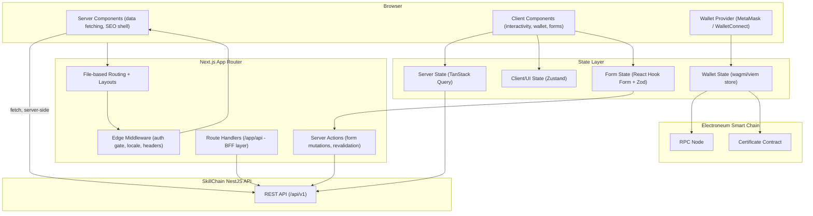
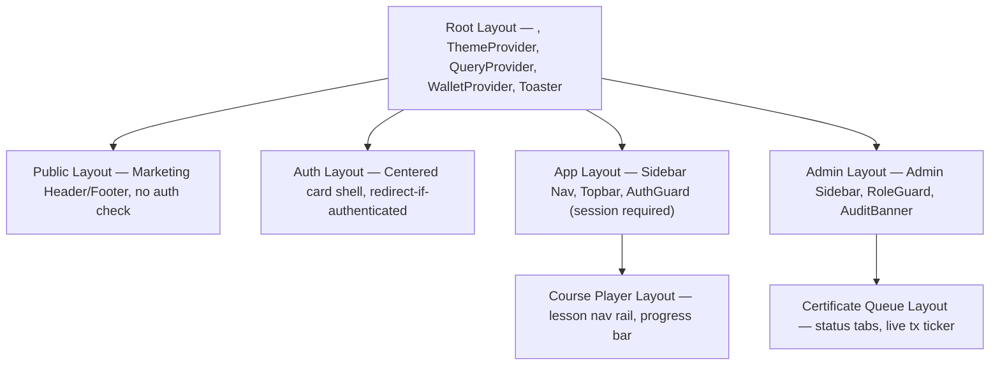
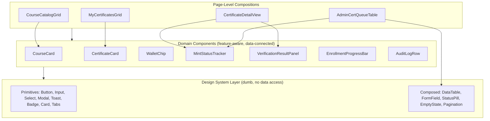
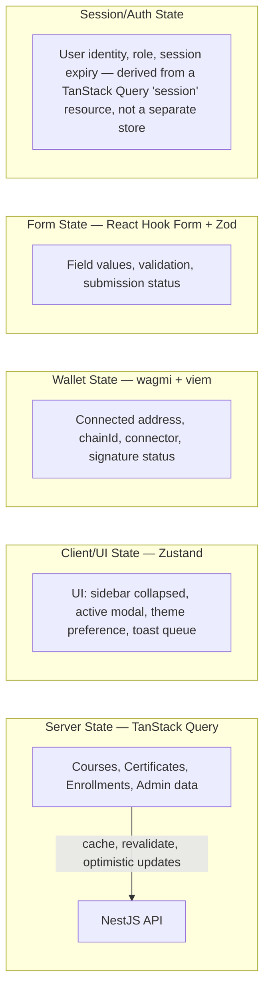
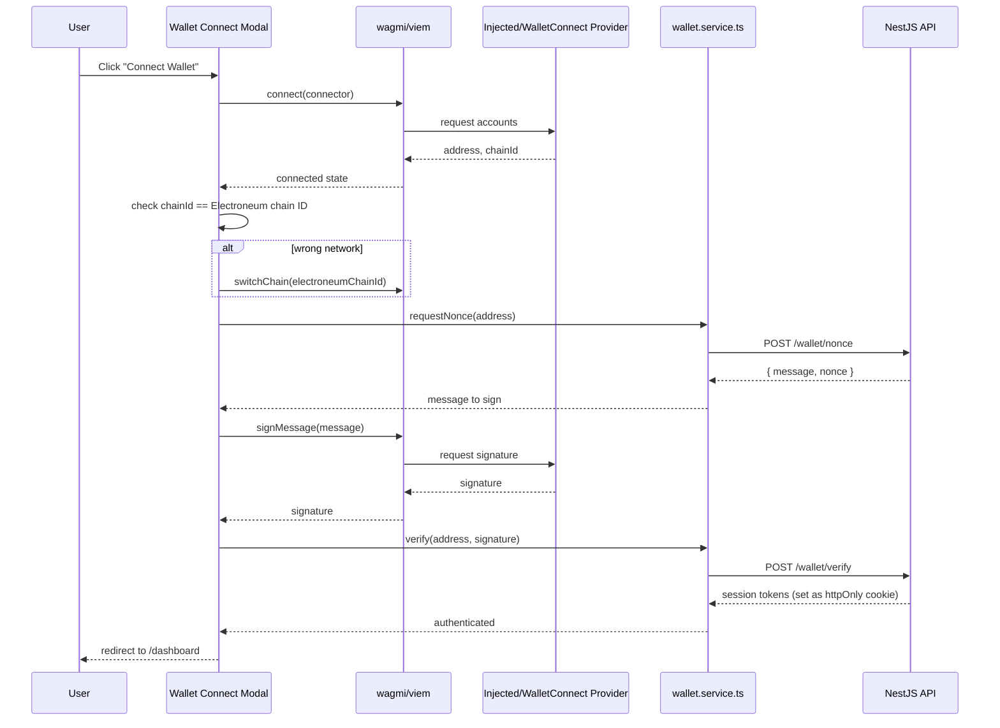
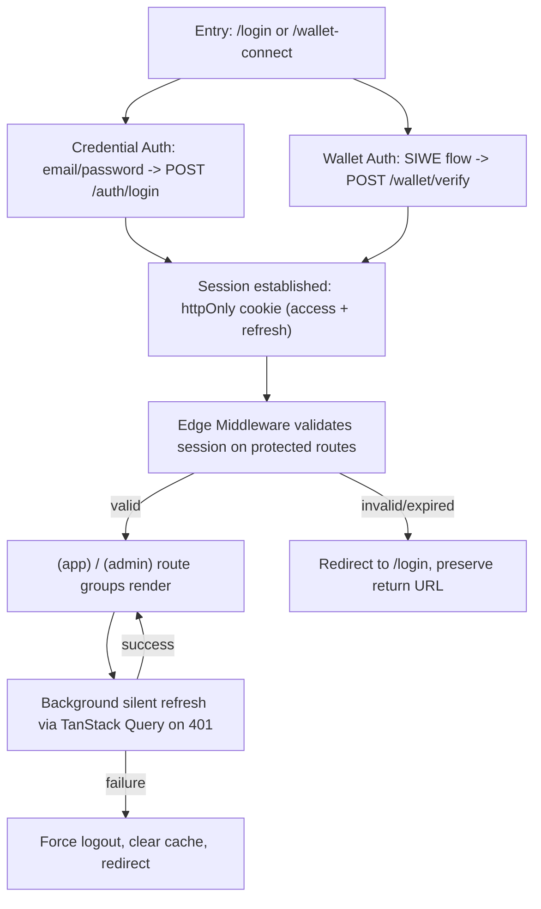
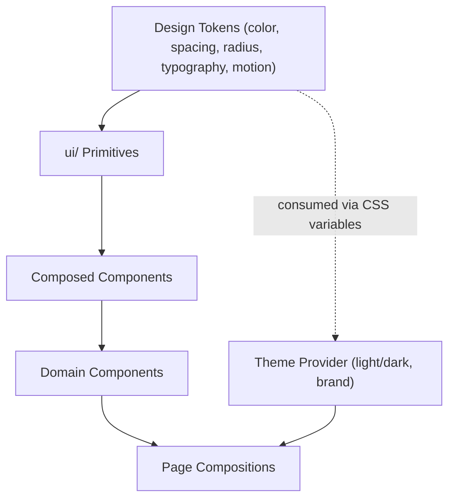

# SkillChain — Frontend Architecture Blueprint
**Framework:** Next.js (App Router) · **Language:** TypeScript · **Chain:** Electroneum Smart Chain

This document defines structure and responsibility boundaries only — no implementation code, per requirements. It is designed to sit directly on top of the backend API and database blueprints already produced.

---

## 1. Architectural Overview



**Guiding principles**
- **Server Components by default**, Client Components only where interactivity, browser APIs, or wallet access are required — minimizes JS shipped to the browser and keeps SEO-critical pages (course catalog, public certificate verification) fast and crawlable.
- **The backend NestJS API is the single source of truth** for all data; the frontend never talks to Postgres or Prisma directly. Route Handlers exist only as a thin BFF (Backend-for-Frontend) layer for concerns like cookie-based session forwarding, not as an independent data layer.
- **Wallet state is isolated** from application/server state — a wallet disconnect/chain-switch must never corrupt or block unrelated UI state.
- **Public verification pages are unauthenticated and server-rendered** — a verifier should never need to connect a wallet or log in to confirm a certificate is real.

---

## 2. Next.js App Router Structure

```
app/
├── (public)/                          # Unauthenticated, SEO-indexable
│   ├── layout.tsx                     # Public shell (marketing header/footer)
│   ├── page.tsx                       # Landing page
│   ├── courses/
│   │   ├── page.tsx                   # Course catalog (server-rendered, filterable)
│   │   └── [slug]/
│   │       └── page.tsx               # Course detail
│   ├── verify/
│   │   └── [certificateId]/
│   │       └── page.tsx               # Public certificate verification
│   └── issuers/
│       └── [issuerId]/
│           └── page.tsx               # Public issuer profile
│
├── (auth)/                            # Auth flows, minimal chrome
│   ├── layout.tsx
│   ├── login/page.tsx
│   ├── register/page.tsx
│   ├── wallet-connect/page.tsx        # SIWE-style wallet auth entry
│   └── verify-email/page.tsx
│
├── (app)/                             # Authenticated learner/issuer experience
│   ├── layout.tsx                     # App shell: sidebar, topbar, auth guard
│   ├── dashboard/page.tsx
│   ├── courses/
│   │   ├── page.tsx                   # "My learning"
│   │   └── [slug]/
│   │       ├── page.tsx               # Course player shell
│   │       └── lessons/[lessonId]/page.tsx
│   ├── certificates/
│   │   ├── page.tsx                   # "My certificates"
│   │   └── [certificateId]/page.tsx   # Certificate detail + share
│   ├── wallet/
│   │   └── page.tsx                   # Linked wallets management
│   └── settings/
│       ├── profile/page.tsx
│       └── security/page.tsx
│
├── (admin)/                           # Role-gated admin/issuer console
│   ├── layout.tsx                     # Admin shell + elevated-auth guard
│   ├── dashboard/page.tsx
│   ├── courses/
│   │   ├── page.tsx
│   │   ├── new/page.tsx
│   │   └── [id]/edit/page.tsx
│   ├── certificates/
│   │   ├── page.tsx                   # Issuance queue, mint status
│   │   └── [id]/page.tsx              # Revocation, tx history
│   ├── issuers/page.tsx               # Issuer whitelist management
│   └── audit-log/page.tsx
│
├── api/                                # Route Handlers (BFF only)
│   ├── auth/session/route.ts          # Cookie/session bridging
│   └── revalidate/route.ts            # On-demand ISR revalidation webhook
│
├── layout.tsx                          # Root layout: providers, fonts, theme
├── error.tsx                           # Root error boundary
├── not-found.tsx
├── loading.tsx
└── global-error.tsx
```

**Route group rationale**
- `(public)`, `(auth)`, `(app)`, `(admin)` are Next.js **route groups** — they don't affect the URL path but let each segment own its own `layout.tsx`, guard logic, and data-fetching posture without polluting shared layouts.
- Public pages (`courses`, `verify`) are structured for static/ISR rendering; authenticated pages are dynamic by nature (per-user data) and rendered on request.

---

## 3. Pages — Responsibility Matrix

| Page | Rendering Mode | Auth | Primary Data Source |
|---|---|---|---|
| Landing (`/`) | Static (ISR) | None | Marketing content (CMS or static) |
| Course catalog (`/courses`) | ISR, revalidated on course publish event | None | `GET /courses` |
| Course detail (`/courses/[slug]`) | ISR | None | `GET /courses/:slug` |
| Verification (`/verify/[certificateId]`) | Dynamic, server-rendered, no-cache | None (public) | `GET /verify/:id` |
| Issuer profile (`/issuers/[id]`) | ISR | None | `GET /issuers/:id` |
| Login / Register | Client-rendered | None | `POST /auth/login`, `/auth/register` |
| Wallet connect | Client-rendered | None → sets session | `POST /wallet/nonce`, `/wallet/verify` |
| Dashboard | Dynamic (SSR) + client hydration | Required | Aggregated: enrollments, certificates, recommendations |
| My Courses | Dynamic | Required | `GET /courses` (enrolled) |
| Course Player | Dynamic, client-heavy (progress tracking) | Required | `GET /courses/:id`, `POST /lessons/:id/progress` |
| My Certificates | Dynamic | Required | `GET /certificates?userId=me` |
| Certificate Detail | Dynamic | Required (owner) or public via `/verify` | `GET /certificates/:id` |
| Wallet Management | Dynamic, client-heavy | Required | `GET/POST /wallet` |
| Admin Dashboard | Dynamic | Admin role | Aggregated admin metrics |
| Admin Course Editor | Dynamic, client-heavy (forms) | Issuer/Admin role | `POST/PATCH /courses` |
| Admin Certificate Queue | Dynamic, polling/streaming | Admin role | `GET /certificates?status=PENDING`, tx status |
| Audit Log | Dynamic, paginated | Super Admin | `GET /admin/audit-log` |

---

## 4. Layouts



| Layout | Owns | Guard Logic |
|---|---|---|
| **Root** | Global providers (theme, query client, wallet, toast/notification host), font loading, `<html>`/`<body>` | None |
| **Public** | Marketing nav, footer, newsletter signup | None — always accessible |
| **Auth** | Centered auth card shell, branding panel | Redirects to `/dashboard` if a valid session already exists |
| **App** (authenticated) | Sidebar navigation, topbar (user menu, notifications, wallet chip), breadcrumb slot | Redirects to `/login` if no session; hydrates user profile into layout-level store |
| **Admin** | Admin-specific sidebar, elevated-session indicator, audit banner | Requires `role ∈ {ISSUER_ADMIN, ADMIN, SUPER_ADMIN}`; re-checks elevated-token freshness for destructive routes |
| **Course Player** (nested under App) | Lesson navigation rail, sticky progress bar | Requires active enrollment for the given course |
| **Certificate Queue** (nested under Admin) | Status filter tabs, live mint/tx status ticker | Requires admin role + issuer scope match |

Layouts are responsible for **shell and guard logic only** — no data-fetching business logic beyond what's needed to render the shell itself (e.g., current user's name/avatar for the topbar).

---

## 5. Component Architecture



**Directory convention**

```
components/
├── ui/                     # Design system primitives (framework-agnostic styling only)
│   ├── button/
│   ├── input/
│   ├── modal/
│   ├── data-table/
│   └── ...
├── domain/                 # Feature-aware, backend-shape-aware components
│   ├── course/
│   │   ├── course-card/
│   │   ├── course-filter-bar/
│   │   └── enrollment-progress-bar/
│   ├── certificate/
│   │   ├── certificate-card/
│   │   ├── mint-status-tracker/
│   │   └── verification-result-panel/
│   ├── wallet/
│   │   ├── wallet-chip/
│   │   └── wallet-connect-modal/
│   └── admin/
│       ├── audit-log-row/
│       └── issuer-whitelist-table/
└── layout/                 # Shell pieces: sidebar, topbar, footer, nav-item
```

**Rules**
- `ui/` components never import from `services/` or `hooks/` that touch the network — they receive data via props only. This keeps the design system reusable and independently storybook-able.
- `domain/` components may consume hooks (§6) but do not perform routing or page-level layout decisions.
- Every domain component that renders a status (certificate status, tx status, enrollment status) maps through a **single shared status-to-visual mapping utility**, so a status color/label is never redefined ad hoc in a second place.

---

## 6. Hooks

Custom hooks are the seam between components and the state/service layer — components never call `services/` or `fetch` directly.

| Hook | Responsibility |
|---|---|
| `useSession()` | Current authenticated user, role, session freshness — backed by server state |
| `useAuth()` | Login, logout, register, refresh orchestration (wraps mutations) |
| `useWalletAuth()` | Nonce request → sign → verify flow orchestration |
| `useWallet()` | Wraps wagmi's connection state: address, chainId, connect/disconnect, network mismatch detection |
| `useCourses(filters)` | Paginated course catalog query |
| `useCourse(slug)` | Single course + lessons |
| `useEnrollment(courseId)` | Enrollment status, progress mutation |
| `useCertificates(userId?)` | List of certificates (own or public-by-wallet) |
| `useCertificate(id)` | Single certificate detail, polls while `status ∈ {PENDING, MINTING}` |
| `useCertificateVerification(id)` | Public verification lookup, no auth required |
| `useMintStatus(certificateId)` | Subscribes/polls blockchain tx status for an in-flight mint |
| `useAdminCertificateQueue(filters)` | Admin-scoped certificate list with status filters |
| `useAuditLog(filters)` | Paginated audit trail (super admin) |
| `useDebouncedValue(value, delay)` | Generic UI utility (search inputs, filters) |
| `useMediaQuery(breakpoint)` | Responsive behavior hook backing §11 |
| `useToast()` | Imperative toast/notification trigger, wraps the global toast host |

**Convention:** data-fetching hooks (`useCourses`, `useCertificate`, etc.) are thin wrappers around TanStack Query, returning a consistent shape (`{ data, isLoading, isError, error }`) and owning their query key structure centrally — query keys are not hand-typed inline in components.

---

## 7. Services (API Client Layer)

```
services/
├── api-client.ts          # Base fetch wrapper: base URL, auth header injection, error normalization
├── auth.service.ts        # login, register, refresh, logout
├── wallet.service.ts      # nonce request, signature verification, linked wallets
├── courses.service.ts     # catalog, detail, enrollment, progress
├── certificates.service.ts# list, detail, issuance trigger, revoke (admin)
├── verification.service.ts# public verification lookup
├── admin.service.ts       # issuer management, audit log, platform settings
└── files.service.ts       # signed upload URL requests
```

**Design rules**
- Services are **pure functions returning typed promises** — no React, no hooks, no state. This makes them independently testable and reusable from Server Components, Route Handlers, and Server Actions alike.
- Every service function's request/response types are generated or hand-mirrored from the backend's DTO contracts (§ prior backend doc, §5) — a single `types/api.ts` (or generated OpenAPI client) is the shared contract surface, preventing drift between frontend expectations and backend responses.
- `api-client.ts` centralizes: base URL resolution (server vs. client), auth token attachment (from cookie on server, from memory/store on client), standardized error unwrapping (matches the backend's error envelope), and correlation ID propagation for tracing.
- Services never read `localStorage` for tokens directly — token storage/retrieval is abstracted behind the auth state layer (§8), so the storage mechanism (httpOnly cookie vs. memory) can change without touching every service call site.

---

## 8. State Management



| State category | Tool | Why |
|---|---|---|
| **Server/remote data** (courses, certificates, enrollments, admin lists) | **TanStack Query** | Caching, background refetch, request de-duplication, optimistic updates for mutations (e.g., enrollment), built-in polling for in-flight mint status |
| **Global UI state** (sidebar collapse, active modal/drawer, theme, toast queue) | **Zustand** | Minimal boilerplate, no provider-wrapping ceremony, ideal for state that's client-only and doesn't need server sync |
| **Wallet/chain state** | **wagmi + viem's internal store** | Purpose-built for wallet connection lifecycle, multi-connector support, chain-switch detection — not reinvented in app state |
| **Form state** | **React Hook Form + Zod resolvers** | Localized to the form component tree, schema-validated, no need to lift into global state |
| **Session/auth identity** | Modeled as a **TanStack Query resource** (`['session']`), not a bespoke context/store | Keeps auth state subject to the same cache invalidation/refetch mechanics as everything else — logout is just a cache clear + redirect |

**Why not Redux:** the app's state naturally splits into "server-cached" and "local-ephemeral" categories that TanStack Query + Zustand cover with far less boilerplate; a single monolithic store would blur the (deliberately kept) line between remote and local state.

**Cross-cutting rule:** no component reaches into more than one state category directly for the same concern — e.g., "is the user authenticated" is answered only by `useSession()`, never by separately checking wallet connection state, which answers a different question ("is a wallet connected") that is not equivalent to "is the user logged in."

---

## 9. Wallet Integration



**Architecture decisions**
- **wagmi + viem** as the wallet connection layer — supports injected wallets (MetaMask) and WalletConnect out of the box, with typed, tree-shakeable primitives for reads/writes against the Electroneum chain.
- **Chain configuration** (Electroneum mainnet + testnet RPC URLs, chain ID, native currency, block explorer) is defined once in a central `chains.ts` config and consumed by both the wagmi config and any direct read calls (e.g., "verify on block explorer" links).
- **Network mismatch handling**: a persistent, dismissible banner/modal appears app-wide (via the `WalletChip` domain component) whenever the connected wallet's `chainId` doesn't match the expected Electroneum chain ID, with a one-click "Switch Network" action — this check lives in `useWallet()`, not duplicated per-page.
- **Wallet connection ≠ authentication.** Connecting a wallet only yields an address; a session is established only after the nonce-sign-verify round trip completes and the backend issues session tokens. A connected-but-unverified wallet state is explicitly representable and handled (e.g., "Sign message to continue" prompt).
- **Read-only chain calls from the client** (e.g., displaying live `ownerOf`/confirmation count on the certificate detail page) go through a dedicated `useMintStatus`/on-chain-read hook using a public RPC provider — this never uses a signer and never requests wallet interaction, since it's a read.
- **Signing requests are always explicit and user-initiated** — no silent/background signature requests; every `signMessage` or transaction-approval call is triggered directly by a user action with clear on-screen context of what's being signed and why.
- **Multi-wallet linking** (`/wallet` management page) reuses the exact same nonce-sign-verify flow per additional wallet, scoped to "link" rather than "authenticate," with the backend distinguishing intent via the request DTO — no separate client-side flow is built for this.

---

## 10. Authentication (Frontend)



**Key decisions**
- **Tokens live in httpOnly, secure cookies**, set by the backend response and forwarded transparently by the browser — never stored in `localStorage`/`sessionStorage`, eliminating an entire class of XSS-driven token theft.
- **Edge Middleware** (`middleware.ts`) performs a lightweight session-presence check (cookie exists + not obviously expired) before a protected route even reaches the React tree — this is a fast gate, not the full authorization check; **fine-grained role authorization still happens server-side** (layout-level guard + every backend endpoint independently enforces its own RBAC, per the backend blueprint).
- **Route groups double as the guard boundary**: `(app)/layout.tsx` and `(admin)/layout.tsx` each perform a server-side session/role fetch before rendering children — an unauthenticated or under-privileged request never renders the protected UI even momentarily (no client-side flash-of-protected-content).
- **Silent refresh**: the API client layer (§7) detects a `401` response, transparently attempts a refresh via the backend's rotation endpoint, and retries the original request once — surfaced to the rest of the app as a normal successful/failed request, not as a special case components need to know about.
- **Logout** clears the TanStack Query cache entirely (not just the session key) — prevents any stale authenticated data from a previous session leaking into a subsequent anonymous or different-user session on a shared device.
- **Admin elevated sessions** (per backend blueprint §12) are modeled as a distinct, shorter-lived claim surfaced to the frontend via the session resource (`scope: 'admin'`); destructive admin actions (revoke certificate, change issuer whitelist) check for **freshness** of this elevated scope and prompt a step-up re-auth modal if it has expired, rather than silently failing at the API layer.

---

## 11. UI Architecture



**Principles**
- **Design-token driven**: color, spacing, radius, type scale, and motion values are defined once as tokens (not hardcoded per component), consumed via CSS custom properties — enables theming (§12) without component-level branching.
- **Composition over configuration**: complex UI (e.g., `DataTable`) is built from small composable primitives (`Table.Root`, `Table.Row`, `Table.Cell`) rather than a single component with dozens of boolean props — keeps the primitive layer flexible across very different domain uses (course lists vs. audit logs vs. certificate queues).
- **Status/visual consistency**: certificate status, transaction status, and enrollment status each map through one canonical status→color/icon/label utility (§5) so "ISSUED" or "PENDING" always looks and reads identically everywhere in the app.
- **Skeleton-first loading states**: every data-driven component defines a matching skeleton/placeholder shape (not a generic spinner) to minimize layout shift and perceived latency, particularly important on the course catalog and certificate list views.
- **Empty/error states are first-class**, not afterthoughts — every list/detail view has a designed empty state (e.g., "No certificates yet — start a course") and a designed error state distinct from a blank screen.
- **Accessibility baseline**: semantic HTML first, ARIA only to fill genuine gaps (custom dropdowns, modals), full keyboard navigability for all interactive elements, focus management on route transitions and modal open/close, color contrast validated against WCAG AA at the token level (so it's correct by construction, not spot-checked per component).

---

## 12. Theme

- **Light/dark mode** supported via a token-swapping `ThemeProvider` at the root layout — theme preference is stored client-side (Zustand-persisted) and synced to a `data-theme` attribute on `<html>`, read before hydration (via a small inline script in the root layout) to avoid a flash of incorrect theme.
- **Token categories:**
  - **Color**: semantic tokens (`color-bg-surface`, `color-text-primary`, `color-border-subtle`, `color-status-success`, `color-status-pending`, `color-status-danger`) rather than raw palette references in components — a status color change is a one-line token edit, not a component hunt.
  - **Typography**: a constrained type scale (display, heading levels, body, caption, mono — the latter used specifically for wallet addresses, tx hashes, and token IDs for legibility/disambiguation).
  - **Spacing/radius**: an 8px-based spacing scale and a small set of radius tokens (sharp for data-dense admin surfaces, rounded for public/marketing surfaces) — kept as tokens so the admin console and public site can subtly diverge without forking the component library.
  - **Motion**: a small set of duration/easing tokens for transitions (page transitions, modal enter/exit, skeleton shimmer) — kept short and consistent to avoid the app feeling sluggish, especially around blockchain-wait states where perceived responsiveness matters most.
- **Brand vs. functional theming are separated**: brand tokens (SkillChain's specific palette/logo treatment) live in one layer; functional tokens (what "success," "danger," "pending" mean visually) live in another — this allows a future white-label/issuer-branded certificate page without touching the functional design system.
- **Public certificate/verification pages** are deliberately theme-locked to light mode with high-contrast, print-friendly styling — these pages are often screenshotted, printed, or shared, so they don't inherit the visiting user's dark-mode preference by default (with an explicit override available).

---

## 13. Responsive Strategy

- **Mobile-first breakpoints**, defined once as tokens and consumed by both CSS and the `useMediaQuery` hook (§6) for any layout logic that must branch in JS (e.g., swapping a data table for a card list on small screens):

| Breakpoint | Target |
|---|---|
| `sm` (≥640px) | Large phones |
| `md` (≥768px) | Tablets |
| `lg` (≥1024px) | Small laptops |
| `xl` (≥1280px) | Desktops |
| `2xl` (≥1536px) | Large/admin monitors |

**Layout adaptation patterns**
- **Public marketing/catalog pages**: fully responsive fluid grid, image-heavy course cards collapse from a 3-column grid → 1-column stack below `md`.
- **App shell** (`(app)` layout): sidebar collapses to a bottom tab bar or slide-over drawer below `md` — navigation model genuinely changes at this breakpoint rather than just shrinking, since a persistent sidebar doesn't work on mobile viewports.
- **Admin console** (`(admin)` layout): optimized primarily for `lg`+ (data tables, multi-column forms, audit logs are desktop-first workflows); below `lg`, dense tables convert to stacked card summaries with drill-in detail views rather than horizontally-scrolling tables, which are treated as a last resort, not a default pattern.
- **Course player**: the lesson navigation rail collapses into a collapsible top drawer on mobile so the content area retains maximum width for reading/video.
- **Certificate detail/verification page**: designed to look correct and complete on a single mobile screen without scrolling past the fold for the core verdict ("Valid ✓ / Revoked ✗"), since these links are frequently shared and opened on mobile from chat apps/social media.
- **Wallet connect modal**: on mobile, defers to wallet deep-linking (WalletConnect's mobile flow opens the installed wallet app directly) rather than showing a QR code meant for a second-device scan — the responsive behavior here is connector-aware, not just viewport-aware.
- **Touch targets**: interactive elements maintain a minimum 44×44px touch target on all breakpoints below `md`, enforced at the primitive component level (§5), not left to per-usage styling.

---

*This document defines structure, responsibility, and architectural decisions only. Component code, page implementations, and hook internals are intentionally out of scope, per requirements, and will be built directly against this blueprint.*