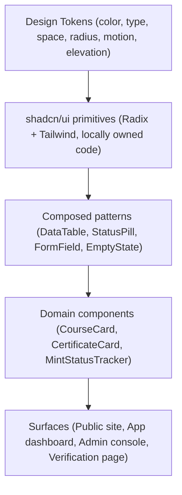
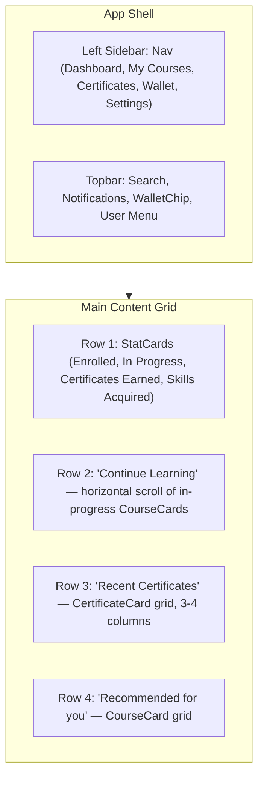
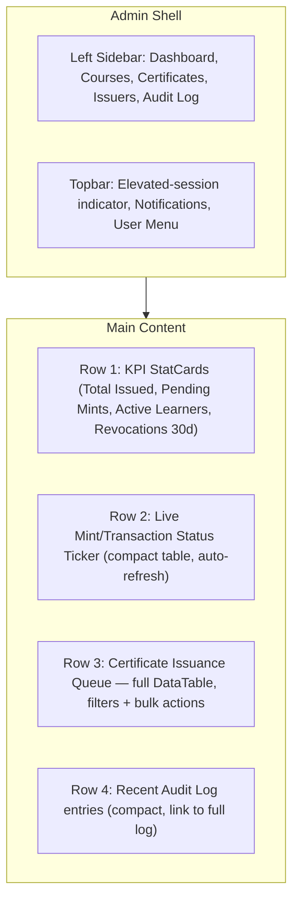
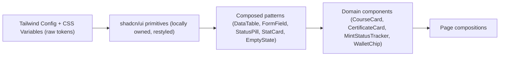

# SkillChain — UI/UX Specification
**Design System Base:** shadcn/ui (Radix primitives + Tailwind) · **Platform:** Web (responsive), Next.js App Router

This document defines the visual and interaction language for SkillChain. It specifies design decisions and rules — not component code — and is meant to be handed directly to whoever implements the shadcn/ui theme layer and Tailwind config.

---

## 1. Design System Philosophy

**Core tenets**
1. **Trust and legibility over decoration.** SkillChain issues verifiable credentials — the UI must read as credible, calm, and precise, not "crypto-flashy." No gradients-over-everything, no neon, no gimmicks on anything related to certificates or verification.
2. **One system, three registers.** The same token set powers three visual registers: the **public/marketing** surface (warmer, more spacious), the **app/dashboard** surface (dense but calm), and the **admin console** (maximally dense, data-first). Registers differ only through token values (spacing scale, radius), never through a forked component library.
3. **Status is sacred.** Certificate status, transaction status, and enrollment status are the most important signals in the product. They get one unambiguous, consistent visual vocabulary used everywhere — never re-invented per screen.
4. **shadcn/ui is a starting point, not a black box.** Components are copied into the codebase (per shadcn's model) and restyled via tokens/Tailwind config — never left at unstyled defaults, never fought against with one-off overrides.

---

## 2. Color Palette

### 2.1 Palette Structure
Colors are defined as a **base ramp** (11 steps, 50–950, per hue) for each of: `neutral`, `brand`, `success`, `warning`, `danger`, `info`. Components never reference raw ramp steps directly — only **semantic tokens** that map onto the ramp, so dark mode and future rebrands are single-source edits.

### 2.2 Base Hues

| Hue | Role | Approx. anchor (600 step) |
|---|---|---|
| `neutral` | Backgrounds, borders, text | Cool slate-gray (slightly blue-leaning, not warm gray — reinforces "fintech-grade trust" over "generic SaaS") |
| `brand` | Primary actions, links, active states | Deep indigo/violet — distinct from typical "crypto green/orange," signals institutional credibility |
| `success` | Issued certificates, confirmed transactions, completed courses | Emerald green |
| `warning` | Pending/minting states, degraded network, soft alerts | Amber |
| `danger` | Revoked certificates, failed transactions, destructive actions | Red (slightly desaturated — reserved for genuine severity, not overused) |
| `info` | Neutral informational callouts, tooltips, non-status badges | Sky blue |

### 2.3 Semantic Token Map (light mode)

| Token | Maps to | Usage |
|---|---|---|
| `bg-canvas` | `neutral-50` | Page background |
| `bg-surface` | `neutral-0` (white) | Cards, panels, modals |
| `bg-surface-sunken` | `neutral-100` | Table row stripes, code/hash blocks |
| `border-subtle` | `neutral-200` | Default dividers/card borders |
| `border-strong` | `neutral-300` | Input borders, focus-adjacent structure |
| `text-primary` | `neutral-900` | Headings, primary body text |
| `text-secondary` | `neutral-600` | Supporting text, labels |
| `text-tertiary` | `neutral-400` | Placeholder, disabled, metadata |
| `brand-default` | `brand-600` | Primary buttons, active nav, links |
| `brand-hover` | `brand-700` | Hover state |
| `brand-subtle` | `brand-50` | Selected row/tab background |
| `status-success` | `success-600` | Issued / Confirmed / Completed |
| `status-warning` | `warning-600` | Pending / Minting / In Progress |
| `status-danger` | `danger-600` | Revoked / Failed / Suspended |
| `status-info` | `info-600` | Draft / Neutral badges |

### 2.4 Dark Mode
Dark mode is **not** an inverted light theme — it's a separately tuned ramp mapping (shadcn/ui's CSS-variable approach handles this natively): `bg-canvas` maps to a near-black neutral (`neutral-950`, not pure `#000`), `bg-surface` sits one step lighter for card separation without harsh borders, and all status hues are slightly desaturated/lightened to avoid vibrating against a dark background. Brand indigo shifts one step lighter (`brand-500`) to maintain contrast on dark surfaces.

### 2.5 Special Rule — Verification Page
The public `/verify/:certificateId` page uses a **locked, high-contrast light palette** regardless of system/user dark-mode preference by default (with an explicit toggle). Rationale: these pages are screenshotted, printed, and embedded — they must render identically and legibly everywhere, independent of the viewer's environment.

### 2.6 Accessibility Contrast Floor
Every semantic text-on-background pairing in the token map is validated at **WCAG AA minimum (4.5:1 for body text, 3:1 for large text/icons)** at the token level — this is enforced once, centrally, not spot-checked per component.

---

## 3. Typography

### 3.1 Typeface Selection

| Role | Typeface | Rationale |
|---|---|---|
| **UI / body / headings** | A geometric-humanist sans (e.g., Inter or equivalent variable font) | High legibility at small sizes, excellent numeral tabular support (important for stats, dashboards) |
| **Monospace** | A code-optimized mono (e.g., JetBrains Mono or equivalent) | Used exclusively for wallet addresses, transaction hashes, token IDs, contract addresses — disambiguates similar characters (0/O, 1/l/I) which is a real trust/security concern when someone is visually verifying an address |

### 3.2 Type Scale (tokenized, not per-component)

| Token | Size / Line-height | Usage |
|---|---|---|
| `display` | 40px / 48px | Landing page hero only |
| `heading-1` | 32px / 40px | Page titles |
| `heading-2` | 24px / 32px | Section titles, card group headers |
| `heading-3` | 20px / 28px | Card titles, modal titles |
| `body-lg` | 16px / 24px | Primary reading text |
| `body-md` | 14px / 20px | Default UI text, table cells, form labels |
| `body-sm` | 13px / 18px | Metadata, timestamps, helper text |
| `caption` | 12px / 16px | Badge labels, table headers (uppercase, letter-spaced) |
| `mono-md` | 14px / 20px | Wallet addresses, hashes (inline) |
| `mono-sm` | 12px / 16px | Hashes in dense table contexts |

### 3.3 Weight Usage
Only three weights are used system-wide: **Regular (400)** for body text, **Medium (500)** for labels/emphasis/table headers, **Semibold (600)** for headings and primary button text. Bold (700) is reserved for the `display` token only — over-use of heavy weights across a data-dense product reduces scannability rather than improving it.

### 3.4 Address/Hash Truncation Convention
Wallet addresses and tx hashes are never wrapped or run at full length in dense UI — a consistent truncation pattern (`0x1234…9abc`) is applied via a shared utility, always paired with a copy-to-clipboard affordance and a tooltip revealing the full value on hover/focus.

---

## 4. Icons

- **Library:** a single consistent outline-style icon set (e.g., Lucide, which is shadcn/ui's default pairing) — no mixing of icon libraries/styles, which is a common source of visual inconsistency.
- **Stroke weight:** fixed at a single weight (1.5–2px) across the entire app; icons are never filled solid except for very small (≤16px) status dots where an outline wouldn't render legibly.
- **Sizing scale:** icons are tokenized at `16px` (inline with `body-sm`/`body-md` text), `20px` (default UI/button icons), `24px` (section headers, empty states), `40px+` (empty-state illustrations, onboarding).
- **Semantic icon mapping** (fixed, never varies by screen):
  - Certificate issued → checkmark-in-circle (success)
  - Certificate pending/minting → spinning loader or hourglass (warning, animated only while genuinely in-flight)
  - Certificate revoked → x-in-circle or shield-off (danger)
  - Wallet connected → wallet/link icon (brand)
  - Wallet mismatch/network warning → alert-triangle (warning)
  - External/on-chain link (block explorer) → external-link icon, always paired with the label "View on Explorer"
- **Decorative vs. functional icons:** purely decorative icons are marked `aria-hidden`; functional icons (icon-only buttons) always carry an accessible label — never an icon alone with no text alternative (§10).

---

## 5. Buttons

### 5.1 Variant System (built on shadcn/ui's `Button` primitive)

| Variant | Use | Visual |
|---|---|---|
| `primary` | The single most important action per view (Enroll, Issue Certificate, Connect Wallet) | Solid `brand-default` fill, white text |
| `secondary` | Alternative but still notable actions | Outlined, `border-strong`, `text-primary` |
| `ghost` | Low-emphasis actions, inline table actions, toolbar icons | No border/fill until hover, `text-secondary` |
| `destructive` | Revoke certificate, delete, deactivate issuer | Solid `status-danger` fill — reserved exclusively for irreversible/high-consequence actions |
| `link` | Inline navigational actions inside text/table cells | No padding, underline on hover, `brand-default` text |

**Rule:** at most **one `primary` button per view/section** — if two actions compete for primary weight, one is demoted to `secondary`. This is enforced as a design review checklist item, not left to per-page discretion.

### 5.2 Sizes
`sm` (32px height, dense tables/toolbars), `md` (36px, default), `lg` (44px, forms and primary marketing CTAs) — sizes are fixed tokens, not arbitrary per-instance heights.

### 5.3 States
Every button variant defines, at the token level: default, hover, active/pressed, focus-visible (a visible ring, not just a color shift — critical for keyboard users), disabled (reduced opacity + `cursor-not-allowed`, never just a color change alone), and **loading** (spinner replaces label or sits inline-leading, button remains its original width to prevent layout shift, and is auto-disabled while loading).

### 5.4 Web3-Specific Button Behavior
- Any button that triggers a wallet signature or on-chain transaction (Connect Wallet, Sign to Verify, Mint, Revoke) enters a distinct **"awaiting wallet"** loading sub-state (different microcopy than a generic API loading state — e.g., "Confirm in wallet…") so the user understands the delay is coming from their wallet app, not the SkillChain backend.
- These buttons never auto-retry silently on rejection — a wallet signature rejection surfaces as a dismissible inline message with the original button restored to its actionable state, never a dead/stuck loading spinner.

---

## 6. Cards

### 6.1 Card Anatomy (shared shell, three content patterns)
All cards share a common shell: `bg-surface`, `border-subtle` (1px), a consistent radius token, and a fixed internal padding scale — content patterns vary, the shell never does.

| Card Type | Content Pattern |
|---|---|
| **CourseCard** | Thumbnail (16:9) → title (`heading-3`) → issuer name + skill tags → progress bar (if enrolled) → footer action |
| **CertificateCard** | Certificate thumbnail/seal → title + course name → `StatusPill` (top-right corner, always) → issued date / mono token ID → footer: "View" + "Share" |
| **StatCard** (dashboard) | Label (`caption`, uppercase) → large numeric value (`heading-1`, tabular numerals) → optional trend indicator (small arrow + delta, colored via status tokens) |
| **AdminEntityCard** (mobile fallback for table rows, §9) | Compact key-value stack replicating the table's columns, with the row's primary action pinned bottom-right |

### 6.2 Interaction
Cards that are primarily navigational (CourseCard, CertificateCard) have the **entire card as the click target** (not just the title), with a visible hover elevation/border-color shift, and a `focus-visible` ring for keyboard navigation — never a card that looks clickable but only responds on a small internal link.

### 6.3 Elevation
A restrained two-step elevation system: `resting` (border only, no shadow — used for the vast majority of cards, keeping dense dashboard views calm) and `raised` (subtle shadow, used only for modals, dropdowns, and cards in an active drag/hover state) — shadows are not used as a default card treatment, since a page full of drop-shadows reads as noisy at dashboard density.

---

## 7. Tables

### 7.1 Base
Built on shadcn/ui's `Table` primitives, extended with a shared `DataTable` composed pattern (sorting, column visibility, pagination, row selection) used consistently across every list view — course catalogs (public-facing simplified version), enrollment lists, certificate queues, audit logs, issuer management.

### 7.2 Structural Rules
- **Header row:** `caption` token (uppercase, letter-spaced, `text-secondary`), sticky on scroll for any table taller than the viewport.
- **Row height:** two densities — `comfortable` (48px, default app/dashboard tables) and `compact` (36px, admin console tables like audit logs where row count is high) — density is a table-level prop, not mixed within one table.
- **Zebra striping:** used only in `compact` density tables (audit log, transaction history) where row-tracking across many rows is genuinely hard without it; `comfortable` tables rely on row borders alone.
- **Status column:** always rendered as a `StatusPill` (§ status vocabulary below), never raw text, never a raw colored cell background — pills keep the status legible against zebra striping and dark mode alike.
- **Address/hash columns:** always truncated + monospace + copy affordance (§3.4) — never left at a raw full-length string that breaks table layout.
- **Empty state:** every table defines a specific empty state (icon + message + primary action where applicable) — "No certificates issued yet" with a relevant CTA, never a bare blank table.
- **Loading state:** skeleton rows matching the real row structure, not a centered spinner replacing the whole table — preserves layout stability and lets the user see the table structure is expected here.
- **Row actions:** overflow into a `ghost`-variant kebab menu beyond 2 inline actions — inline action icons are capped at two to avoid a cluttered action rail.

### 7.3 Canonical Status Vocabulary (used identically in tables, cards, and badges everywhere)

| Status | Pill Color | Icon |
|---|---|---|
| `ISSUED` / `CONFIRMED` / `COMPLETED` | success | check-circle |
| `PENDING` / `MINTING` / `IN_PROGRESS` | warning | hourglass (subtle pulse animation) |
| `REVOKED` / `FAILED` / `SUSPENDED` | danger | x-circle |
| `DRAFT` / `WITHDRAWN` / `INACTIVE` | neutral | circle-dashed |
| Generic informational | info | info-circle |

---

## 8. Dashboard Layout

### 8.1 Learner Dashboard (`(app)/dashboard`)

- **Grid:** 12-column responsive grid at `lg`+; stat cards occupy 3 columns each (4-up row), content sections span full width beneath.
- **Priority order top-to-bottom** matches the above: status/progress snapshot first, actionable "continue" content second, achievement/social-proof (certificates) third, discovery (recommendations) last — reflects the primary job-to-be-done (finish what you started) over passive browsing.

### 8.2 Admin/Issuer Dashboard (`(admin)/dashboard`)

- Admin dashboard is **density-first**: smaller stat cards, `compact` table density by default, no large imagery — every pixel earns its place because this surface is used by power users repeatedly, not browsed casually.
- The **transaction ticker** (Row 2) is the one component on this screen that live-updates (via polling, per the frontend architecture's `useMintStatus`) — everything else refreshes on navigation/manual refresh to avoid a dashboard that visually jitters constantly.

### 8.3 Shared Layout Rules
- Sidebar collapses to icon-only at `lg` and to a drawer below `md` (matches the responsive strategy from the frontend architecture doc).
- Max content width is capped (e.g., ~1440px) and centered on very large/admin monitors — content never stretches edge-to-edge on ultrawide displays, which would break table/card readability.

---

## 9. Forms

### 9.1 Structure
Built on shadcn/ui's `Form` primitives (React Hook Form + Zod integration) with a shared `FormField` composed pattern: label → control → helper text → error message, in a fixed vertical rhythm — no form in the product improvises this stack manually.

### 9.2 Field Rules
- **Labels are always visible**, never placeholder-only (placeholder-as-label fails accessibility and disappears the moment a user starts typing, losing context).
- **Required vs. optional:** required is the default assumption for core flows (registration, course creation); optional fields are explicitly marked `(optional)` in the label — not the inverse — since marking every required field is noisier than marking the exception.
- **Inline validation:** errors surface on blur (not on every keystroke, which feels punitive) after first submission attempt; once an error is showing, it re-validates live as the user corrects it, so the error clears the moment it's actually fixed.
- **Error messages are specific and actionable** ("Wallet address must be a valid Electroneum address" not "Invalid input") — copy is owned centrally in a validation-message map, not hand-written per form instance.

### 9.3 Web3-Specific Form Patterns
- **Wallet address fields** (e.g., admin manually whitelisting an issuer) validate checksum format live and render a small identicon/avatar preview next to a validated address, giving a secondary visual confirmation beyond the raw string — reduces the real risk of a mistyped/malicious address being submitted unnoticed.
- **Amount/gas-adjacent fields** (if ever exposed, e.g., admin gas price override) use tabular-numeral monospace input styling and explicit unit labels — never a bare unlabeled number field for anything financial.

### 9.4 Multi-Step Forms
Course creation (admin) is a multi-step form (Details → Curriculum → Skills → Certificate Design → Review) using a shared `Stepper` pattern with persistent step state (so navigating back doesn't lose data) and a review step that shows every prior answer before final submission — no destructive multi-step flow submits without a final confirmation screen.

### 9.5 Submission & Feedback
Every form's submit button enters the standard button loading state (§5.3); on success, the user sees an explicit success toast/confirmation (not just a silent redirect) except where the destination screen itself unambiguously confirms success (e.g., landing on the newly created course's detail page).

---

## 10. Accessibility

- **Standard:** WCAG 2.1 AA as the floor across the entire product, including the public verification page, which is treated as the **highest-priority accessible surface** since it must work for the widest, least-known audience (employers, third-party verifiers) without exception.
- **Color is never the sole signal.** Every status pill pairs color with an icon and a text label (§7.3) — this also means the product remains usable for color-blind users without any special mode.
- **Keyboard navigation:** full tab-order coverage on every interactive surface, visible `focus-visible` rings (never `outline: none` without a replacement), modals trap focus and return it to the triggering element on close, and the sidebar/nav is reachable and operable via keyboard alone.
- **Screen reader support:** all icon-only buttons carry `aria-label`; live-updating regions (transaction ticker, mint status) use `aria-live="polite"` so status changes are announced without interrupting the user; skeleton loading states are marked `aria-busy`.
- **Forms:** every input is programmatically associated with its label (`for`/`id`, or Radix's built-in association via shadcn primitives); error messages are linked via `aria-describedby` so a screen reader announces the error alongside the field, not just visually adjacent to it.
- **Motion:** all non-essential animation (skeleton shimmer, hover transitions, the pending-status pulse) respects `prefers-reduced-motion` and falls back to a static equivalent — never essential information conveyed through motion alone (e.g., the pending pulse is a nice-to-have, not the only signal that something is "in progress," which is also stated in text).
- **Contrast:** enforced at the token level (§2.6); no component is allowed to override a token with a non-compliant custom color, which is a lint-enforceable rule at the theme-config level, not just a design guideline.
- **Target sizing:** minimum 44×44px touch targets on all breakpoints below `md` (per the frontend architecture's responsive strategy), applying equally to icon-only buttons and table row actions.

---

## 11. Design System (Governance & Composition)

### 11.1 Layering Model

- **No layer skips downward.** A page composition never reaches past domain/composed components to restyle a shadcn primitive inline — if a one-off style is needed repeatedly, it graduates into the composed layer instead of proliferating as ad hoc overrides.
- **Tokens are the only source of visual truth.** Hex codes, arbitrary pixel values, and one-off Tailwind arbitrary-value classes (`w-[137px]`) are treated as smells in review — everything traces back to a token or the fixed scale.

### 11.2 Documentation & Ownership
- A living component inventory (Storybook or equivalent) documents every composed and domain component with its states (default/hover/loading/error/empty/disabled) — the canonical status vocabulary (§7.3) and button variant rules (§5.1) are enforced by linking directly to this inventory in PR review, not re-explained per PR.
- Design tokens are versioned alongside the codebase (not owned separately in a design tool disconnected from implementation) — a token change is a reviewable pull request like any other.

### 11.3 Consistency Guardrails
- **One `primary` button per view** (§5.1), **one canonical status vocabulary** (§7.3), **one truncation utility** for addresses/hashes (§3.4), **one empty-state pattern**, **one loading-skeleton pattern** — these five rules are the most commonly violated in fast-moving product development and are called out explicitly as the design system's non-negotiables.

---

## 12. shadcn/ui Usage

### 12.1 Why shadcn/ui Fits This Project
- Components are **copied into the repository**, not installed as an opaque dependency — this matters for SkillChain because several components (StatusPill, MintStatusTracker, wallet-aware buttons) need behavior shadcn doesn't ship out of the box, and owning the code outright avoids fighting a black-box library's override system.
- Built on **Radix primitives**, which gives correct accessibility behavior (focus trapping, ARIA roles, keyboard interaction) for free on complex components (Dialog, DropdownMenu, Select, Tabs, Popover) — directly supports §10 without reinventing interaction logic.
- **Tailwind-native**, which aligns with the token-driven theming approach (§2, §11) — theme changes are CSS-variable edits, not component rewrites.

### 12.2 Primitives Adopted As-Is (light restyle only)
`Button`, `Input`, `Textarea`, `Select`, `Checkbox`, `RadioGroup`, `Switch`, `Tabs`, `Tooltip`, `Popover`, `DropdownMenu`, `Dialog`, `AlertDialog` (used specifically for destructive confirmations — revoke certificate, deactivate issuer), `Toast`/`Sonner` (notification host), `Avatar`, `Separator`, `ScrollArea`.

### 12.3 Primitives Extended into Composed Patterns
| shadcn primitive | Extended into | Extension |
|---|---|---|
| `Table` | `DataTable` | Sorting, pagination, column visibility, row selection, density prop, empty/loading states (§7) |
| `Badge` | `StatusPill` | Fixed color/icon mapping per canonical status vocabulary (§7.3), never used with an arbitrary color prop |
| `Card` | `StatCard`, `CourseCard`, `CertificateCard` | Fixed internal content slots per §6 |
| `Form` (RHF wrapper) | `FormField` | Standardized label/control/helper/error stack (§9.1) |
| `Skeleton` | Per-component skeleton variants | Matched to real content shape (table rows, cards, stat blocks) rather than generic blocks |
| `Progress` | `EnrollmentProgressBar`, `MintStatusTracker` (step variant) | Domain-specific labeling (e.g., step labels: Pending → Minting → Confirmed) layered on the base primitive |

### 12.4 Deliberately Not Used From shadcn (custom-built instead)
- **Wallet connection UI** (connect modal, network-mismatch banner) — shadcn has no Web3 awareness; built as a domain component composed from shadcn's `Dialog` + custom wagmi-connected logic, per the frontend architecture's wallet integration design.
- **Certificate visual/seal rendering** — a bespoke SVG-based component (matches the actual on-chain certificate artwork), not a generic card pattern.

### 12.5 Theming Mechanism
shadcn/ui's CSS-variable theming approach is used directly as the implementation of §2's semantic token map — light/dark mode is two variable sets swapped via the `data-theme` attribute described in the frontend architecture's theme section, with no component-level conditional styling for theme required.

---

*This specification defines visual and interaction rules only. Implementation (Tailwind config values, shadcn component installation/customization, Storybook setup) is intentionally out of scope, per requirements, and should be built directly against the tokens and rules defined here.*